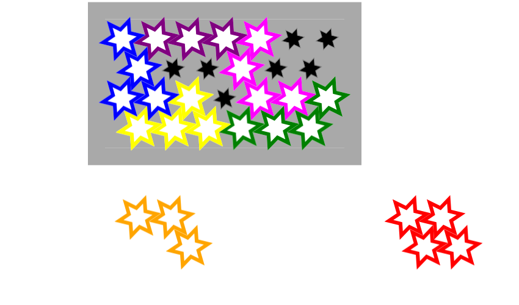
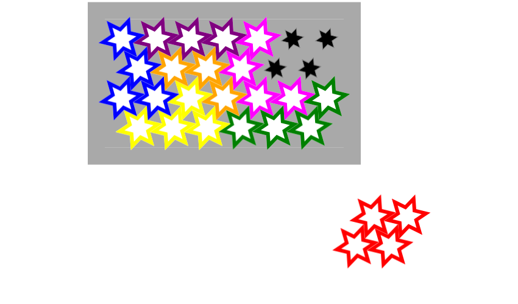

# COMP1110 Assignment 1

## Academic Honesty and Integrity

Honesty and integrity are of utmost importance. These goals are *not* at odds
with being resourceful and working collaboratively. You *should* be resourceful
and you should discuss the assignment
and other aspects of the course with others taking the class. However, *you must
never misrepresent the work of others as your own*. If you have taken ideas from
elsewhere or used code sourced from elsewhere, you must say so with *utmost
clarity*. At each stage of the assignment you will be asked to submit a statement
of originality, either as a group or as individuals. This statement is the place
for you to declare which ideas or code contained in your submission were sourced
from elsewhere.

Please read the ANU's [official position](http://academichonesty.anu.edu.au/) on
academic honesty. If you have any questions, please ask me.

Carefully review the [statement of originality](originality.md) which you must
complete.  Edit that statement and update it as you complete the assignment,
ensuring that when you complete the assignment, a truthful statement is committed
and pushed to your repo.

## Purpose

In this assignment is introductory, helping you gain familiarity with the basics
of Java, but doing so in the context of slightly larger piece of code.  Most
of the assignment is composed of a series of small tasks.

## Assignment Deliverable

The assignment is worth 5% of your total assessment, and it will be marked out of 5.
However, these marks are [redeemable](https://cs.anu.edu.au/courses/comp1110/assessments/redeemable/) by the exam, so if
your exam mark / 20 is higher than your assignment one mark, you will get the exam mark / 20 rather than the assignment one mark.
**The mark breakdown is described on the [deliverables](https://cs.anu.edu.au/courses/comp1110/assessments/deliverables/#D1A) page.**

The assignment is due at **[11:45 Friday Week 3](https://www.timeanddate.com/worldclock/fixedtime.html?msg=Assignment+1+Due&iso=20190315T0045&p1=%253A), 15 March 2019**
([time remaining](https://www.timeanddate.com/countdown/generic?p0=1440&iso=20190315T0045&msg=Assignment%201%20Due)).
You can find [this deadline](https://cs.anu.edu.au/courses/comp1110/assessments/deliverables/#D1A)
on the [deliverables page](https://cs.anu.edu.au/courses/comp1110/assessments/deliverables/), where all assignment deadlines for this semester are
listed.
Your tutor will mark your assignment by accessing your GitLab repository, so it is essential that you carefully follow
instructions for setting up and maintaining your repository.
You will be marked according to **whatever is committed to your repository at the time of the deadline**.
Since the first assignment is redeemable, **[late extensions are not offered and will not be given](https://cs.anu.edu.au/courses/comp1110/deadlines/)**.
As always throughout the course, if a personal circumstance arises that affects your capacity to complete the course,
please carefully follow the ANU's [special consideration process](http://www.anu.edu.au/students/program-administration/assessments-exams/special-assessment-consideration),
and your circumstances will be accounted for in your final assessment.

## Overview

This assignment is based on a puzzle game called
[IQ Stars](https://www.smartgames.eu/uk/one-player-games/iq-stars).

The game is played on a board consisting of 26 star-shaped spaces in a hexagonal grid.
There are seven puzzle pieces which are composed of various numbers of linked stars, arranged in different shapes so that they may be placed on the grid.
As an example, the 'C' piece is shown below:

To begin the puzzle, the player is provided with a starting position
in which the positions and orientations of some of the pieces are fixed.
The objective is to place the remaining pieces so that the grid is completely covered.
Pieces may not overlap.

Pieces can be moved onto the board by clicking and dragging with the mouse.
They can be rotated using the scroll wheel (or equivalent scroll function).

Each time the puzzle is played the objective may be different.
Some objectives are easier to solve than others. 
The puzzle is designed so that the player may specify a difficulty level.
The puzzle comes packaged with a booklet of objectives of different difficulty levels, each with multiple different objectives.
In our version, the user may select the level of difficulty on a slider.

The images below show the progression of a simple game.

The game starts with some of the pieces already placed. The location and orientation of these pieces is fixed, and may not be changed by the player.
These pieces form the objective of the puzzle.

The player then starts placing pieces. First they move the orange 'B' piece so that its origin is in the 'I' hex.

The player then rotates the red 'D' piece twice (i.e. by 120 degrees), to the 'C' orientation.

Finally the player moves the 'D' piece to the top-right corner of the board, at hex 'G'.
The puzzle is now complete.

The player can start a new game by selecting a difficulty level and
pressing the 'Restart' button.

### Your task

Unfortunately your version of the assignment has some missing code.   While the
graphical user interface is complete, some of the important logic is missing,
so it won't work quite as described above.  It is your job to fix the problems
so that it works.  Do not change the code except by following each of the
assigned tasks.   When those task are completed, the game will function
correctly.

## Legal and Ethical Issues

First, as with any work you do, you must abide by the principles of
[honesty and integrity](https://cs.anu.edu.au/courses/comp1110/09-integrity/).
We expect you to demonstrate honesty and integrity in everything you do.

In addition to those ground rules, you are to follow the rules one would normally
be subject to in a commercial setting. In particular, you may make use of the
works of others under two fundamental conditions: a) your use of their work must
be clearly acknowledged, and b) your use of their work must be legal (for example,
consistent with any copyright and licensing that applies to the given material).
**Please understand that violation of these rules is a very serious offence.**
However, as long as you abide by these rules, you are explicitly invited to
conduct research and make use of a variety of sources. You are also given an
explicit means with which to declare your use of other sources (via originality
statements you must complete). It is important to realize that you will be
assessed on the basis of your original contributions to the project. While you
won't be penalized for correctly attributed use of others' ideas, the work of
others will not be considered as part of your contribution. Therefore, these
rules allow you to copy another student's work entirely if: a) they gave you
permission to do so, and b) you acknowledged that you had done so. Notice,
however, that if you were to do this you would have no original contribution and
so would receive no marks for the assignment (but you would not have broken any
rules either).

## Evaluation Criteria

**The mark breakdown is described on the
[deliverables](https://cs.anu.edu.au/courses/comp1110/assessments/deliverables/#D1A) page.**

**Pass**
* Tasks #1, #2, and #3,

**Credit**
* Task #4 *(in addition to all tasks required for Pass)*

**Distinction**
* Task #5 and #6 *(in addition to all tasks required for Credit)*

**High Distinction**
* Tasks #7 and #8 *(in addition to all tasks required for Distinction)*

**IMPORTANT NOTE:**
*It is very important that you understand that you are*
**not** *required to complete all elements of the assignment.
In fact, you are not encouraged to pursue the Distinction and High
Distinction tasks unless you feel motivated and able to do so. Recall that the
assignment is redeemable against the exam. The last parts of the assignment are
significantly harder than the others, but together worth only one additional mark. I
don't encourage you to spend too much time on this unless you are enjoying the
challenge of solving these harder problems.  Solutions to tasks #7 and #8 may
involve ideas that I have* **not covered** *in class; you may
need to go beyond the course material.*
