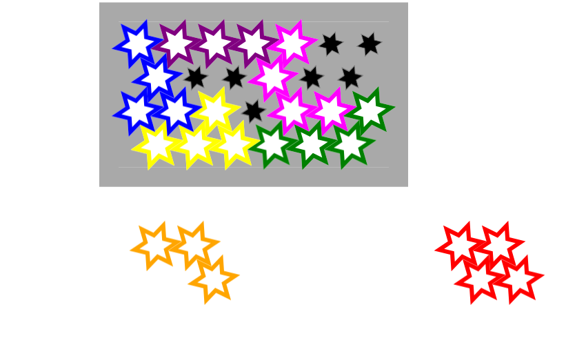
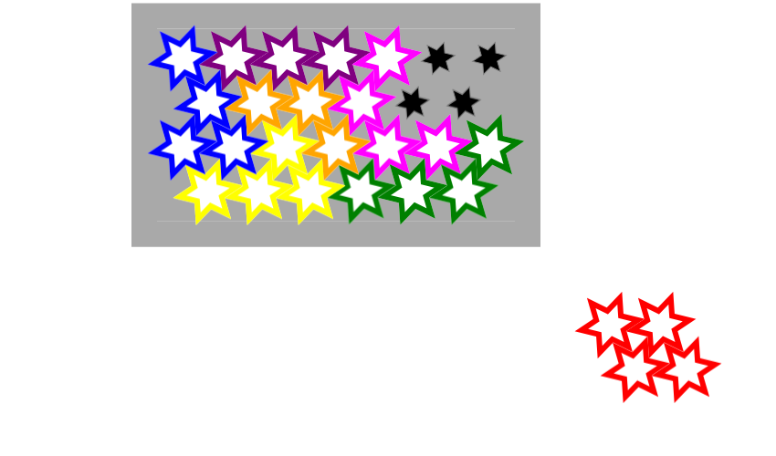
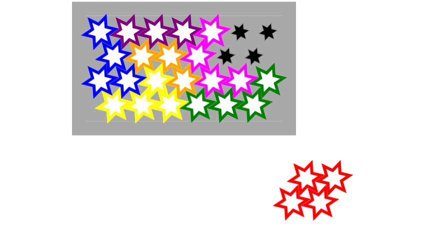
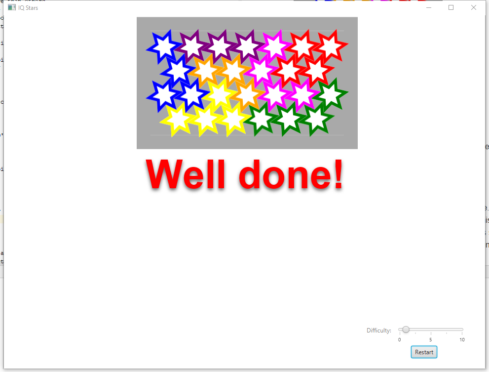

# Assignment One Feedback
## Tutor Comment

It would be beneficial to use comments throughout your code so other people can more easily understand what is happening
at a given time. Your naming of variables is great! I could tell exactly what a variable was storing without reading
through all the loops of your code.
Your task 6 is quite lengthy declaring all the hexes. There's nothing wrong with this, but it's usually better to avoid
this where possible. Think: could you create a new Hex at the origin for each shape, and then just translate and rotate
that Hex based on what orientation it is in? Is there a mathematical relationship between these values?
There wont always be, but hard-coding each piece's location based on each orientation is usually not the way you want to
do things. - Imagine if you had 1000 pieces? That would take a long time to code!

Overall, good work!


## Mark

**  4.0/5.0**

## Miscellaneous marks

| Level | Requirement | Result |
|:-:|---|:-:|
|P|Forked assignment 1 repository | 0.5/0.5 |
|P|Originality statement edited, committed, pushed | 0.5/0.5 |
|P|Git log file reveals healthy use of Git | 0.25/0.25 |
|P|Edited classes compile correctly | 0.5/0.5 |
|CR|Code is of high quality | 0.35/0.35 |
|HD|Task 8 generate good solution | 0/0.25 |
|HD|Solution is outstanding in its design and implementation | 0/0.25 |

**Total for miscellaneous marks:** 2.1/2.6

## Test results

| Task | Test | Result | Worth |
|:-:|---|:-:|:-:|
|2|PieceFixed|2/2|.4|
|3|ValidPiecePlacement|4/4|.4|
|4|SimpleObjective|3/3|.4|
|5|FixOrientations|5/5|.4|
|6|GetCovered|6/6|.3|
|7|FindSolutions|0/6|.3|
|8|InterestingObjective|0/3|.2|


**Total for tests:** 1.9/2.4


## Statement of Originality

I declare that the work I have submitted for assignment one is entirely my own work, with the following documented exceptions:

* The idea of <using boolean to return in task3: isValidPiecePlacement() > came from a discussion with < Zeyu Gong>


Signed: Xinyu Kang (u6120911)

## Git Log
```
commit 3d2bdfedaeb0b555c4c8fc82d6374cc65f0b8e0d
Author: Xinyu Kang <u6120911@anu.edu.au>
Date:   Wed Mar 13 20:39:33 2019 +1100

    Update originality.md

commit 00c19487ae6f0d6cbdaa377d5e1bdeb62b12c821
Author: u6120911 <u6120911@anu.edu.au>
Date:   Wed Mar 13 20:34:37 2019 +1100

    Finished task 1~6 and passed all the tests

commit 2a82b0f2f8c92e14aeed6eca892a53be7ce815cb
Merge: fec0ff3 cfaffa4
Author: u6120911 <u6120911@anu.edu.au>
Date:   Sun Mar 10 15:20:11 2019 +1100

    Merge remote-tracking branch 'origin/master'

commit fec0ff3ae2be5f204d5b385b13f8c979c5fb6286
Author: u6120911 <u6120911@anu.edu.au>
Date:   Sun Mar 10 15:18:17 2019 +1100

    Finished task 1~6 and passes all the tests

commit cfaffa4ca11570b2b06c07917beca8cbb2c49117
Author: Xinyu Kang <u6120911@anu.edu.au>
Date:   Sun Mar 10 15:11:40 2019 +1100

    Update originality.md

commit 22af4393bd06c8365fd0067ce5a7b07290e12d3b
Author: milthorpe <josh.milthorpe@gmail.com>
Date:   Wed Feb 27 21:21:37 2019 +1100

    fix documentation for Task 4

commit 3da7a53708d401ba707cb02cbd30ec3619bec8c2
Author: milthorpe <josh.milthorpe@gmail.com>
Date:   Tue Feb 26 06:59:50 2019 +1100

    .gitignore

commit 2e44b61316cf554c82375242d8d2ca1fcc5a30e1
Author: Josh Milthorpe <josh.milthorpe@anu.edu.au>
Date:   Tue Feb 26 06:57:00 2019 +1100

    remove unnecessary print from test

commit 510745b0737ae5699f43897a9c5607bf635ffa7a
Author: Josh Milthorpe <josh.milthorpe@anu.edu.au>
Date:   Tue Feb 26 02:04:45 2019 +1100

    fix marking scheme

commit 7ebb3951fd0b612b2d6f7f922a4090c301809976
Author: milthorpe <josh.milthorpe@gmail.com>
Date:   Tue Feb 26 02:02:53 2019 +1100

    assignment released
```
## Changes
``` diff
diff -ru -x .git /students/u3179443/comp1110/comp1110-tutors/bin/../master/comp1110-ass1/comp1110-ass1.iml comp1110-ass1/comp1110-ass1.iml
--- /students/u3179443/comp1110/comp1110-tutors/bin/../master/comp1110-ass1/comp1110-ass1.iml	2019-03-06 22:09:21.000000000 +1100
+++ comp1110-ass1/comp1110-ass1.iml	2019-03-15 22:32:06.887660191 +1100
@@ -1,23 +1,23 @@
-<?xml version="1.0" encoding="UTF-8"?>
-<module type="JAVA_MODULE" version="4">
-  <component name="NewModuleRootManager" inherit-compiler-output="true">
-    <exclude-output />
-    <content url="file://$MODULE_DIR$">
-      <sourceFolder url="file://$MODULE_DIR$/src" isTestSource="false" />
-      <sourceFolder url="file://$MODULE_DIR$/tests" isTestSource="true" />
-    </content>
-    <orderEntry type="inheritedJdk" />
-    <orderEntry type="sourceFolder" forTests="false" />
-    <orderEntry type="module-library" scope="TEST">
-      <library name="JUnit4">
-        <CLASSES>
-          <root url="jar://$APPLICATION_HOME_DIR$/lib/junit-4.12.jar!/" />
-          <root url="jar://$APPLICATION_HOME_DIR$/lib/hamcrest-core-1.3.jar!/" />
-        </CLASSES>
-        <JAVADOC />
-        <SOURCES />
-      </library>
-    </orderEntry>
-    <orderEntry type="library" name="lib" level="project" />
-  </component>
+<?xml version="1.0" encoding="UTF-8"?>
+<module type="JAVA_MODULE" version="4">
+  <component name="NewModuleRootManager" inherit-compiler-output="true">
+    <exclude-output />
+    <content url="file://$MODULE_DIR$">
+      <sourceFolder url="file://$MODULE_DIR$/src" isTestSource="false" />
+      <sourceFolder url="file://$MODULE_DIR$/tests" isTestSource="true" />
+    </content>
+    <orderEntry type="inheritedJdk" />
+    <orderEntry type="sourceFolder" forTests="false" />
+    <orderEntry type="module-library" scope="TEST">
+      <library name="JUnit4">
+        <CLASSES>
+          <root url="jar://$APPLICATION_HOME_DIR$/lib/junit-4.12.jar!/" />
+          <root url="jar://$APPLICATION_HOME_DIR$/lib/hamcrest-core-1.3.jar!/" />
+        </CLASSES>
+        <JAVADOC />
+        <SOURCES />
+      </library>
+    </orderEntry>
+    <orderEntry type="library" name="lib" level="project" />
+  </component>
 </module>
\ No newline at end of file
Only in comp1110-ass1: feedback.md
diff -ru -x .git /students/u3179443/comp1110/comp1110-tutors/bin/../master/comp1110-ass1/.gitignore comp1110-ass1/.gitignore
--- /students/u3179443/comp1110/comp1110-tutors/bin/../master/comp1110-ass1/.gitignore	2019-03-06 22:09:21.000000000 +1100
+++ comp1110-ass1/.gitignore	2019-03-15 22:32:06.835659907 +1100
@@ -1,15 +1,15 @@
-clean.zip
-bin
-out
-.idea/workspace.xml
-.idea/uiDesigner.xml
-.idea/vcs.xml
-.idea/workspace.xml
-.idea/compiler.xml
-.idea/copyright/
-.idea/codeStyles/
-.idea/emacs.xml
-.idea/encodings.xml
-.idea/gradle.xml
-.idea/description.html
-
+clean.zip
+bin
+out
+.idea/workspace.xml
+.idea/uiDesigner.xml
+.idea/vcs.xml
+.idea/workspace.xml
+.idea/compiler.xml
+.idea/copyright/
+.idea/codeStyles/
+.idea/emacs.xml
+.idea/encodings.xml
+.idea/gradle.xml
+.idea/description.html
+
Only in /students/u3179443/comp1110/comp1110-tutors/bin/../master/comp1110-ass1/.idea: encodings.xml
diff -ru -x .git /students/u3179443/comp1110/comp1110-tutors/bin/../master/comp1110-ass1/.idea/libraries/lib.xml comp1110-ass1/.idea/libraries/lib.xml
--- /students/u3179443/comp1110/comp1110-tutors/bin/../master/comp1110-ass1/.idea/libraries/lib.xml	2019-03-06 22:09:21.000000000 +1100
+++ comp1110-ass1/.idea/libraries/lib.xml	2019-03-15 22:32:06.839659929 +1100
@@ -1,13 +1,13 @@
-<component name="libraryTable">
-  <library name="lib">
-    <CLASSES>
-      <root url="file://$PATH_TO_FX$" />
-    </CLASSES>
-    <JAVADOC />
-    <SOURCES>
-      <root url="file://$PATH_TO_FX$" />
-    </SOURCES>
-    <jarDirectory url="file://$PATH_TO_FX$" recursive="false" />
-    <jarDirectory url="file://$PATH_TO_FX$" recursive="false" type="SOURCES" />
-  </library>
+<component name="libraryTable">
+  <library name="lib">
+    <CLASSES>
+      <root url="file://$PATH_TO_FX$" />
+    </CLASSES>
+    <JAVADOC />
+    <SOURCES>
+      <root url="file://$PATH_TO_FX$" />
+    </SOURCES>
+    <jarDirectory url="file://$PATH_TO_FX$" recursive="false" />
+    <jarDirectory url="file://$PATH_TO_FX$" recursive="false" type="SOURCES" />
+  </library>
 </component>
\ No newline at end of file
diff -ru -x .git /students/u3179443/comp1110/comp1110-tutors/bin/../master/comp1110-ass1/.idea/misc.xml comp1110-ass1/.idea/misc.xml
--- /students/u3179443/comp1110/comp1110-tutors/bin/../master/comp1110-ass1/.idea/misc.xml	2019-03-06 22:09:21.000000000 +1100
+++ comp1110-ass1/.idea/misc.xml	2019-03-15 22:32:06.843659951 +1100
@@ -1,6 +1,6 @@
-<?xml version="1.0" encoding="UTF-8"?>
-<project version="4">
-  <component name="ProjectRootManager" version="2" languageLevel="JDK_11" default="false" project-jdk-name="11" project-jdk-type="JavaSDK">
-    <output url="file://$PROJECT_DIR$/out" />
-  </component>
+<?xml version="1.0" encoding="UTF-8"?>
+<project version="4">
+  <component name="ProjectRootManager" version="2" languageLevel="JDK_11" default="false" project-jdk-name="11" project-jdk-type="JavaSDK">
+    <output url="file://$PROJECT_DIR$/out" />
+  </component>
 </project>
\ No newline at end of file
diff -ru -x .git /students/u3179443/comp1110/comp1110-tutors/bin/../master/comp1110-ass1/.idea/modules.xml comp1110-ass1/.idea/modules.xml
--- /students/u3179443/comp1110/comp1110-tutors/bin/../master/comp1110-ass1/.idea/modules.xml	2019-03-06 22:09:21.000000000 +1100
+++ comp1110-ass1/.idea/modules.xml	2019-03-15 22:32:06.843659951 +1100
@@ -1,8 +1,8 @@
-<?xml version="1.0" encoding="UTF-8"?>
-<project version="4">
-  <component name="ProjectModuleManager">
-    <modules>
-      <module fileurl="file://$PROJECT_DIR$/comp1110-ass1.iml" filepath="$PROJECT_DIR$/comp1110-ass1.iml" />
-    </modules>
-  </component>
+<?xml version="1.0" encoding="UTF-8"?>
+<project version="4">
+  <component name="ProjectModuleManager">
+    <modules>
+      <module fileurl="file://$PROJECT_DIR$/comp1110-ass1.iml" filepath="$PROJECT_DIR$/comp1110-ass1.iml" />
+    </modules>
+  </component>
 </project>
\ No newline at end of file
diff -ru -x .git /students/u3179443/comp1110/comp1110-tutors/bin/../master/comp1110-ass1/.idea/runConfigurations/Game.xml comp1110-ass1/.idea/runConfigurations/Game.xml
--- /students/u3179443/comp1110/comp1110-tutors/bin/../master/comp1110-ass1/.idea/runConfigurations/Game.xml	2019-03-06 22:09:21.000000000 +1100
+++ comp1110-ass1/.idea/runConfigurations/Game.xml	2019-03-15 22:32:06.847659973 +1100
@@ -1,16 +1,16 @@
-<component name="ProjectRunConfigurationManager">
-  <configuration default="false" name="Game" type="Application" factoryName="Application" nameIsGenerated="true">
-    <option name="MAIN_CLASS_NAME" value="comp1110.ass1.gui.Game" />
-    <module name="comp1110-ass1" />
-    <option name="VM_PARAMETERS" value="--module-path ${PATH_TO_FX} --add-modules=javafx.controls,javafx.fxml,javafx.media" />
-    <extension name="coverage">
-      <pattern>
-        <option name="PATTERN" value="comp1110.ass1.*" />
-        <option name="ENABLED" value="true" />
-      </pattern>
-    </extension>
-    <method v="2">
-      <option name="Make" enabled="true" />
-    </method>
-  </configuration>
+<component name="ProjectRunConfigurationManager">
+  <configuration default="false" name="Game" type="Application" factoryName="Application" nameIsGenerated="true">
+    <option name="MAIN_CLASS_NAME" value="comp1110.ass1.gui.Game" />
+    <module name="comp1110-ass1" />
+    <option name="VM_PARAMETERS" value="--module-path ${PATH_TO_FX} --add-modules=javafx.controls,javafx.fxml,javafx.media" />
+    <extension name="coverage">
+      <pattern>
+        <option name="PATTERN" value="comp1110.ass1.*" />
+        <option name="ENABLED" value="true" />
+      </pattern>
+    </extension>
+    <method v="2">
+      <option name="Make" enabled="true" />
+    </method>
+  </configuration>
 </component>
\ No newline at end of file
diff -ru -x .git /students/u3179443/comp1110/comp1110-tutors/bin/../master/comp1110-ass1/.idea/runConfigurations/T02_PieceFixedTest.xml comp1110-ass1/.idea/runConfigurations/T02_PieceFixedTest.xml
--- /students/u3179443/comp1110/comp1110-tutors/bin/../master/comp1110-ass1/.idea/runConfigurations/T02_PieceFixedTest.xml	2019-03-06 22:09:21.000000000 +1100
+++ comp1110-ass1/.idea/runConfigurations/T02_PieceFixedTest.xml	2019-03-15 22:32:06.847659973 +1100
@@ -1,28 +1,28 @@
-<component name="ProjectRunConfigurationManager">
-  <configuration default="false" name="T02 PieceFixedTest" type="JUnit" factoryName="JUnit">
-    <extension name="coverage" enabled="false" merge="false" sample_coverage="true" runner="idea">
-      <pattern>
-        <option name="PATTERN" value="comp1110.ass1.*" />
-        <option name="ENABLED" value="true" />
-      </pattern>
-    </extension>
-    <module name="comp1110-ass1" />
-    <option name="ALTERNATIVE_JRE_PATH_ENABLED" value="false" />
-    <option name="ALTERNATIVE_JRE_PATH" />
-    <option name="PACKAGE_NAME" value="comp1110.ass1" />
-    <option name="MAIN_CLASS_NAME" value="comp1110.ass1.PieceFixedTest" />
-    <option name="METHOD_NAME" value="" />
-    <option name="TEST_OBJECT" value="class" />
-    <option name="VM_PARAMETERS" value="-ea" />
-    <option name="PARAMETERS" value="" />
-    <option name="WORKING_DIRECTORY" value="file://$MODULE_DIR$" />
-    <option name="ENV_VARIABLES" />
-    <option name="PASS_PARENT_ENVS" value="true" />
-    <option name="TEST_SEARCH_SCOPE">
-      <value defaultName="singleModule" />
-    </option>
-    <envs />
-    <patterns />
-    <method />
-  </configuration>
+<component name="ProjectRunConfigurationManager">
+  <configuration default="false" name="T02 PieceFixedTest" type="JUnit" factoryName="JUnit">
+    <extension name="coverage" enabled="false" merge="false" sample_coverage="true" runner="idea">
+      <pattern>
+        <option name="PATTERN" value="comp1110.ass1.*" />
+        <option name="ENABLED" value="true" />
+      </pattern>
+    </extension>
+    <module name="comp1110-ass1" />
+    <option name="ALTERNATIVE_JRE_PATH_ENABLED" value="false" />
+    <option name="ALTERNATIVE_JRE_PATH" />
+    <option name="PACKAGE_NAME" value="comp1110.ass1" />
+    <option name="MAIN_CLASS_NAME" value="comp1110.ass1.PieceFixedTest" />
+    <option name="METHOD_NAME" value="" />
+    <option name="TEST_OBJECT" value="class" />
+    <option name="VM_PARAMETERS" value="-ea" />
+    <option name="PARAMETERS" value="" />
+    <option name="WORKING_DIRECTORY" value="file://$MODULE_DIR$" />
+    <option name="ENV_VARIABLES" />
+    <option name="PASS_PARENT_ENVS" value="true" />
+    <option name="TEST_SEARCH_SCOPE">
+      <value defaultName="singleModule" />
+    </option>
+    <envs />
+    <patterns />
+    <method />
+  </configuration>
 </component>
\ No newline at end of file
diff -ru -x .git /students/u3179443/comp1110/comp1110-tutors/bin/../master/comp1110-ass1/.idea/runConfigurations/T03_ValidPiecePlacementTest.xml comp1110-ass1/.idea/runConfigurations/T03_ValidPiecePlacementTest.xml
--- /students/u3179443/comp1110/comp1110-tutors/bin/../master/comp1110-ass1/.idea/runConfigurations/T03_ValidPiecePlacementTest.xml	2019-03-06 22:09:21.000000000 +1100
+++ comp1110-ass1/.idea/runConfigurations/T03_ValidPiecePlacementTest.xml	2019-03-15 22:32:06.851659994 +1100
@@ -1,20 +1,20 @@
-<component name="ProjectRunConfigurationManager">
-  <configuration default="false" name="T03 ValidPiecePlacementTest" type="JUnit" factoryName="JUnit">
-    <module name="comp1110-ass1" />
-    <extension name="coverage">
-      <pattern>
-        <option name="PATTERN" value="comp1110.ass1.*" />
-        <option name="ENABLED" value="true" />
-      </pattern>
-    </extension>
-    <option name="PACKAGE_NAME" value="comp1110.ass1" />
-    <option name="MAIN_CLASS_NAME" value="comp1110.ass1.ValidPiecePlacementTest" />
-    <option name="METHOD_NAME" value="" />
-    <option name="TEST_OBJECT" value="class" />
-    <option name="PARAMETERS" value="" />
-    <option name="WORKING_DIRECTORY" value="%MODULE_WORKING_DIR%" />
-    <method v="2">
-      <option name="Make" enabled="true" />
-    </method>
-  </configuration>
+<component name="ProjectRunConfigurationManager">
+  <configuration default="false" name="T03 ValidPiecePlacementTest" type="JUnit" factoryName="JUnit">
+    <module name="comp1110-ass1" />
+    <extension name="coverage">
+      <pattern>
+        <option name="PATTERN" value="comp1110.ass1.*" />
+        <option name="ENABLED" value="true" />
+      </pattern>
+    </extension>
+    <option name="PACKAGE_NAME" value="comp1110.ass1" />
+    <option name="MAIN_CLASS_NAME" value="comp1110.ass1.ValidPiecePlacementTest" />
+    <option name="METHOD_NAME" value="" />
+    <option name="TEST_OBJECT" value="class" />
+    <option name="PARAMETERS" value="" />
+    <option name="WORKING_DIRECTORY" value="%MODULE_WORKING_DIR%" />
+    <method v="2">
+      <option name="Make" enabled="true" />
+    </method>
+  </configuration>
 </component>
\ No newline at end of file
diff -ru -x .git /students/u3179443/comp1110/comp1110-tutors/bin/../master/comp1110-ass1/.idea/runConfigurations/T04_SimpleObjectiveTest.xml comp1110-ass1/.idea/runConfigurations/T04_SimpleObjectiveTest.xml
--- /students/u3179443/comp1110/comp1110-tutors/bin/../master/comp1110-ass1/.idea/runConfigurations/T04_SimpleObjectiveTest.xml	2019-03-06 22:09:21.000000000 +1100
+++ comp1110-ass1/.idea/runConfigurations/T04_SimpleObjectiveTest.xml	2019-03-15 22:32:06.851659994 +1100
@@ -1,20 +1,20 @@
-<component name="ProjectRunConfigurationManager">
-  <configuration default="false" name="T04 SimpleObjectiveTest" type="JUnit" factoryName="JUnit">
-    <module name="comp1110-ass1" />
-    <extension name="coverage">
-      <pattern>
-        <option name="PATTERN" value="comp1110.ass1.*" />
-        <option name="ENABLED" value="true" />
-      </pattern>
-    </extension>
-    <option name="PACKAGE_NAME" value="comp1110.ass1" />
-    <option name="MAIN_CLASS_NAME" value="comp1110.ass1.SimpleObjectiveTest" />
-    <option name="METHOD_NAME" value="" />
-    <option name="TEST_OBJECT" value="class" />
-    <option name="PARAMETERS" value="" />
-    <option name="WORKING_DIRECTORY" value="$MODULE_DIR$" />
-    <method v="2">
-      <option name="Make" enabled="true" />
-    </method>
-  </configuration>
+<component name="ProjectRunConfigurationManager">
+  <configuration default="false" name="T04 SimpleObjectiveTest" type="JUnit" factoryName="JUnit">
+    <module name="comp1110-ass1" />
+    <extension name="coverage">
+      <pattern>
+        <option name="PATTERN" value="comp1110.ass1.*" />
+        <option name="ENABLED" value="true" />
+      </pattern>
+    </extension>
+    <option name="PACKAGE_NAME" value="comp1110.ass1" />
+    <option name="MAIN_CLASS_NAME" value="comp1110.ass1.SimpleObjectiveTest" />
+    <option name="METHOD_NAME" value="" />
+    <option name="TEST_OBJECT" value="class" />
+    <option name="PARAMETERS" value="" />
+    <option name="WORKING_DIRECTORY" value="$MODULE_DIR$" />
+    <method v="2">
+      <option name="Make" enabled="true" />
+    </method>
+  </configuration>
 </component>
\ No newline at end of file
diff -ru -x .git /students/u3179443/comp1110/comp1110-tutors/bin/../master/comp1110-ass1/.idea/runConfigurations/T05_FixOrientationsTest.xml comp1110-ass1/.idea/runConfigurations/T05_FixOrientationsTest.xml
--- /students/u3179443/comp1110/comp1110-tutors/bin/../master/comp1110-ass1/.idea/runConfigurations/T05_FixOrientationsTest.xml	2019-03-06 22:09:21.000000000 +1100
+++ comp1110-ass1/.idea/runConfigurations/T05_FixOrientationsTest.xml	2019-03-15 22:32:06.855660016 +1100
@@ -1,20 +1,20 @@
-<component name="ProjectRunConfigurationManager">
-  <configuration default="false" name="T05 FixOrientationsTest" type="JUnit" factoryName="JUnit">
-    <module name="comp1110-ass1" />
-    <extension name="coverage">
-      <pattern>
-        <option name="PATTERN" value="comp1110.ass1.*" />
-        <option name="ENABLED" value="true" />
-      </pattern>
-    </extension>
-    <option name="PACKAGE_NAME" value="comp1110.ass1" />
-    <option name="MAIN_CLASS_NAME" value="comp1110.ass1.FixOrientationsTest" />
-    <option name="METHOD_NAME" value="" />
-    <option name="TEST_OBJECT" value="class" />
-    <option name="PARAMETERS" value="" />
-    <option name="WORKING_DIRECTORY" value="$MODULE_DIR$" />
-    <method v="2">
-      <option name="Make" enabled="true" />
-    </method>
-  </configuration>
+<component name="ProjectRunConfigurationManager">
+  <configuration default="false" name="T05 FixOrientationsTest" type="JUnit" factoryName="JUnit">
+    <module name="comp1110-ass1" />
+    <extension name="coverage">
+      <pattern>
+        <option name="PATTERN" value="comp1110.ass1.*" />
+        <option name="ENABLED" value="true" />
+      </pattern>
+    </extension>
+    <option name="PACKAGE_NAME" value="comp1110.ass1" />
+    <option name="MAIN_CLASS_NAME" value="comp1110.ass1.FixOrientationsTest" />
+    <option name="METHOD_NAME" value="" />
+    <option name="TEST_OBJECT" value="class" />
+    <option name="PARAMETERS" value="" />
+    <option name="WORKING_DIRECTORY" value="$MODULE_DIR$" />
+    <method v="2">
+      <option name="Make" enabled="true" />
+    </method>
+  </configuration>
 </component>
\ No newline at end of file
diff -ru -x .git /students/u3179443/comp1110/comp1110-tutors/bin/../master/comp1110-ass1/.idea/runConfigurations/T06_GetCoveredTest.xml comp1110-ass1/.idea/runConfigurations/T06_GetCoveredTest.xml
--- /students/u3179443/comp1110/comp1110-tutors/bin/../master/comp1110-ass1/.idea/runConfigurations/T06_GetCoveredTest.xml	2019-03-06 22:09:21.000000000 +1100
+++ comp1110-ass1/.idea/runConfigurations/T06_GetCoveredTest.xml	2019-03-15 22:32:06.855660016 +1100
@@ -1,20 +1,20 @@
-<component name="ProjectRunConfigurationManager">
-  <configuration default="false" name="T06 GetCoveredTest" type="JUnit" factoryName="JUnit">
-    <module name="comp1110-ass1" />
-    <extension name="coverage">
-      <pattern>
-        <option name="PATTERN" value="comp1110.ass1.*" />
-        <option name="ENABLED" value="true" />
-      </pattern>
-    </extension>
-    <option name="PACKAGE_NAME" value="comp1110.ass1" />
-    <option name="MAIN_CLASS_NAME" value="comp1110.ass1.GetCoveredTest" />
-    <option name="METHOD_NAME" value="" />
-    <option name="TEST_OBJECT" value="class" />
-    <option name="PARAMETERS" value="" />
-    <option name="WORKING_DIRECTORY" value="$MODULE_DIR$" />
-    <method v="2">
-      <option name="Make" enabled="true" />
-    </method>
-  </configuration>
+<component name="ProjectRunConfigurationManager">
+  <configuration default="false" name="T06 GetCoveredTest" type="JUnit" factoryName="JUnit">
+    <module name="comp1110-ass1" />
+    <extension name="coverage">
+      <pattern>
+        <option name="PATTERN" value="comp1110.ass1.*" />
+        <option name="ENABLED" value="true" />
+      </pattern>
+    </extension>
+    <option name="PACKAGE_NAME" value="comp1110.ass1" />
+    <option name="MAIN_CLASS_NAME" value="comp1110.ass1.GetCoveredTest" />
+    <option name="METHOD_NAME" value="" />
+    <option name="TEST_OBJECT" value="class" />
+    <option name="PARAMETERS" value="" />
+    <option name="WORKING_DIRECTORY" value="$MODULE_DIR$" />
+    <method v="2">
+      <option name="Make" enabled="true" />
+    </method>
+  </configuration>
 </component>
\ No newline at end of file
diff -ru -x .git /students/u3179443/comp1110/comp1110-tutors/bin/../master/comp1110-ass1/.idea/runConfigurations/T07_FindSolutionsTest.xml comp1110-ass1/.idea/runConfigurations/T07_FindSolutionsTest.xml
--- /students/u3179443/comp1110/comp1110-tutors/bin/../master/comp1110-ass1/.idea/runConfigurations/T07_FindSolutionsTest.xml	2019-03-06 22:09:21.000000000 +1100
+++ comp1110-ass1/.idea/runConfigurations/T07_FindSolutionsTest.xml	2019-03-15 22:32:06.859660039 +1100
@@ -1,20 +1,20 @@
-<component name="ProjectRunConfigurationManager">
-  <configuration default="false" name="T07 FindSolutionsTest" type="JUnit" factoryName="JUnit">
-    <module name="comp1110-ass1" />
-    <extension name="coverage">
-      <pattern>
-        <option name="PATTERN" value="comp1110.ass1.*" />
-        <option name="ENABLED" value="true" />
-      </pattern>
-    </extension>
-    <option name="PACKAGE_NAME" value="comp1110.ass1" />
-    <option name="MAIN_CLASS_NAME" value="comp1110.ass1.FindSolutionsTest" />
-    <option name="METHOD_NAME" value="" />
-    <option name="TEST_OBJECT" value="class" />
-    <option name="PARAMETERS" value="" />
-    <option name="WORKING_DIRECTORY" value="$MODULE_DIR$" />
-    <method v="2">
-      <option name="Make" enabled="true" />
-    </method>
-  </configuration>
+<component name="ProjectRunConfigurationManager">
+  <configuration default="false" name="T07 FindSolutionsTest" type="JUnit" factoryName="JUnit">
+    <module name="comp1110-ass1" />
+    <extension name="coverage">
+      <pattern>
+        <option name="PATTERN" value="comp1110.ass1.*" />
+        <option name="ENABLED" value="true" />
+      </pattern>
+    </extension>
+    <option name="PACKAGE_NAME" value="comp1110.ass1" />
+    <option name="MAIN_CLASS_NAME" value="comp1110.ass1.FindSolutionsTest" />
+    <option name="METHOD_NAME" value="" />
+    <option name="TEST_OBJECT" value="class" />
+    <option name="PARAMETERS" value="" />
+    <option name="WORKING_DIRECTORY" value="$MODULE_DIR$" />
+    <method v="2">
+      <option name="Make" enabled="true" />
+    </method>
+  </configuration>
 </component>
\ No newline at end of file
diff -ru -x .git /students/u3179443/comp1110/comp1110-tutors/bin/../master/comp1110-ass1/.idea/runConfigurations/T08_InterestingObjectiveTest.xml comp1110-ass1/.idea/runConfigurations/T08_InterestingObjectiveTest.xml
--- /students/u3179443/comp1110/comp1110-tutors/bin/../master/comp1110-ass1/.idea/runConfigurations/T08_InterestingObjectiveTest.xml	2019-03-06 22:09:21.000000000 +1100
+++ comp1110-ass1/.idea/runConfigurations/T08_InterestingObjectiveTest.xml	2019-03-15 22:32:06.859660039 +1100
@@ -1,20 +1,20 @@
-<component name="ProjectRunConfigurationManager">
-  <configuration default="false" name="T08 InterestingObjectiveTest" type="JUnit" factoryName="JUnit">
-    <module name="comp1110-ass1" />
-    <extension name="coverage">
-      <pattern>
-        <option name="PATTERN" value="comp1110.ass1.*" />
-        <option name="ENABLED" value="true" />
-      </pattern>
-    </extension>
-    <option name="PACKAGE_NAME" value="comp1110.ass1" />
-    <option name="MAIN_CLASS_NAME" value="comp1110.ass1.InterestingObjectiveTest" />
-    <option name="METHOD_NAME" value="" />
-    <option name="TEST_OBJECT" value="class" />
-    <option name="PARAMETERS" value="" />
-    <option name="WORKING_DIRECTORY" value="$MODULE_DIR$" />
-    <method v="2">
-      <option name="Make" enabled="true" />
-    </method>
-  </configuration>
+<component name="ProjectRunConfigurationManager">
+  <configuration default="false" name="T08 InterestingObjectiveTest" type="JUnit" factoryName="JUnit">
+    <module name="comp1110-ass1" />
+    <extension name="coverage">
+      <pattern>
+        <option name="PATTERN" value="comp1110.ass1.*" />
+        <option name="ENABLED" value="true" />
+      </pattern>
+    </extension>
+    <option name="PACKAGE_NAME" value="comp1110.ass1" />
+    <option name="MAIN_CLASS_NAME" value="comp1110.ass1.InterestingObjectiveTest" />
+    <option name="METHOD_NAME" value="" />
+    <option name="TEST_OBJECT" value="class" />
+    <option name="PARAMETERS" value="" />
+    <option name="WORKING_DIRECTORY" value="$MODULE_DIR$" />
+    <method v="2">
+      <option name="Make" enabled="true" />
+    </method>
+  </configuration>
 </component>
\ No newline at end of file
Only in /students/u3179443/comp1110/comp1110-tutors/bin/../master/comp1110-ass1/.idea: vcs.xml
Only in /students/u3179443/comp1110/comp1110-tutors/bin/../master/comp1110-ass1/.idea: workspace.xml
diff -ru -x .git /students/u3179443/comp1110/comp1110-tutors/bin/../master/comp1110-ass1/originality.md comp1110-ass1/originality.md
--- /students/u3179443/comp1110/comp1110-tutors/bin/../master/comp1110-ass1/originality.md	2019-03-06 22:09:21.000000000 +1100
+++ comp1110-ass1/originality.md	2019-03-15 22:32:06.887660191 +1100
@@ -1,14 +1,13 @@
-# COMP1110 Assignment 1
-
-**Every student must edit the following statement of originality and commit it as part of their assignment submission.**
-Your assignment **will not** be marked unless you have completed this statement.
-
-## Statement of Originality
-
-I declare that the work I have submitted for assignment one is entirely my own work, with the following documented exceptions:
-
-* The idea of <...> came from a discussion with <...>
-
-* The code in class <...> uses an idea suggested by <...>
-
-Signed: Mary Jones (u2345678)
\ No newline at end of file
+# COMP1110 Assignment 1
+
+**Every student must edit the following statement of originality and commit it as part of their assignment submission.**
+Your assignment **will not** be marked unless you have completed this statement.
+
+## Statement of Originality
+
+I declare that the work I have submitted for assignment one is entirely my own work, with the following documented exceptions:
+
+* The idea of <using boolean to return in task3: isValidPiecePlacement() > came from a discussion with < Zeyu Gong>
+
+
+Signed: Xinyu Kang (u6120911)
\ No newline at end of file
diff -ru -x .git /students/u3179443/comp1110/comp1110-tutors/bin/../master/comp1110-ass1/README.md comp1110-ass1/README.md
--- /students/u3179443/comp1110/comp1110-tutors/bin/../master/comp1110-ass1/README.md	2019-03-06 22:09:21.000000000 +1100
+++ comp1110-ass1/README.md	2019-03-15 22:32:06.859660039 +1100
@@ -1,163 +1,163 @@
-# COMP1110 Assignment 1
-
-## Academic Honesty and Integrity
-
-Honesty and integrity are of utmost importance. These goals are *not* at odds
-with being resourceful and working collaboratively. You *should* be resourceful
-and you should discuss the assignment
-and other aspects of the course with others taking the class. However, *you must
-never misrepresent the work of others as your own*. If you have taken ideas from
-elsewhere or used code sourced from elsewhere, you must say so with *utmost
-clarity*. At each stage of the assignment you will be asked to submit a statement
-of originality, either as a group or as individuals. This statement is the place
-for you to declare which ideas or code contained in your submission were sourced
-from elsewhere.
-
-Please read the ANU's [official position](http://academichonesty.anu.edu.au/) on
-academic honesty. If you have any questions, please ask me.
-
-Carefully review the [statement of originality](originality.md) which you must
-complete.  Edit that statement and update it as you complete the assignment,
-ensuring that when you complete the assignment, a truthful statement is committed
-and pushed to your repo.
-
-## Purpose
-
-In this assignment is introductory, helping you gain familiarity with the basics
-of Java, but doing so in the context of slightly larger piece of code.  Most
-of the assignment is composed of a series of small tasks.
-
-## Assignment Deliverable
-
-The assignment is worth 5% of your total assessment, and it will be marked out of 5.
-However, these marks are [redeemable](https://cs.anu.edu.au/courses/comp1110/assessments/redeemable/) by the exam, so if
-your exam mark / 20 is higher than your assignment one mark, you will get the exam mark / 20 rather than the assignment one mark.
-**The mark breakdown is described on the [deliverables](https://cs.anu.edu.au/courses/comp1110/assessments/deliverables/#D1A) page.**
-
-The assignment is due at **[11:45 Friday Week 3](https://www.timeanddate.com/worldclock/fixedtime.html?msg=Assignment+1+Due&iso=20190315T0045&p1=%253A), 15 March 2019**
-([time remaining](https://www.timeanddate.com/countdown/generic?p0=1440&iso=20190315T0045&msg=Assignment%201%20Due)).
-You can find [this deadline](https://cs.anu.edu.au/courses/comp1110/assessments/deliverables/#D1A)
-on the [deliverables page](https://cs.anu.edu.au/courses/comp1110/assessments/deliverables/), where all assignment deadlines for this semester are
-listed.
-Your tutor will mark your assignment by accessing your GitLab repository, so it is essential that you carefully follow
-instructions for setting up and maintaining your repository.
-You will be marked according to **whatever is committed to your repository at the time of the deadline**.
-Since the first assignment is redeemable, **[late extensions are not offered and will not be given](https://cs.anu.edu.au/courses/comp1110/deadlines/)**.
-As always throughout the course, if a personal circumstance arises that affects your capacity to complete the course,
-please carefully follow the ANU's [special consideration process](http://www.anu.edu.au/students/program-administration/assessments-exams/special-assessment-consideration),
-and your circumstances will be accounted for in your final assessment.
-
-## Overview
-
-This assignment is based on a puzzle game called
-[IQ Stars](https://www.smartgames.eu/uk/one-player-games/iq-stars).
-
-The game is played on a board consisting of 26 star-shaped spaces in a hexagonal grid.
-There are seven puzzle pieces which are composed of various numbers of linked stars, arranged in different shapes so that they may be placed on the grid.
-As an example, the 'C' piece is shown below:
-
-
-
-To begin the puzzle, the player is provided with a starting position
-in which the positions and orientations of some of the pieces are fixed.
-The objective is to place the remaining pieces so that the grid is completely covered.
-Pieces may not overlap.
-
-Pieces can be moved onto the board by clicking and dragging with the mouse.
-They can be rotated using the scroll wheel (or equivalent scroll function).
-
-Each time the puzzle is played the objective may be different.
-Some objectives are easier to solve than others. 
-The puzzle is designed so that the player may specify a difficulty level.
-The puzzle comes packaged with a booklet of objectives of different difficulty levels, each with multiple different objectives.
-In our version, the user may select the level of difficulty on a slider.
-
-The images below show the progression of a simple game.
-
-The game starts with some of the pieces already placed. The location and orientation of these pieces is fixed, and may not be changed by the player.
-These pieces form the objective of the puzzle.
-
-
-
-The player then starts placing pieces. First they move the orange 'B' piece so that its origin is in the 'I' hex.
-
-
-
-The player then rotates the red 'D' piece twice (i.e. by 120 degrees), to the 'C' orientation.
-
-
-
-Finally the player moves the 'D' piece to the top-right corner of the board, at hex 'G'.
-The puzzle is now complete.
-
-
-
-The player can start a new game by selecting a difficulty level and
-pressing the 'Restart' button.
-
-### Your task
-
-Unfortunately your version of the assignment has some missing code.   While the
-graphical user interface is complete, some of the important logic is missing,
-so it won't work quite as described above.  It is your job to fix the problems
-so that it works.  Do not change the code except by following each of the
-assigned tasks.   When those task are completed, the game will function
-correctly.
-
-## Legal and Ethical Issues
-
-First, as with any work you do, you must abide by the principles of
-[honesty and integrity](https://cs.anu.edu.au/courses/comp1110/09-integrity/).
-We expect you to demonstrate honesty and integrity in everything you do.
-
-In addition to those ground rules, you are to follow the rules one would normally
-be subject to in a commercial setting. In particular, you may make use of the
-works of others under two fundamental conditions: a) your use of their work must
-be clearly acknowledged, and b) your use of their work must be legal (for example,
-consistent with any copyright and licensing that applies to the given material).
-**Please understand that violation of these rules is a very serious offence.**
-However, as long as you abide by these rules, you are explicitly invited to
-conduct research and make use of a variety of sources. You are also given an
-explicit means with which to declare your use of other sources (via originality
-statements you must complete). It is important to realize that you will be
-assessed on the basis of your original contributions to the project. While you
-won't be penalized for correctly attributed use of others' ideas, the work of
-others will not be considered as part of your contribution. Therefore, these
-rules allow you to copy another student's work entirely if: a) they gave you
-permission to do so, and b) you acknowledged that you had done so. Notice,
-however, that if you were to do this you would have no original contribution and
-so would receive no marks for the assignment (but you would not have broken any
-rules either).
-
-## Evaluation Criteria
-
-**The mark breakdown is described on the
-[deliverables](https://cs.anu.edu.au/courses/comp1110/assessments/deliverables/#D1A) page.**
-
-<a name="p"></a>
-**Pass**
-* Tasks #1, #2, and #3,
-
-<a name="cr"></a>
-**Credit**
-* Task #4 *(in addition to all tasks required for Pass)*
-
-<a name="d"></a>
-**Distinction**
-* Task #5 and #6 *(in addition to all tasks required for Credit)*
-
-<a name="hd"></a>
-**High Distinction**
-* Tasks #7 and #8 *(in addition to all tasks required for Distinction)*
-
-**IMPORTANT NOTE:**
-*It is very important that you understand that you are*
-**not** *required to complete all elements of the assignment.
-In fact, you are not encouraged to pursue the Distinction and High
-Distinction tasks unless you feel motivated and able to do so. Recall that the
-assignment is redeemable against the exam. The last parts of the assignment are
-significantly harder than the others, but together worth only one additional mark. I
-don't encourage you to spend too much time on this unless you are enjoying the
-challenge of solving these harder problems.  Solutions to tasks #7 and #8 may
-involve ideas that I have* **not covered** *in class; you may
-need to go beyond the course material.*
+# COMP1110 Assignment 1
+
+## Academic Honesty and Integrity
+
+Honesty and integrity are of utmost importance. These goals are *not* at odds
+with being resourceful and working collaboratively. You *should* be resourceful
+and you should discuss the assignment
+and other aspects of the course with others taking the class. However, *you must
+never misrepresent the work of others as your own*. If you have taken ideas from
+elsewhere or used code sourced from elsewhere, you must say so with *utmost
+clarity*. At each stage of the assignment you will be asked to submit a statement
+of originality, either as a group or as individuals. This statement is the place
+for you to declare which ideas or code contained in your submission were sourced
+from elsewhere.
+
+Please read the ANU's [official position](http://academichonesty.anu.edu.au/) on
+academic honesty. If you have any questions, please ask me.
+
+Carefully review the [statement of originality](originality.md) which you must
+complete.  Edit that statement and update it as you complete the assignment,
+ensuring that when you complete the assignment, a truthful statement is committed
+and pushed to your repo.
+
+## Purpose
+
+In this assignment is introductory, helping you gain familiarity with the basics
+of Java, but doing so in the context of slightly larger piece of code.  Most
+of the assignment is composed of a series of small tasks.
+
+## Assignment Deliverable
+
+The assignment is worth 5% of your total assessment, and it will be marked out of 5.
+However, these marks are [redeemable](https://cs.anu.edu.au/courses/comp1110/assessments/redeemable/) by the exam, so if
+your exam mark / 20 is higher than your assignment one mark, you will get the exam mark / 20 rather than the assignment one mark.
+**The mark breakdown is described on the [deliverables](https://cs.anu.edu.au/courses/comp1110/assessments/deliverables/#D1A) page.**
+
+The assignment is due at **[11:45 Friday Week 3](https://www.timeanddate.com/worldclock/fixedtime.html?msg=Assignment+1+Due&iso=20190315T0045&p1=%253A), 15 March 2019**
+([time remaining](https://www.timeanddate.com/countdown/generic?p0=1440&iso=20190315T0045&msg=Assignment%201%20Due)).
+You can find [this deadline](https://cs.anu.edu.au/courses/comp1110/assessments/deliverables/#D1A)
+on the [deliverables page](https://cs.anu.edu.au/courses/comp1110/assessments/deliverables/), where all assignment deadlines for this semester are
+listed.
+Your tutor will mark your assignment by accessing your GitLab repository, so it is essential that you carefully follow
+instructions for setting up and maintaining your repository.
+You will be marked according to **whatever is committed to your repository at the time of the deadline**.
+Since the first assignment is redeemable, **[late extensions are not offered and will not be given](https://cs.anu.edu.au/courses/comp1110/deadlines/)**.
+As always throughout the course, if a personal circumstance arises that affects your capacity to complete the course,
+please carefully follow the ANU's [special consideration process](http://www.anu.edu.au/students/program-administration/assessments-exams/special-assessment-consideration),
+and your circumstances will be accounted for in your final assessment.
+
+## Overview
+
+This assignment is based on a puzzle game called
+[IQ Stars](https://www.smartgames.eu/uk/one-player-games/iq-stars).
+
+The game is played on a board consisting of 26 star-shaped spaces in a hexagonal grid.
+There are seven puzzle pieces which are composed of various numbers of linked stars, arranged in different shapes so that they may be placed on the grid.
+As an example, the 'C' piece is shown below:
+
+
+
+To begin the puzzle, the player is provided with a starting position
+in which the positions and orientations of some of the pieces are fixed.
+The objective is to place the remaining pieces so that the grid is completely covered.
+Pieces may not overlap.
+
+Pieces can be moved onto the board by clicking and dragging with the mouse.
+They can be rotated using the scroll wheel (or equivalent scroll function).
+
+Each time the puzzle is played the objective may be different.
+Some objectives are easier to solve than others. 
+The puzzle is designed so that the player may specify a difficulty level.
+The puzzle comes packaged with a booklet of objectives of different difficulty levels, each with multiple different objectives.
+In our version, the user may select the level of difficulty on a slider.
+
+The images below show the progression of a simple game.
+
+The game starts with some of the pieces already placed. The location and orientation of these pieces is fixed, and may not be changed by the player.
+These pieces form the objective of the puzzle.
+
+
+
+The player then starts placing pieces. First they move the orange 'B' piece so that its origin is in the 'I' hex.
+
+
+
+The player then rotates the red 'D' piece twice (i.e. by 120 degrees), to the 'C' orientation.
+
+
+
+Finally the player moves the 'D' piece to the top-right corner of the board, at hex 'G'.
+The puzzle is now complete.
+
+
+
+The player can start a new game by selecting a difficulty level and
+pressing the 'Restart' button.
+
+### Your task
+
+Unfortunately your version of the assignment has some missing code.   While the
+graphical user interface is complete, some of the important logic is missing,
+so it won't work quite as described above.  It is your job to fix the problems
+so that it works.  Do not change the code except by following each of the
+assigned tasks.   When those task are completed, the game will function
+correctly.
+
+## Legal and Ethical Issues
+
+First, as with any work you do, you must abide by the principles of
+[honesty and integrity](https://cs.anu.edu.au/courses/comp1110/09-integrity/).
+We expect you to demonstrate honesty and integrity in everything you do.
+
+In addition to those ground rules, you are to follow the rules one would normally
+be subject to in a commercial setting. In particular, you may make use of the
+works of others under two fundamental conditions: a) your use of their work must
+be clearly acknowledged, and b) your use of their work must be legal (for example,
+consistent with any copyright and licensing that applies to the given material).
+**Please understand that violation of these rules is a very serious offence.**
+However, as long as you abide by these rules, you are explicitly invited to
+conduct research and make use of a variety of sources. You are also given an
+explicit means with which to declare your use of other sources (via originality
+statements you must complete). It is important to realize that you will be
+assessed on the basis of your original contributions to the project. While you
+won't be penalized for correctly attributed use of others' ideas, the work of
+others will not be considered as part of your contribution. Therefore, these
+rules allow you to copy another student's work entirely if: a) they gave you
+permission to do so, and b) you acknowledged that you had done so. Notice,
+however, that if you were to do this you would have no original contribution and
+so would receive no marks for the assignment (but you would not have broken any
+rules either).
+
+## Evaluation Criteria
+
+**The mark breakdown is described on the
+[deliverables](https://cs.anu.edu.au/courses/comp1110/assessments/deliverables/#D1A) page.**
+
+<a name="p"></a>
+**Pass**
+* Tasks #1, #2, and #3,
+
+<a name="cr"></a>
+**Credit**
+* Task #4 *(in addition to all tasks required for Pass)*
+
+<a name="d"></a>
+**Distinction**
+* Task #5 and #6 *(in addition to all tasks required for Credit)*
+
+<a name="hd"></a>
+**High Distinction**
+* Tasks #7 and #8 *(in addition to all tasks required for Distinction)*
+
+**IMPORTANT NOTE:**
+*It is very important that you understand that you are*
+**not** *required to complete all elements of the assignment.
+In fact, you are not encouraged to pursue the Distinction and High
+Distinction tasks unless you feel motivated and able to do so. Recall that the
+assignment is redeemable against the exam. The last parts of the assignment are
+significantly harder than the others, but together worth only one additional mark. I
+don't encourage you to spend too much time on this unless you are enjoying the
+challenge of solving these harder problems.  Solutions to tasks #7 and #8 may
+involve ideas that I have* **not covered** *in class; you may
+need to go beyond the course material.*
diff -ru -x .git /students/u3179443/comp1110/comp1110-tutors/bin/../master/comp1110-ass1/src/comp1110/ass1/gui/Game.java comp1110-ass1/src/comp1110/ass1/gui/Game.java
--- /students/u3179443/comp1110/comp1110-tutors/bin/../master/comp1110-ass1/src/comp1110/ass1/gui/Game.java	2019-03-06 22:09:21.000000000 +1100
+++ comp1110-ass1/src/comp1110/ass1/gui/Game.java	2019-03-15 22:32:06.903660280 +1100
@@ -1,694 +1,694 @@
-package comp1110.ass1.gui;
-
-import comp1110.ass1.Hex;
-import comp1110.ass1.IQStars;
-import comp1110.ass1.Piece;
-import javafx.application.Application;
-import javafx.application.Platform;
-import javafx.collections.ObservableList;
-import javafx.event.ActionEvent;
-import javafx.event.EventHandler;
-import javafx.scene.Group;
-import javafx.scene.Node;
-import javafx.scene.Scene;
-import javafx.scene.control.Button;
-import javafx.scene.control.Label;
-import javafx.scene.control.Slider;
-import javafx.scene.effect.DropShadow;
-import javafx.scene.input.KeyCode;
-import javafx.scene.media.AudioClip;
-import javafx.scene.paint.Color;
-import javafx.scene.paint.Paint;
-import javafx.scene.shape.Polygon;
-import javafx.scene.shape.Rectangle;
-import javafx.scene.shape.StrokeType;
-import javafx.scene.text.Font;
-import javafx.scene.text.FontWeight;
-import javafx.scene.text.Text;
-import javafx.scene.text.TextAlignment;
-import javafx.scene.transform.Rotate;
-import javafx.stage.Stage;
-
-import java.util.ArrayList;
-import java.util.List;
-
-/**
- * This is a JavaFX application that gives a graphical user interface (GUI) to the
- * simple IQStars game.
- * <p>
- * The tasks set for assignment one do NOT require you to refer to this class, so...
- * <p>
- * YOU MAY IGNORE THE CODE HERE ENTIRELY
- * <p>
- * ...while you do assignment one.
- * <p>
- * However, the class serves as a working example of a number of JavaFX concepts
- * that you may need later in the semester, so you may find this code helpful
- * later in the semester.
- * <p>
- * Among other things, the class demonstrates:
- * - Using inner classes that subclass standard JavaFX classes such as ImageView
- * - Using JavaFX groups to control properties such as visibility and lifetime of
- * a collection of objects
- * - Using opacity/transparency
- * - Using mouse events to implement a draggable object
- * - Making dropped objects snap to legal destinations
- * - Using a clickable button with an associated event
- * - Using a slider for user-input
- * - Using keyboard events to implement toggles controlled by the player
- * - Using bitmap images (public domain, CC0)
- * - Using an mp3 audio track (public domain, CC0)
- * - Using IllegalArgumentExceptions to check for and flag errors
- */
-public class Game extends Application {
-
-    /* board layout */
-    private static final double HEX_HEIGHT = 65;
-    private static final double HEX_WIDTH = (int) (HEX_HEIGHT * (Math.sqrt(3) / 2));
-
-    private static final int MARGIN_X = (int) HEX_HEIGHT;
-    private static final int BOARD_X = (int) HEX_HEIGHT * 4;
-    private static final int MARGIN_Y = (int) (HEX_HEIGHT * 0.5);
-    private static final int BOARD_Y = MARGIN_Y;
-    private static final int BOARD_WIDTH = Hex.NUM_COLS * (int) HEX_HEIGHT;
-    private static final int GAME_WIDTH = 2 * BOARD_X + BOARD_WIDTH;
-    private static final int BOARD_HEIGHT = (int) (Hex.NUM_ROWS * HEX_HEIGHT);
-    private static final int PIECE_AREA_HEIGHT = (int) (2 * Piece.MAX_PIECE_WIDTH * HEX_HEIGHT);
-    private static final int GAME_HEIGHT = 2 * MARGIN_Y + BOARD_HEIGHT + PIECE_AREA_HEIGHT;
-
-    /* color the underlying board */
-    private static final Paint SUBBOARD_FILL = Color.DARKGREY;
-    private static final Paint SUBBOARD_STROKE = Color.GREY;
-
-    /* where to find media assets */
-    private static final String URI_BASE = "assets/";
-
-    /* Loop in public domain CC 0 http://www.freesound.org/people/oceanictrancer/sounds/211684/ */
-    private static final String LOOP_URI = Game.class.getResource(URI_BASE + "211684__oceanictrancer__classic-house-loop-128-bpm.wav").toString();
-    public static final int PIECES_PER_HOME_ROW = 4;
-    private AudioClip loop;
-
-    /* game variables */
-    private boolean loopPlaying = false;
-
-    /* node groups */
-    private final Group root = new Group();
-    private final Group solution = new Group();
-    private final Group board = new Group();
-    private final Group controls = new Group();
-    private final Group pieces = new Group();
-
-    /* the difficulty slider */
-    private final Slider difficulty = new Slider();
-
-    /* message on completion */
-    private final Text completionText = new Text("Well done!");
-
-    /* the underlying IQStars game */
-    IQStars iqStars;
-
-    String[] piecePlacements = new String[Piece.values().length];   //  all off screen to begin with
-
-    class Star extends Polygon {
-        double mouseX, mouseY;      // the last known mouse positions (used when dragging)
-        double startX, startY;
-        FXPiece piece;
-
-        Star(double startX, double startY, Color fillColor, FXPiece piece) {
-            this.startX = startX;
-            this.startY = startY;
-            setLayoutX(startX);
-            setLayoutY(startY);
-            this.piece = piece;
-
-            double radius = HEX_HEIGHT * 3 / 5;
-
-            addPointsForStar(getPoints(), radius);
-
-            // create random Color and set as newStar's fill
-            setStroke(fillColor);
-            setStrokeWidth(6);
-            setStrokeType(StrokeType.INSIDE);
-            setFill(Color.WHITE);
-
-            if (piece instanceof DraggableFXPiece) {
-                DraggableFXPiece draggable = (DraggableFXPiece) piece;
-                setOnMousePressed(event -> {      // mouse press indicates begin of drag
-                    mouseX = event.getSceneX();
-                    mouseY = event.getSceneY();
-                });
-
-                setOnMouseDragged(event -> {      // mouse is being dragged
-                    draggable.toFront();
-                    double movementX = event.getSceneX() - mouseX;
-                    double movementY = event.getSceneY() - mouseY;
-                    draggable.drag(movementX, movementY);
-                    mouseX = event.getSceneX();
-                    mouseY = event.getSceneY();
-                });
-
-                setOnMouseReleased(event -> {     // drag is complete
-                    if (draggable.onBoard()) {
-                        draggable.setPosition();
-                        String placementString = getPlacementString();
-                        if (IQStars.isValidPlacement(placementString)) {
-                            // place piece
-                            draggable.snapToGrid();
-                            if (IQStars.fixOrientations(placementString) != null && IQStars.fixOrientations(placementString).equals(iqStars.getSolution())) {
-                                showCompletion();
-                            }
-                        } else {
-                            piecePlacements[piece.piece.ordinal()] = IQStars.NOT_PLACED;
-                            draggable.snapToHome();
-                        }
-                    } else {
-                        draggable.snapToHome();
-                    }
-                });
-
-                /* event handlers */
-                setOnScroll(event -> {            // scroll to change orientation
-                    draggable.rotate();
-                    if (draggable.onBoard()) {
-                        draggable.setPosition();
-                        String placementString = getPlacementString();
-                        if (IQStars.isValidPlacement(placementString)) {
-                            // place piece
-                            draggable.snapToGrid();
-                        } else {
-                            piecePlacements[draggable.piece.ordinal()] = IQStars.NOT_PLACED;
-                            draggable.snapToHome();
-                        }
-                    } else {
-                        draggable.snapToHome();
-                    }
-                    event.consume();
-                });
-            }
-        }
-    }
-
-    class FXPiece extends Group {
-        final Piece piece;
-        int col;
-        int row;
-        int rotation;
-        Rotate rotate;
-        List<Star> stars = new ArrayList<>();
-        boolean invisible = false;
-
-        FXPiece(char id) {
-            if (!(id >= 'A' && id <= 'L')) {
-                throw new IllegalArgumentException("Bad piece id: '" + id + "'");
-            }
-            piece = Piece.valueOf(String.valueOf(id));
-
-            Color pieceColor = getColorForPiece(piece);
-
-            for (Hex hex : piece.shape) {
-                double xOffset = hex.row % 2 == 0 ? 0 : 0.5;
-                // distance between rows is 3/4 HEX_HEIGHT; distance between columns is HEX_WIDTH
-                Star star = new Star((xOffset + hex.col) * HEX_WIDTH, hex.row * 3.0 / 4 * HEX_HEIGHT, pieceColor, this);
-                stars.add(star);
-                pieces.getChildren().add(star);
-            }
-
-            rotate = new Rotate(); // Pivot X Top-Left corner
-            rotate.setPivotX(0);
-            rotate.setPivotY(0);
-            getTransforms().add(rotate);
-        }
-
-        private Color getColorForPiece(Piece piece) {
-            Color color;
-            switch (piece) {
-                case A:
-                    color = Color.PURPLE;
-                    break;
-                case B:
-                    color = Color.ORANGE;
-                    break;
-                case C:
-                    color = Color.MAGENTA;
-                    break;
-                case D:
-                    color = Color.RED;
-                    break;
-                case E:
-                    color = Color.GREEN;
-                    break;
-                case F:
-                    color = Color.YELLOW;
-                    break;
-                case G:
-                    color = Color.BLUE;
-                    break;
-                default:
-                    color = Color.GREY;
-            }
-            return color;
-        }
-
-        /**
-         * Construct a piece at a particular place on the
-         * board at a given orientation.
-         *
-         * @param placementString a four-character piece placement string
-         */
-        FXPiece(String placementString) {
-            this(placementString.charAt(0));
-            char hexChar = placementString.charAt(1);
-            Hex hex = new Hex(hexChar);
-            this.row = hex.row;
-            this.col = hex.col;
-            char rotationChar = placementString.charAt(2);
-            rotation = rotationChar - 'A';
-            updateRotation();
-            snapToGrid();
-        }
-
-        protected void updateRotation() {
-            rotate.setAngle((rotation % 6) * 60);
-            for (Star star : stars) {
-                double radius = Math.hypot(star.startX, star.startY);
-                double angle = Math.atan2(star.startY, star.startX);
-                double newAngle = angle + Math.toRadians(rotate.getAngle());
-                double newX = Math.cos(newAngle) * radius;
-                double newY = Math.sin(newAngle) * radius;
-                star.setLayoutX(newX);
-                star.setLayoutY(newY);
-            }
-        }
-
-        /**
-         * Snap the piece to the nearest grid position (if it is over the grid)
-         */
-        protected void snapToGrid() {
-            double xOffset = row % 2 == 0 ? 0 : 0.5;
-            setLayoutX(BOARD_X + (xOffset + col) * HEX_WIDTH);
-            setLayoutY(BOARD_Y + ((row * 3.0 / 4.0)) * HEX_HEIGHT);
-            for (Star star : stars) {
-                star.setTranslateX(getLayoutX());
-                star.setTranslateY(getLayoutY());
-                star.setOpacity(1.0);
-            }
-        }
-
-        protected void toggleInvisible() {
-            double opacity;
-            if (invisible) {
-                invisible = false;
-                opacity = 1.0;
-            } else {
-                invisible = true;
-                opacity = 0.0;
-            }
-            for (Star star : stars) {
-                star.setOpacity(opacity);
-            }
-        }
-    }
-
-    /**
-     * This class extends FXPatch with the capacity for it to be dragged and dropped,
-     * and snap-to-grid.
-     */
-    class DraggableFXPiece extends FXPiece {
-        double homeX, homeY;         // the position in the window where the piece should be when not on the board
-
-        /**
-         * Construct a draggable piece
-         *
-         * @param id The piece identifier ('A' - 'L')
-         */
-        DraggableFXPiece(char id) {
-            super(id);
-
-            int index = id - 'A';
-            int homeCol = (index % PIECES_PER_HOME_ROW);
-            this.homeX = homeCol * HEX_HEIGHT * (Piece.MAX_PIECE_WIDTH + 0.4) + HEX_HEIGHT;
-            int homeRow = index / PIECES_PER_HOME_ROW;
-            this.homeY = BOARD_HEIGHT + MARGIN_Y + HEX_HEIGHT * 0.5 + Piece.MAX_PIECE_WIDTH * HEX_HEIGHT * homeRow;
-
-            snapToHome();
-        }
-
-        protected void drag(double movementX, double movementY) {
-            setLayoutX(getLayoutX() + movementX);
-            setLayoutY(getLayoutY() + movementY);
-            for (Star star : stars) {
-                star.setTranslateX(getLayoutX());
-                star.setTranslateY(getLayoutY());
-                star.setOpacity(0.5);
-                star.toFront();
-            }
-        }
-
-        /**
-         * @return true if the piece is on the board
-         */
-        private boolean onBoard() {
-            return getLayoutX() > (BOARD_X - HEX_WIDTH) && (getLayoutX() < (BOARD_X + BOARD_WIDTH))
-                    && getLayoutY() > (BOARD_Y - HEX_HEIGHT) && (getLayoutY() < (BOARD_Y + BOARD_HEIGHT));
-        }
-
-        /**
-         * Snap the piece to its home position (if it is not on the grid)
-         */
-        private void snapToHome() {
-            setLayoutX(homeX);
-            setLayoutY(homeY);
-            for (Star star : stars) {
-                star.setTranslateX(getLayoutX());
-                star.setTranslateY(getLayoutY());
-                star.setOpacity(1.0);
-            }
-            setRotate(0);
-            piecePlacements[piece.ordinal()] = IQStars.NOT_PLACED;
-            setOpacity(1.0);
-        }
-
-        /**
-         * Rotate the piece by 60 degrees.
-         */
-        private void rotate() {
-            rotation = (rotation + 1) % 6;
-            updateRotation();
-        }
-
-        /**
-         * Determine the grid-position of the origin of the piece (0 .. 12)
-         * or -1 if it is off the grid, taking into account its rotation.
-         */
-        private void setPosition() {
-            row = (int) ((getLayoutY() + 0.5 * HEX_HEIGHT - BOARD_Y) / (HEX_HEIGHT * 3.0 / 4.0));
-            double xOffset = row % 2 == 0 ? 0 : 0.5;
-            col = (int) ((getLayoutX() + (0.5 - xOffset) * HEX_WIDTH - BOARD_X) / HEX_WIDTH);
-            Hex hex = new Hex(col, row);
-            piecePlacements[piece.ordinal()] = String.valueOf(new char[]{
-                    piece.getId(),
-                    hex.getIndex(),
-                    (char) ('A' + rotation)});
-        }
-
-
-        /**
-         * @return the piece placement represented as a string
-         */
-        public String toString() {
-            return "" + piecePlacements[piece.ordinal()];
-        }
-    }
-
-    /**
-     * Create a star of the given radius
-     */
-    private static void addPointsForStar(ObservableList<Double> points, double radius) {
-        // start at rightmost corner, which is rotated 10 degrees
-        double bearing = -1; // in 36ths of a circle, or PI/18 radians
-        for (int i = 0; i < 6; i++) {
-            // point
-            double x = Math.cos(Math.PI / 18 * bearing) * radius;
-            double y = Math.sin(Math.PI / 18 * bearing) * radius;
-            points.add(x);
-            points.add(y);
-            bearing += 3;
-            // inner corner
-            x = Math.cos(Math.PI / 18 * bearing) * radius / 2;
-            y = Math.sin(Math.PI / 18 * bearing) * radius / 2;
-            points.add(x);
-            points.add(y);
-            bearing += 3;
-        }
-    }
-
-    private String getPlacementString() {
-        StringBuilder sb = new StringBuilder();
-        for (String piecePlacementString : piecePlacements) {
-            sb.append(piecePlacementString);
-        }
-        return sb.toString();
-    }
-
-
-    /**
-     * Set up event handlers for the main game
-     *
-     * @param scene The Scene used by the game.
-     */
-    private void setUpHandlers(Scene scene) {
-        /* create handlers for key press and release events */
-        scene.setOnKeyPressed(event -> {
-            if (event.getCode() == KeyCode.M) {
-                toggleSoundLoop();
-                event.consume();
-            } else if (event.getCode() == KeyCode.Q) {
-                Platform.exit();
-                event.consume();
-            } else if (event.getCode() == KeyCode.SLASH) {
-                toggleSolutionVisibility();
-                event.consume();
-            }
-        });
-        scene.setOnKeyReleased(event -> {
-            if (event.getCode() == KeyCode.SLASH) {
-                toggleSolutionVisibility();
-                event.consume();
-            }
-        });
-    }
-
-    private void toggleSolutionVisibility() {
-        for (Node node : solution.getChildren()) {
-            if (node instanceof FXPiece) {
-                FXPiece piece = (FXPiece) (node);
-                piece.toggleInvisible();
-            }
-        }
-    }
-
-
-    /**
-     * Set up the sound loop (to play when the 'M' key is pressed)
-     */
-    private void setUpSoundLoop() {
-        try {
-            loop = new AudioClip(LOOP_URI);
-            loop.setCycleCount(AudioClip.INDEFINITE);
-        } catch (Exception e) {
-            System.err.println(":-( something bad happened (" + LOOP_URI + "): " + e);
-        }
-    }
-
-
-    /**
-     * Turn the sound loop on or off
-     */
-    private void toggleSoundLoop() {
-        if (loopPlaying)
-            loop.stop();
-        else
-            loop.play();
-        loopPlaying = !loopPlaying;
-    }
-
-
-    /**
-     * Set up the group that represents the solution (and make it transparent)
-     *
-     * @param solution The solution string.
-     */
-    private void makeSolution(String solution) {
-        this.solution.getChildren().clear();
-        if (solution == null) return;
-
-        if (solution.length() != Piece.values().length * 3) {
-            throw new IllegalArgumentException("Solution incorrect length: " + solution);
-        }
-        for (int i = 0; i < solution.length(); i += 3) {
-            FXPiece piece = new FXPiece(solution.substring(i, i + 3));
-            piece.toggleInvisible();
-            this.solution.getChildren().add(piece);
-        }
-    }
-
-
-    /**
-     * Set up the group that represents the spaces that make the board
-     */
-    private void makeBoard() {
-        board.setLayoutX(BOARD_X + MARGIN_X);
-        board.setLayoutY(BOARD_Y + MARGIN_Y);
-        board.getChildren().clear();
-        Rectangle background = new Rectangle(Hex.NUM_COLS * HEX_WIDTH, (0.25 + Hex.NUM_ROWS * 3.0 / 4) * HEX_HEIGHT);
-        background.setLayoutX(-0.5 * HEX_WIDTH);
-        background.setLayoutY(-0.5 * HEX_HEIGHT);
-        background.setFill(SUBBOARD_FILL);
-        background.setStroke(SUBBOARD_FILL);
-        background.setStrokeWidth(HEX_WIDTH / 2);
-        background.setStrokeType(StrokeType.OUTSIDE);
-        board.getChildren().add(background);
-
-        for (int row = 0; row < Hex.NUM_ROWS; row++) {
-            int numCols = row % 2 == 0 ? Hex.NUM_COLS : Hex.NUM_COLS - 1;
-            double xOffset = row % 2 == 0 ? 0 : 0.5 * HEX_WIDTH;
-            for (int col = 0; col < numCols; col++) {
-                // each hex is marked with a small star
-                Polygon smallStar = new Polygon();
-                smallStar.setFill(Color.BLACK);
-                smallStar.setStroke(SUBBOARD_STROKE);
-                addPointsForStar(smallStar.getPoints(), HEX_WIDTH / 3);
-                smallStar.setLayoutX(xOffset + col * HEX_WIDTH);
-                smallStar.setLayoutY(row * 3.0 / 4.0 * HEX_HEIGHT);
-                board.getChildren().add(smallStar);
-            }
-        }
-        board.toBack();
-    }
-
-
-    /**
-     * Set up each of the twelve pieces
-     */
-    private void makePieces(String objective) {
-        pieces.getChildren().clear();
-        for (Piece piece : Piece.values()) {
-            if (iqStars.isPieceFixed(piece.getId())) {
-                int offset = 0;
-                while (objective.charAt(offset) != piece.getId()) offset += 3;
-                String placement = objective.substring(offset, offset + 3);
-                piecePlacements[piece.ordinal()] = placement;
-                pieces.getChildren().add(new FXPiece(placement));
-            } else {
-                pieces.getChildren().add(new DraggableFXPiece(piece.getId()));
-                piecePlacements[piece.ordinal()] = IQStars.NOT_PLACED;
-            }
-        }
-        pieces.setLayoutX(MARGIN_X);
-        pieces.setLayoutY(MARGIN_Y);
-    }
-
-    /**
-     * Put all of the pieces back in their home position
-     */
-    private void resetPieces() {
-        pieces.toFront();
-        for (Node n : pieces.getChildren()) {
-            if (n instanceof DraggableFXPiece) {
-                ((DraggableFXPiece) n).snapToHome();
-            }
-        }
-    }
-
-
-    /**
-     * Create the controls that allow the game to be restarted and the difficulty
-     * level set.
-     */
-    private void makeControls() {
-        Button button = new Button("Restart");
-        button.setLayoutX(GAME_WIDTH - 150);
-        button.setLayoutY(GAME_HEIGHT - 45);
-        button.setOnAction(e -> newGame());
-        controls.getChildren().add(button);
-
-        difficulty.setMin(0);
-        difficulty.setMax(10);
-        difficulty.setValue(1);
-        difficulty.setShowTickLabels(true);
-        difficulty.setShowTickMarks(true);
-        difficulty.setMajorTickUnit(5);
-        difficulty.setMinorTickCount(1);
-        difficulty.setSnapToTicks(true);
-
-        difficulty.setLayoutX(GAME_WIDTH - 180);
-        difficulty.setLayoutY(GAME_HEIGHT - 85);
-        controls.getChildren().add(difficulty);
-
-        final Label difficultyCaption = new Label("Difficulty:");
-        difficultyCaption.setTextFill(Color.GREY);
-        difficultyCaption.setLayoutX(GAME_WIDTH - 240);
-        difficultyCaption.setLayoutY(GAME_HEIGHT - 85);
-        controls.getChildren().add(difficultyCaption);
-    }
-
-
-    /**
-     * Create the message to be displayed when the player completes the puzzle.
-     */
-    private void makeCompletion() {
-        DropShadow ds = new DropShadow();
-        ds.setOffsetY(4.0f);
-        ds.setColor(Color.color(0.4f, 0.4f, 0.4f));
-        completionText.setFill(Color.RED);
-        completionText.setEffect(ds);
-        completionText.setCache(true);
-        completionText.setFont(Font.font("Arial", FontWeight.EXTRA_BOLD, 80));
-        completionText.setLayoutX(GAME_WIDTH / 2.0 - 200);
-        completionText.setLayoutY(350);
-        completionText.setTextAlignment(TextAlignment.CENTER);
-        root.getChildren().add(completionText);
-    }
-
-    /**
-     * Show the completion message
-     */
-    private void showCompletion() {
-        completionText.toFront();
-        completionText.setOpacity(1);
-    }
-
-    /**
-     * IQStars the completion message
-     */
-    private void hideCompletion() {
-        completionText.toBack();
-        completionText.setOpacity(0);
-    }
-
-
-    /**
-     * Start a new game, resetting everything as necessary
-     */
-    private void newGame() {
-        try {
-            hideCompletion();
-            iqStars = new IQStars(difficulty.getValue());
-            makePieces(iqStars.getObjective());
-            makeSolution(iqStars.getSolution());
-        } catch (IllegalArgumentException e) {
-            System.err.println("Uh oh. " + e);
-            e.printStackTrace();
-            Platform.exit();
-        }
-    }
-
-
-    /**
-     * The entry point for JavaFX.  This method gets called when JavaFX starts
-     * The key setup is all done by this method.
-     *
-     * @param primaryStage The stage (window) in which the game occurs.
-     * @throws Exception
-     */
-    @Override
-    public void start(Stage primaryStage) throws Exception {
-        primaryStage.setTitle("IQ Stars");
-        Scene scene = new Scene(root, GAME_WIDTH, GAME_HEIGHT);
-        root.getChildren().add(pieces);
-        root.getChildren().add(board);
-        root.getChildren().add(solution);
-        root.getChildren().add(controls);
-
-        setUpHandlers(scene);
-        setUpSoundLoop();
-        makeBoard();
-        makeControls();
-        makeCompletion();
-
-        newGame();
-
-        primaryStage.setScene(scene);
-        primaryStage.show();
-    }
-}
+package comp1110.ass1.gui;
+
+import comp1110.ass1.Hex;
+import comp1110.ass1.IQStars;
+import comp1110.ass1.Piece;
+import javafx.application.Application;
+import javafx.application.Platform;
+import javafx.collections.ObservableList;
+import javafx.event.ActionEvent;
+import javafx.event.EventHandler;
+import javafx.scene.Group;
+import javafx.scene.Node;
+import javafx.scene.Scene;
+import javafx.scene.control.Button;
+import javafx.scene.control.Label;
+import javafx.scene.control.Slider;
+import javafx.scene.effect.DropShadow;
+import javafx.scene.input.KeyCode;
+import javafx.scene.media.AudioClip;
+import javafx.scene.paint.Color;
+import javafx.scene.paint.Paint;
+import javafx.scene.shape.Polygon;
+import javafx.scene.shape.Rectangle;
+import javafx.scene.shape.StrokeType;
+import javafx.scene.text.Font;
+import javafx.scene.text.FontWeight;
+import javafx.scene.text.Text;
+import javafx.scene.text.TextAlignment;
+import javafx.scene.transform.Rotate;
+import javafx.stage.Stage;
+
+import java.util.ArrayList;
+import java.util.List;
+
+/**
+ * This is a JavaFX application that gives a graphical user interface (GUI) to the
+ * simple IQStars game.
+ * <p>
+ * The tasks set for assignment one do NOT require you to refer to this class, so...
+ * <p>
+ * YOU MAY IGNORE THE CODE HERE ENTIRELY
+ * <p>
+ * ...while you do assignment one.
+ * <p>
+ * However, the class serves as a working example of a number of JavaFX concepts
+ * that you may need later in the semester, so you may find this code helpful
+ * later in the semester.
+ * <p>
+ * Among other things, the class demonstrates:
+ * - Using inner classes that subclass standard JavaFX classes such as ImageView
+ * - Using JavaFX groups to control properties such as visibility and lifetime of
+ * a collection of objects
+ * - Using opacity/transparency
+ * - Using mouse events to implement a draggable object
+ * - Making dropped objects snap to legal destinations
+ * - Using a clickable button with an associated event
+ * - Using a slider for user-input
+ * - Using keyboard events to implement toggles controlled by the player
+ * - Using bitmap images (public domain, CC0)
+ * - Using an mp3 audio track (public domain, CC0)
+ * - Using IllegalArgumentExceptions to check for and flag errors
+ */
+public class Game extends Application {
+
+    /* board layout */
+    private static final double HEX_HEIGHT = 65;
+    private static final double HEX_WIDTH = (int) (HEX_HEIGHT * (Math.sqrt(3) / 2));
+
+    private static final int MARGIN_X = (int) HEX_HEIGHT;
+    private static final int BOARD_X = (int) HEX_HEIGHT * 4;
+    private static final int MARGIN_Y = (int) (HEX_HEIGHT * 0.5);
+    private static final int BOARD_Y = MARGIN_Y;
+    private static final int BOARD_WIDTH = Hex.NUM_COLS * (int) HEX_HEIGHT;
+    private static final int GAME_WIDTH = 2 * BOARD_X + BOARD_WIDTH;
+    private static final int BOARD_HEIGHT = (int) (Hex.NUM_ROWS * HEX_HEIGHT);
+    private static final int PIECE_AREA_HEIGHT = (int) (2 * Piece.MAX_PIECE_WIDTH * HEX_HEIGHT);
+    private static final int GAME_HEIGHT = 2 * MARGIN_Y + BOARD_HEIGHT + PIECE_AREA_HEIGHT;
+
+    /* color the underlying board */
+    private static final Paint SUBBOARD_FILL = Color.DARKGREY;
+    private static final Paint SUBBOARD_STROKE = Color.GREY;
+
+    /* where to find media assets */
+    private static final String URI_BASE = "assets/";
+
+    /* Loop in public domain CC 0 http://www.freesound.org/people/oceanictrancer/sounds/211684/ */
+    private static final String LOOP_URI = Game.class.getResource(URI_BASE + "211684__oceanictrancer__classic-house-loop-128-bpm.wav").toString();
+    public static final int PIECES_PER_HOME_ROW = 4;
+    private AudioClip loop;
+
+    /* game variables */
+    private boolean loopPlaying = false;
+
+    /* node groups */
+    private final Group root = new Group();
+    private final Group solution = new Group();
+    private final Group board = new Group();
+    private final Group controls = new Group();
+    private final Group pieces = new Group();
+
+    /* the difficulty slider */
+    private final Slider difficulty = new Slider();
+
+    /* message on completion */
+    private final Text completionText = new Text("Well done!");
+
+    /* the underlying IQStars game */
+    IQStars iqStars;
+
+    String[] piecePlacements = new String[Piece.values().length];   //  all off screen to begin with
+
+    class Star extends Polygon {
+        double mouseX, mouseY;      // the last known mouse positions (used when dragging)
+        double startX, startY;
+        FXPiece piece;
+
+        Star(double startX, double startY, Color fillColor, FXPiece piece) {
+            this.startX = startX;
+            this.startY = startY;
+            setLayoutX(startX);
+            setLayoutY(startY);
+            this.piece = piece;
+
+            double radius = HEX_HEIGHT * 3 / 5;
+
+            addPointsForStar(getPoints(), radius);
+
+            // create random Color and set as newStar's fill
+            setStroke(fillColor);
+            setStrokeWidth(6);
+            setStrokeType(StrokeType.INSIDE);
+            setFill(Color.WHITE);
+
+            if (piece instanceof DraggableFXPiece) {
+                DraggableFXPiece draggable = (DraggableFXPiece) piece;
+                setOnMousePressed(event -> {      // mouse press indicates begin of drag
+                    mouseX = event.getSceneX();
+                    mouseY = event.getSceneY();
+                });
+
+                setOnMouseDragged(event -> {      // mouse is being dragged
+                    draggable.toFront();
+                    double movementX = event.getSceneX() - mouseX;
+                    double movementY = event.getSceneY() - mouseY;
+                    draggable.drag(movementX, movementY);
+                    mouseX = event.getSceneX();
+                    mouseY = event.getSceneY();
+                });
+
+                setOnMouseReleased(event -> {     // drag is complete
+                    if (draggable.onBoard()) {
+                        draggable.setPosition();
+                        String placementString = getPlacementString();
+                        if (IQStars.isValidPlacement(placementString)) {
+                            // place piece
+                            draggable.snapToGrid();
+                            if (IQStars.fixOrientations(placementString) != null && IQStars.fixOrientations(placementString).equals(iqStars.getSolution())) {
+                                showCompletion();
+                            }
+                        } else {
+                            piecePlacements[piece.piece.ordinal()] = IQStars.NOT_PLACED;
+                            draggable.snapToHome();
+                        }
+                    } else {
+                        draggable.snapToHome();
+                    }
+                });
+
+                /* event handlers */
+                setOnScroll(event -> {            // scroll to change orientation
+                    draggable.rotate();
+                    if (draggable.onBoard()) {
+                        draggable.setPosition();
+                        String placementString = getPlacementString();
+                        if (IQStars.isValidPlacement(placementString)) {
+                            // place piece
+                            draggable.snapToGrid();
+                        } else {
+                            piecePlacements[draggable.piece.ordinal()] = IQStars.NOT_PLACED;
+                            draggable.snapToHome();
+                        }
+                    } else {
+                        draggable.snapToHome();
+                    }
+                    event.consume();
+                });
+            }
+        }
+    }
+
+    class FXPiece extends Group {
+        final Piece piece;
+        int col;
+        int row;
+        int rotation;
+        Rotate rotate;
+        List<Star> stars = new ArrayList<>();
+        boolean invisible = false;
+
+        FXPiece(char id) {
+            if (!(id >= 'A' && id <= 'L')) {
+                throw new IllegalArgumentException("Bad piece id: '" + id + "'");
+            }
+            piece = Piece.valueOf(String.valueOf(id));
+
+            Color pieceColor = getColorForPiece(piece);
+
+            for (Hex hex : piece.shape) {
+                double xOffset = hex.row % 2 == 0 ? 0 : 0.5;
+                // distance between rows is 3/4 HEX_HEIGHT; distance between columns is HEX_WIDTH
+                Star star = new Star((xOffset + hex.col) * HEX_WIDTH, hex.row * 3.0 / 4 * HEX_HEIGHT, pieceColor, this);
+                stars.add(star);
+                pieces.getChildren().add(star);
+            }
+
+            rotate = new Rotate(); // Pivot X Top-Left corner
+            rotate.setPivotX(0);
+            rotate.setPivotY(0);
+            getTransforms().add(rotate);
+        }
+
+        private Color getColorForPiece(Piece piece) {
+            Color color;
+            switch (piece) {
+                case A:
+                    color = Color.PURPLE;
+                    break;
+                case B:
+                    color = Color.ORANGE;
+                    break;
+                case C:
+                    color = Color.MAGENTA;
+                    break;
+                case D:
+                    color = Color.RED;
+                    break;
+                case E:
+                    color = Color.GREEN;
+                    break;
+                case F:
+                    color = Color.YELLOW;
+                    break;
+                case G:
+                    color = Color.BLUE;
+                    break;
+                default:
+                    color = Color.GREY;
+            }
+            return color;
+        }
+
+        /**
+         * Construct a piece at a particular place on the
+         * board at a given orientation.
+         *
+         * @param placementString a four-character piece placement string
+         */
+        FXPiece(String placementString) {
+            this(placementString.charAt(0));
+            char hexChar = placementString.charAt(1);
+            Hex hex = new Hex(hexChar);
+            this.row = hex.row;
+            this.col = hex.col;
+            char rotationChar = placementString.charAt(2);
+            rotation = rotationChar - 'A';
+            updateRotation();
+            snapToGrid();
+        }
+
+        protected void updateRotation() {
+            rotate.setAngle((rotation % 6) * 60);
+            for (Star star : stars) {
+                double radius = Math.hypot(star.startX, star.startY);
+                double angle = Math.atan2(star.startY, star.startX);
+                double newAngle = angle + Math.toRadians(rotate.getAngle());
+                double newX = Math.cos(newAngle) * radius;
+                double newY = Math.sin(newAngle) * radius;
+                star.setLayoutX(newX);
+                star.setLayoutY(newY);
+            }
+        }
+
+        /**
+         * Snap the piece to the nearest grid position (if it is over the grid)
+         */
+        protected void snapToGrid() {
+            double xOffset = row % 2 == 0 ? 0 : 0.5;
+            setLayoutX(BOARD_X + (xOffset + col) * HEX_WIDTH);
+            setLayoutY(BOARD_Y + ((row * 3.0 / 4.0)) * HEX_HEIGHT);
+            for (Star star : stars) {
+                star.setTranslateX(getLayoutX());
+                star.setTranslateY(getLayoutY());
+                star.setOpacity(1.0);
+            }
+        }
+
+        protected void toggleInvisible() {
+            double opacity;
+            if (invisible) {
+                invisible = false;
+                opacity = 1.0;
+            } else {
+                invisible = true;
+                opacity = 0.0;
+            }
+            for (Star star : stars) {
+                star.setOpacity(opacity);
+            }
+        }
+    }
+
+    /**
+     * This class extends FXPatch with the capacity for it to be dragged and dropped,
+     * and snap-to-grid.
+     */
+    class DraggableFXPiece extends FXPiece {
+        double homeX, homeY;         // the position in the window where the piece should be when not on the board
+
+        /**
+         * Construct a draggable piece
+         *
+         * @param id The piece identifier ('A' - 'L')
+         */
+        DraggableFXPiece(char id) {
+            super(id);
+
+            int index = id - 'A';
+            int homeCol = (index % PIECES_PER_HOME_ROW);
+            this.homeX = homeCol * HEX_HEIGHT * (Piece.MAX_PIECE_WIDTH + 0.4) + HEX_HEIGHT;
+            int homeRow = index / PIECES_PER_HOME_ROW;
+            this.homeY = BOARD_HEIGHT + MARGIN_Y + HEX_HEIGHT * 0.5 + Piece.MAX_PIECE_WIDTH * HEX_HEIGHT * homeRow;
+
+            snapToHome();
+        }
+
+        protected void drag(double movementX, double movementY) {
+            setLayoutX(getLayoutX() + movementX);
+            setLayoutY(getLayoutY() + movementY);
+            for (Star star : stars) {
+                star.setTranslateX(getLayoutX());
+                star.setTranslateY(getLayoutY());
+                star.setOpacity(0.5);
+                star.toFront();
+            }
+        }
+
+        /**
+         * @return true if the piece is on the board
+         */
+        private boolean onBoard() {
+            return getLayoutX() > (BOARD_X - HEX_WIDTH) && (getLayoutX() < (BOARD_X + BOARD_WIDTH))
+                    && getLayoutY() > (BOARD_Y - HEX_HEIGHT) && (getLayoutY() < (BOARD_Y + BOARD_HEIGHT));
+        }
+
+        /**
+         * Snap the piece to its home position (if it is not on the grid)
+         */
+        private void snapToHome() {
+            setLayoutX(homeX);
+            setLayoutY(homeY);
+            for (Star star : stars) {
+                star.setTranslateX(getLayoutX());
+                star.setTranslateY(getLayoutY());
+                star.setOpacity(1.0);
+            }
+            setRotate(0);
+            piecePlacements[piece.ordinal()] = IQStars.NOT_PLACED;
+            setOpacity(1.0);
+        }
+
+        /**
+         * Rotate the piece by 60 degrees.
+         */
+        private void rotate() {
+            rotation = (rotation + 1) % 6;
+            updateRotation();
+        }
+
+        /**
+         * Determine the grid-position of the origin of the piece (0 .. 12)
+         * or -1 if it is off the grid, taking into account its rotation.
+         */
+        private void setPosition() {
+            row = (int) ((getLayoutY() + 0.5 * HEX_HEIGHT - BOARD_Y) / (HEX_HEIGHT * 3.0 / 4.0));
+            double xOffset = row % 2 == 0 ? 0 : 0.5;
+            col = (int) ((getLayoutX() + (0.5 - xOffset) * HEX_WIDTH - BOARD_X) / HEX_WIDTH);
+            Hex hex = new Hex(col, row);
+            piecePlacements[piece.ordinal()] = String.valueOf(new char[]{
+                    piece.getId(),
+                    hex.getIndex(),
+                    (char) ('A' + rotation)});
+        }
+
+
+        /**
+         * @return the piece placement represented as a string
+         */
+        public String toString() {
+            return "" + piecePlacements[piece.ordinal()];
+        }
+    }
+
+    /**
+     * Create a star of the given radius
+     */
+    private static void addPointsForStar(ObservableList<Double> points, double radius) {
+        // start at rightmost corner, which is rotated 10 degrees
+        double bearing = -1; // in 36ths of a circle, or PI/18 radians
+        for (int i = 0; i < 6; i++) {
+            // point
+            double x = Math.cos(Math.PI / 18 * bearing) * radius;
+            double y = Math.sin(Math.PI / 18 * bearing) * radius;
+            points.add(x);
+            points.add(y);
+            bearing += 3;
+            // inner corner
+            x = Math.cos(Math.PI / 18 * bearing) * radius / 2;
+            y = Math.sin(Math.PI / 18 * bearing) * radius / 2;
+            points.add(x);
+            points.add(y);
+            bearing += 3;
+        }
+    }
+
+    private String getPlacementString() {
+        StringBuilder sb = new StringBuilder();
+        for (String piecePlacementString : piecePlacements) {
+            sb.append(piecePlacementString);
+        }
+        return sb.toString();
+    }
+
+
+    /**
+     * Set up event handlers for the main game
+     *
+     * @param scene The Scene used by the game.
+     */
+    private void setUpHandlers(Scene scene) {
+        /* create handlers for key press and release events */
+        scene.setOnKeyPressed(event -> {
+            if (event.getCode() == KeyCode.M) {
+                toggleSoundLoop();
+                event.consume();
+            } else if (event.getCode() == KeyCode.Q) {
+                Platform.exit();
+                event.consume();
+            } else if (event.getCode() == KeyCode.SLASH) {
+                toggleSolutionVisibility();
+                event.consume();
+            }
+        });
+        scene.setOnKeyReleased(event -> {
+            if (event.getCode() == KeyCode.SLASH) {
+                toggleSolutionVisibility();
+                event.consume();
+            }
+        });
+    }
+
+    private void toggleSolutionVisibility() {
+        for (Node node : solution.getChildren()) {
+            if (node instanceof FXPiece) {
+                FXPiece piece = (FXPiece) (node);
+                piece.toggleInvisible();
+            }
+        }
+    }
+
+
+    /**
+     * Set up the sound loop (to play when the 'M' key is pressed)
+     */
+    private void setUpSoundLoop() {
+        try {
+            loop = new AudioClip(LOOP_URI);
+            loop.setCycleCount(AudioClip.INDEFINITE);
+        } catch (Exception e) {
+            System.err.println(":-( something bad happened (" + LOOP_URI + "): " + e);
+        }
+    }
+
+
+    /**
+     * Turn the sound loop on or off
+     */
+    private void toggleSoundLoop() {
+        if (loopPlaying)
+            loop.stop();
+        else
+            loop.play();
+        loopPlaying = !loopPlaying;
+    }
+
+
+    /**
+     * Set up the group that represents the solution (and make it transparent)
+     *
+     * @param solution The solution string.
+     */
+    private void makeSolution(String solution) {
+        this.solution.getChildren().clear();
+        if (solution == null) return;
+
+        if (solution.length() != Piece.values().length * 3) {
+            throw new IllegalArgumentException("Solution incorrect length: " + solution);
+        }
+        for (int i = 0; i < solution.length(); i += 3) {
+            FXPiece piece = new FXPiece(solution.substring(i, i + 3));
+            piece.toggleInvisible();
+            this.solution.getChildren().add(piece);
+        }
+    }
+
+
+    /**
+     * Set up the group that represents the spaces that make the board
+     */
+    private void makeBoard() {
+        board.setLayoutX(BOARD_X + MARGIN_X);
+        board.setLayoutY(BOARD_Y + MARGIN_Y);
+        board.getChildren().clear();
+        Rectangle background = new Rectangle(Hex.NUM_COLS * HEX_WIDTH, (0.25 + Hex.NUM_ROWS * 3.0 / 4) * HEX_HEIGHT);
+        background.setLayoutX(-0.5 * HEX_WIDTH);
+        background.setLayoutY(-0.5 * HEX_HEIGHT);
+        background.setFill(SUBBOARD_FILL);
+        background.setStroke(SUBBOARD_FILL);
+        background.setStrokeWidth(HEX_WIDTH / 2);
+        background.setStrokeType(StrokeType.OUTSIDE);
+        board.getChildren().add(background);
+
+        for (int row = 0; row < Hex.NUM_ROWS; row++) {
+            int numCols = row % 2 == 0 ? Hex.NUM_COLS : Hex.NUM_COLS - 1;
+            double xOffset = row % 2 == 0 ? 0 : 0.5 * HEX_WIDTH;
+            for (int col = 0; col < numCols; col++) {
+                // each hex is marked with a small star
+                Polygon smallStar = new Polygon();
+                smallStar.setFill(Color.BLACK);
+                smallStar.setStroke(SUBBOARD_STROKE);
+                addPointsForStar(smallStar.getPoints(), HEX_WIDTH / 3);
+                smallStar.setLayoutX(xOffset + col * HEX_WIDTH);
+                smallStar.setLayoutY(row * 3.0 / 4.0 * HEX_HEIGHT);
+                board.getChildren().add(smallStar);
+            }
+        }
+        board.toBack();
+    }
+
+
+    /**
+     * Set up each of the twelve pieces
+     */
+    private void makePieces(String objective) {
+        pieces.getChildren().clear();
+        for (Piece piece : Piece.values()) {
+            if (iqStars.isPieceFixed(piece.getId())) {
+                int offset = 0;
+                while (objective.charAt(offset) != piece.getId()) offset += 3;
+                String placement = objective.substring(offset, offset + 3);
+                piecePlacements[piece.ordinal()] = placement;
+                pieces.getChildren().add(new FXPiece(placement));
+            } else {
+                pieces.getChildren().add(new DraggableFXPiece(piece.getId()));
+                piecePlacements[piece.ordinal()] = IQStars.NOT_PLACED;
+            }
+        }
+        pieces.setLayoutX(MARGIN_X);
+        pieces.setLayoutY(MARGIN_Y);
+    }
+
+    /**
+     * Put all of the pieces back in their home position
+     */
+    private void resetPieces() {
+        pieces.toFront();
+        for (Node n : pieces.getChildren()) {
+            if (n instanceof DraggableFXPiece) {
+                ((DraggableFXPiece) n).snapToHome();
+            }
+        }
+    }
+
+
+    /**
+     * Create the controls that allow the game to be restarted and the difficulty
+     * level set.
+     */
+    private void makeControls() {
+        Button button = new Button("Restart");
+        button.setLayoutX(GAME_WIDTH - 150);
+        button.setLayoutY(GAME_HEIGHT - 45);
+        button.setOnAction(e -> newGame());
+        controls.getChildren().add(button);
+
+        difficulty.setMin(0);
+        difficulty.setMax(10);
+        difficulty.setValue(1);
+        difficulty.setShowTickLabels(true);
+        difficulty.setShowTickMarks(true);
+        difficulty.setMajorTickUnit(5);
+        difficulty.setMinorTickCount(1);
+        difficulty.setSnapToTicks(true);
+
+        difficulty.setLayoutX(GAME_WIDTH - 180);
+        difficulty.setLayoutY(GAME_HEIGHT - 85);
+        controls.getChildren().add(difficulty);
+
+        final Label difficultyCaption = new Label("Difficulty:");
+        difficultyCaption.setTextFill(Color.GREY);
+        difficultyCaption.setLayoutX(GAME_WIDTH - 240);
+        difficultyCaption.setLayoutY(GAME_HEIGHT - 85);
+        controls.getChildren().add(difficultyCaption);
+    }
+
+
+    /**
+     * Create the message to be displayed when the player completes the puzzle.
+     */
+    private void makeCompletion() {
+        DropShadow ds = new DropShadow();
+        ds.setOffsetY(4.0f);
+        ds.setColor(Color.color(0.4f, 0.4f, 0.4f));
+        completionText.setFill(Color.RED);
+        completionText.setEffect(ds);
+        completionText.setCache(true);
+        completionText.setFont(Font.font("Arial", FontWeight.EXTRA_BOLD, 80));
+        completionText.setLayoutX(GAME_WIDTH / 2.0 - 200);
+        completionText.setLayoutY(350);
+        completionText.setTextAlignment(TextAlignment.CENTER);
+        root.getChildren().add(completionText);
+    }
+
+    /**
+     * Show the completion message
+     */
+    private void showCompletion() {
+        completionText.toFront();
+        completionText.setOpacity(1);
+    }
+
+    /**
+     * IQStars the completion message
+     */
+    private void hideCompletion() {
+        completionText.toBack();
+        completionText.setOpacity(0);
+    }
+
+
+    /**
+     * Start a new game, resetting everything as necessary
+     */
+    private void newGame() {
+        try {
+            hideCompletion();
+            iqStars = new IQStars(difficulty.getValue());
+            makePieces(iqStars.getObjective());
+            makeSolution(iqStars.getSolution());
+        } catch (IllegalArgumentException e) {
+            System.err.println("Uh oh. " + e);
+            e.printStackTrace();
+            Platform.exit();
+        }
+    }
+
+
+    /**
+     * The entry point for JavaFX.  This method gets called when JavaFX starts
+     * The key setup is all done by this method.
+     *
+     * @param primaryStage The stage (window) in which the game occurs.
+     * @throws Exception
+     */
+    @Override
+    public void start(Stage primaryStage) throws Exception {
+        primaryStage.setTitle("IQ Stars");
+        Scene scene = new Scene(root, GAME_WIDTH, GAME_HEIGHT);
+        root.getChildren().add(pieces);
+        root.getChildren().add(board);
+        root.getChildren().add(solution);
+        root.getChildren().add(controls);
+
+        setUpHandlers(scene);
+        setUpSoundLoop();
+        makeBoard();
+        makeControls();
+        makeCompletion();
+
+        newGame();
+
+        primaryStage.setScene(scene);
+        primaryStage.show();
+    }
+}
Only in comp1110-ass1/src/comp1110/ass1: Hex.class
diff -ru -x .git /students/u3179443/comp1110/comp1110-tutors/bin/../master/comp1110-ass1/src/comp1110/ass1/Hex.java comp1110-ass1/src/comp1110/ass1/Hex.java
--- /students/u3179443/comp1110/comp1110-tutors/bin/../master/comp1110-ass1/src/comp1110/ass1/Hex.java	2019-03-06 22:09:21.000000000 +1100
+++ comp1110-ass1/src/comp1110/ass1/Hex.java	2019-03-15 22:32:06.891660214 +1100
@@ -1,145 +1,145 @@
-package comp1110.ass1;
-
-/**
- * This class represents a single hexagonal space on the board.
- * A Hex can be identified by index ('A'-Z'), or by odd-r offset coordinates (col, row), or by cube coordinates (x,y,z).
- * Each of these is useful for different reasons, but we will mostly operate in offset coordinates.
- * <p>
- * See <a href="https://www.redblobgames.com/grids/hexagons/">Hexagonal Grids</a> by Red Blob Games for an
- * explanation of the offset and cube coordinate systems.
- */
-public class Hex {
-    /* constants describing the shape of the board */
-    public static final int NUM_ROWS = 4;
-    public static final int NUM_COLS = 7;
-    public static final int NUM_SPACES = 26; // number of spaces on board
-    public final int col;
-    public final int row;
-
-    /**
-     * Create a new Hex with the given column and row coordinates.
-     *
-     * @param col the column index
-     * @param row the row index
-     */
-    public Hex(int col, int row) {
-        this.col = col;
-        this.row = row;
-    }
-
-    /**
-     * Create a new Hex with the given index 'A'-'Z'.
-     *
-     * @param index the hex index character
-     */
-    public Hex(char index) {
-        int hexNum = index - 'A';
-        if (hexNum >= 20) {
-            row = 3;
-            col = hexNum - 20;
-        } else if (hexNum >= 13) {
-            row = 2;
-            col = hexNum - 13;
-        } else if (hexNum >= 7) {
-            row = 1;
-            col = hexNum - 7;
-        } else {
-            row = 0;
-            col = hexNum;
-        }
-    }
-
-    /**
-     * Create a new Hex from the given cube coordinates.
-     *
-     * @param x
-     * @param y
-     * @param z
-     */
-    public Hex(int x, int y, int z) {
-        col = x + (z - (z & 1)) / 2;
-        row = z;
-    }
-
-    /**
-     * @return get the index character 'A'-'Z' for this Hex
-     */
-    public char getIndex() {
-        int hex;
-        switch (row) {
-            case 0:
-                if (col >= 0 && col < NUM_COLS) hex = col;
-                else return '!';
-                break;
-            case 1:
-                if (col >= 0 && col < NUM_COLS - 1) hex = col + 7;
-                else return '!';
-                break;
-            case 2:
-                if (col >= 0 && col < NUM_COLS) hex = col + 13;
-                else return '!';
-                break;
-            case 3:
-                if (col >= 0 && col < NUM_COLS - 1) hex = col + 20;
-                else return '!';
-                break;
-            default:
-                return '!';
-        }
-        return (char) ('A' + hex);
-    }
-
-    public int[] getCubeCoordinates() {
-        int x = col - (row - (row & 1)) / 2;
-        int z = row;
-        int y = -x - z;
-        return new int[]{x, y, z};
-    }
-
-    /**
-     * Translate this hex by the vector from the origin to the given hex.
-     *
-     * @param vector the hex by which this vector should be translated
-     * @return the new hex after translation
-     */
-    public Hex translate(Hex vector) {
-        int[] thisCube = getCubeCoordinates();
-        int[] vectorCube = vector.getCubeCoordinates();
-        for (int i = 0; i < 3; i++) {
-            thisCube[i] += vectorCube[i];
-        }
-        return new Hex(thisCube[0], thisCube[1], thisCube[2]);
-    }
-
-    /**
-     * Rotate this hex clockwise around the origin by 60 degrees.
-     * A rotation 60 right shoves each coordinate one slot to the right:
-     * [ x,  y,  z]
-     * to    [-z, -x, -y]
-     * See <a href="https://www.redblobgames.com/grids/hexagons/">Hexagonal Grids</a> by Red Blob Games
-     *
-     * @return the new hex after rotation by 60 degrees clockwise
-     */
-    public Hex rotate60Degrees() {
-        int[] cube = getCubeCoordinates();
-        return new Hex(-cube[2], -cube[0], -cube[1]);
-    }
-
-    @Override
-    public boolean equals(Object obj) {
-        if (obj instanceof Hex) {
-            Hex s = (Hex) obj;
-            return s.col == this.col && s.row == this.row;
-        }
-        return false;
-    }
-
-    @Override
-    public int hashCode() {
-        return col * 37 + row;
-    }
-
-    public String toString() {
-        return col + "," + row;
-    }
-}
+package comp1110.ass1;
+
+/**
+ * This class represents a single hexagonal space on the board.
+ * A Hex can be identified by index ('A'-Z'), or by odd-r offset coordinates (col, row), or by cube coordinates (x,y,z).
+ * Each of these is useful for different reasons, but we will mostly operate in offset coordinates.
+ * <p>
+ * See <a href="https://www.redblobgames.com/grids/hexagons/">Hexagonal Grids</a> by Red Blob Games for an
+ * explanation of the offset and cube coordinate systems.
+ */
+public class Hex {
+    /* constants describing the shape of the board */
+    public static final int NUM_ROWS = 4;
+    public static final int NUM_COLS = 7;
+    public static final int NUM_SPACES = 26; // number of spaces on board
+    public final int col;
+    public final int row;
+
+    /**
+     * Create a new Hex with the given column and row coordinates.
+     *
+     * @param col the column index
+     * @param row the row index
+     */
+    public Hex(int col, int row) {
+        this.col = col;
+        this.row = row;
+    }
+
+    /**
+     * Create a new Hex with the given index 'A'-'Z'.
+     *
+     * @param index the hex index character
+     */
+    public Hex(char index) {
+        int hexNum = index - 'A';
+        if (hexNum >= 20) {
+            row = 3;
+            col = hexNum - 20;
+        } else if (hexNum >= 13) {
+            row = 2;
+            col = hexNum - 13;
+        } else if (hexNum >= 7) {
+            row = 1;
+            col = hexNum - 7;
+        } else {
+            row = 0;
+            col = hexNum;
+        }
+    }
+
+    /**
+     * Create a new Hex from the given cube coordinates.
+     *
+     * @param x
+     * @param y
+     * @param z
+     */
+    public Hex(int x, int y, int z) {
+        col = x + (z - (z & 1)) / 2;
+        row = z;
+    }
+
+    /**
+     * @return get the index character 'A'-'Z' for this Hex
+     */
+    public char getIndex() {
+        int hex;
+        switch (row) {
+            case 0:
+                if (col >= 0 && col < NUM_COLS) hex = col;
+                else return '!';
+                break;
+            case 1:
+                if (col >= 0 && col < NUM_COLS - 1) hex = col + 7;
+                else return '!';
+                break;
+            case 2:
+                if (col >= 0 && col < NUM_COLS) hex = col + 13;
+                else return '!';
+                break;
+            case 3:
+                if (col >= 0 && col < NUM_COLS - 1) hex = col + 20;
+                else return '!';
+                break;
+            default:
+                return '!';
+        }
+        return (char) ('A' + hex);
+    }
+
+    public int[] getCubeCoordinates() {
+        int x = col - (row - (row & 1)) / 2;
+        int z = row;
+        int y = -x - z;
+        return new int[]{x, y, z};
+    }
+
+    /**
+     * Translate this hex by the vector from the origin to the given hex.
+     *
+     * @param vector the hex by which this vector should be translated
+     * @return the new hex after translation
+     */
+    public Hex translate(Hex vector) {
+        int[] thisCube = getCubeCoordinates();
+        int[] vectorCube = vector.getCubeCoordinates();
+        for (int i = 0; i < 3; i++) {
+            thisCube[i] += vectorCube[i];
+        }
+        return new Hex(thisCube[0], thisCube[1], thisCube[2]);
+    }
+
+    /**
+     * Rotate this hex clockwise around the origin by 60 degrees.
+     * A rotation 60 right shoves each coordinate one slot to the right:
+     * [ x,  y,  z]
+     * to    [-z, -x, -y]
+     * See <a href="https://www.redblobgames.com/grids/hexagons/">Hexagonal Grids</a> by Red Blob Games
+     *
+     * @return the new hex after rotation by 60 degrees clockwise
+     */
+    public Hex rotate60Degrees() {
+        int[] cube = getCubeCoordinates();
+        return new Hex(-cube[2], -cube[0], -cube[1]);
+    }
+
+    @Override
+    public boolean equals(Object obj) {
+        if (obj instanceof Hex) {
+            Hex s = (Hex) obj;
+            return s.col == this.col && s.row == this.row;
+        }
+        return false;
+    }
+
+    @Override
+    public int hashCode() {
+        return col * 37 + row;
+    }
+
+    public String toString() {
+        return col + "," + row;
+    }
+}
Only in comp1110-ass1/src/comp1110/ass1: IQStars.class
diff -ru -x .git /students/u3179443/comp1110/comp1110-tutors/bin/../master/comp1110-ass1/src/comp1110/ass1/IQStars.java comp1110-ass1/src/comp1110/ass1/IQStars.java
--- /students/u3179443/comp1110/comp1110-tutors/bin/../master/comp1110-ass1/src/comp1110/ass1/IQStars.java	2019-03-06 22:09:21.000000000 +1100
+++ comp1110-ass1/src/comp1110/ass1/IQStars.java	2019-03-15 22:32:06.895660236 +1100
@@ -1,289 +1,394 @@
-package comp1110.ass1;
-
-import java.util.*;
-
-/**
- * This class represents a game of IQ Stars, which is based directly on the puzzle
- * from SmartGames called "IQ Stars"
- * <p>
- * https://www.smartgames.eu/uk/one-player-games/iq-stars
- * <p>
- * This class provides the core logic of the puzzle, which is used by the GUI
- * to run the game in a window.
- * <p>
- * The board is composed of hexagonal spaces arranged in a grid.
- * Each space is assigned an index which is a letter of the alphabet,
- * using row-major order starting at the top left of the board.
- * Thus the top-left space has an index of 'A';
- * the top-right space has an index of 'G';
- * the bottom-left space has an index of 'U'; and
- * the bottom-right space has an index of 'Z'.
- * <p>
- * There are seven puzzle pieces which are composed of various numbers of linked
- * stars, arranged in a planar manner so that they may be laid on the hex grid.
- * Each piece's position is described in terms of its origin, which is the
- * top-left-most star when in its unrotated state (as illustrated above).
- * <p>
- * The puzzle uses a 'placement string' to represent the state of the board.
- * A placement string is composed of zero or more 'piece placement strings',
- * indicating the location of each piece that has already been placed on the board.
- * <p>
- * A piece placement string consists of three characters:
- * - The first character identifies which of the seven pieces is being placed ('A' to 'G').
- * - The second character identifies the column in which the origin of the piece is placed ('A' to 'Z').
- * - The third character identifies the rotation of the piece ('A' to 'F').
- * <p>
- * The default (unrotated) orientation is 'A'.
- * Orientation 'B' means the piece is rotated 60 degrees clockwise around its origin;
- * Orientation 'C' means the piece is rotated 120 degrees;
- * Orientation 'D' means the piece is rotated 180 degrees;
- * Orientation 'E' means the piece is rotated 240 degrees; and
- * Orientation 'F' means the piece is rotated 300 degrees.
- */
-public class IQStars {
-    /* a trivial objective that can be used to drive the game */
-    public static final String TRIVIAL_OBJECTIVE = "ABACSDETCFWDGOD";
-    public static final String TRIVIAL_SOLUTION = "ABABIACSDDGCETCFWDGOD";
-
-    /* empty placement string for unplaced pieces */
-    public static final String NOT_PLACED = "";
-
-    /* a set of progressively harder objectives that can be used to drive the game */
-    public static final String[][] SAMPLE_OBJECTIVES = {
-            /* STARTER */
-            {"CREDDCEUFFBCGSE", "AVADHBEAAFGCGEC", "AEABCADMCFBCGIB"},
-            /* JUNIOR */
-            {"ECAFNAGGC", "ACBDDAGVF", "AKCDBAFGC"},
-            /* EXPERT */
-            {"BPCFEA", "AUAEKC"},
-            /* MASTER */
-            {"BVF", "GKC"}
-    };
-
-
-    private String objective;         // the objective of this instance of the game
-    private String solution;          // the solution to the current game
-
-    /**
-     * Constructor for a game, given a level of difficulty for the new game
-     * <p>
-     * This should create a new game with a single valid solution and a level of
-     * difficulty that corresponds to the argument difficulty.
-     *
-     * @param difficulty A value between 0.0 (easiest) and 10.0 (hardest) specifying the desired level of difficulty.
-     */
-    public IQStars(double difficulty) {
-        objective = establishInterestingObjective(difficulty);
-        if (objective == null)
-            objective = establishSimpleObjective(difficulty);
-    }
-
-
-    /**
-     * Create a new game with the given objective.
-     *
-     * @param objective The objective for the new game
-     */
-    public IQStars(String objective) {
-        this.objective = objective;
-    }
-
-    /**
-     * @param piece the name of the piece, 'A'-'G'
-     * @return true if the placement of the given piece is fixed in current puzzle objective;
-     * otherwise return false
-     */
-    public boolean isPieceFixed(char piece) {
-        // FIXME Task 2:  Replace the code below with code that correctly checks the objective
-        return false;
-    }
-
-    /**
-     * Determine whether a given piece placement string is valid.
-     * A pieces placement string is valid if and only if:
-     * the first character is a piece ID 'A'-'G';
-     * the second character is a column 'A'-Z';
-     * the third character is an orientation 'A'-'F'
-     *
-     * @return true if the given piece placement string is valid
-     */
-    public static boolean isValidPiecePlacement(String piecePlacementString) {
-        // FIXME Task 3: Replace the code below with code that correctly checks whether the piece placement is valid
-        return false;
-    }
-
-    /**
-     * Set the game's objective using the given difficulty level and the sample
-     * objectives provided in SAMPLE_OBJECTIVES.
-     * <p>
-     * The code should index into the samples according to the difficulty, using the
-     * first arrays for difficulty values less than 2.5/10, the next for values
-     * less than 5.0/10, the next for values less than 7.5/10, and the last for
-     * the remaining values.
-     * <p>
-     * Note that difficulty is a double in the range 0.0 and 10.0.  It may take on any
-     * value in the range 0.0 to 10.0.   Your task is to map those values to the
-     * SAMPLE_OBJECTIVES provided.
-     * <p>
-     * The code should choose within the arrays randomly, so for a given difficulty
-     * level, any one of the sample values might be used.
-     * <p>
-     * For example, if the difficulty level was 1/10, then the first array ('STARTER')
-     * of values should be used.   A random number generator should then choose
-     * an index between 0 and 2 and set the objective accordingly, so if the randomly
-     * generated value was 1, then it would choose the objective
-     * "AVADHBEAAFGCGEC" and so on.
-     *
-     * @param difficulty A value between 0.0 (easiest) and 10.0 (hardest) specifying the desired level of difficulty.
-     */
-    public static String establishSimpleObjective(double difficulty) {
-        // FIXME Task 4:  Replace the code below with code that draws from SAMPLE_OBJECTIVES
-        return TRIVIAL_OBJECTIVE;
-    }
-
-    /**
-     * Determine whether a given placement string is valid.
-     * A placement string is valid if and only if:
-     * it is composed of zero or more three-character piece placement strings,
-     * each piece appears only once; and
-     * no two pieces overlap.
-     *
-     * @return true if the given placement string is valid
-     */
-    public static boolean isValidPlacement(String placementString) {
-        HashSet<Piece> pieces = new HashSet<>();
-        HashSet<Character> covered = new HashSet<>();
-        for (int offset = 0; offset < placementString.length(); offset += 3) {
-            String piecePlacementString = placementString.substring(offset, offset + 3);
-            if (!isValidPiecePlacement(piecePlacementString)) {
-                return false;
-            }
-            Piece piece = Piece.valueOf(String.valueOf(piecePlacementString.charAt(0)));
-            if (!pieces.add(piece)) {
-                return false;
-            }
-            char[] pieceCover = piece.getCovered(piecePlacementString.charAt(1), piecePlacementString.charAt(2));
-            for (char space : pieceCover) {
-                if (space == Piece.INVALID_SPACE) {
-                    return false;
-                }
-                if (!covered.add(space)) {
-                    return false;
-                }
-            }
-        }
-        return true;
-    }
-
-    /**
-     * Take a non-empty string composed of three-character piece placement strings,
-     * and if the piece name is 'A' or 'D' and the orientation is any char 'D'-'F',
-     * replace the orientation as follows:
-     * 'D' -> 'A'
-     * 'E' -> 'B'
-     * 'F' -> 'C'
-     * The orientation char for pieces 'B', 'C', and 'E' through 'G' should not be changed.
-     * <p>
-     * As changing the orientation rotates the piece around its origin hex, it
-     * is also necessary to translate the piece (i.e. change its origin) to
-     * cover the same set of hexes. For example, if the 'D' piece starts in
-     * orientation 'D' at hex 'Q' it will cover the hexes ['I', 'J', 'P', 'Q'].
-     * If the piece is then rotated by 180 degrees to orientation 'A', its
-     * origin is translated upwards and to the left to hex 'I', so that the
-     * piece covers the same set of hexes. Therefore 'DQD' becomes 'DIA'.
-     * <p>
-     * Examples:
-     * <p>
-     * in:  "ACDBGACEF"    out: "AAABGACEF"
-     * in:  "BDCFGHDQD"    out: "BDCFGHDIA"
-     * in:  "HACDREICD"    out: "HACDEBICD"
-     * <p>
-     * Hint: You may want to convert from String to array of char using toCharArray(), and then
-     * do your work using the char array before converting back by creating a new String with
-     * the char array as the argument to the constructor.
-     *
-     * @param in A string composed of three-character piece placement strings
-     * @return the input string with corrected orientations for pieces 'A' and 'D'
-     */
-    public static String fixOrientations(String in) {
-        // FIXME Task 5: implement code that correctly returns a canonical string according to the comment above.
-        return null;
-    }
-
-    /**
-     * Find all solutions to this game, and return them as an array of strings, each string
-     * describing a placement of the pieces as a sequence of three-character piece placement
-     * strings.
-     * <p>
-     * Invalid piece orientations should be fixed using the fixOrientation method.
-     * <p>
-     * Invalid solutions should not be returned by this method.
-     *
-     * @return An array of strings representing the set of all solutions to this puzzle.
-     * If there are no solutions, the array should be empty (not null).
-     */
-    public String[] getSolutions() {
-        // FIXME Task 7: replace this code with code that determines all solutions for this puzzle's objective
-        return new String[]{TRIVIAL_SOLUTION};
-    }
-
-    /**
-     * Set the game's objective using the given difficulty level.
-     * <p>
-     * This method should generate different objectives according to the following:
-     * <p>
-     * - It should respect the given difficulty, using some *principled* and *documented*
-     * approach determining the difficulty of a particular objective.
-     * <p>
-     * - It should not use TRIVIAL_OBJECTIVE or objectives from SAMPLE_OBJECTIVES.
-     * <p>
-     * - It should provide a rich number of objectives (much more than SAMPLE_OBJECTIVES),
-     * so that the player is not likely to be given the same objective repeatedly.
-     * <p>
-     * - It should offer a more graduated notion of difficulty levels, more than just the
-     * four levels provided by SAMPLE_OBJECTIVES.   The tests expect to see difficulty
-     * resolved to at least eight levels.
-     * <p>
-     * <p>
-     * Note that difficulty is given as a double that is greater or equal to 0.0 and less than 10.0.
-     * It may take on any value in the range [0,10).
-     * <p>
-     * This requires a deeper understanding of the problem, and some way of determining
-     * what makes a particular objective difficult or easy.
-     *
-     * @param difficulty A value between 0.0 (easiest) and 10.0 (hardest) specifying the desired level of difficulty.
-     */
-    public static String establishInterestingObjective(double difficulty) {
-        // FIXME Task 8: Replace this code with a good objective generator that does not draw from a simple set of samples
-        return null;
-    }
-
-    /**
-     * @return the objective of the current game.
-     */
-    public String getObjective() {
-        return objective;
-    }
-
-    /**
-     * Return the solution to the puzzle.  The solution is calculated lazily, so first
-     * check whether it's already been calculated.
-     *
-     * @return A string representing the solution to this habitat.
-     */
-    public String getSolution() {
-        if (solution == null) setSolution();
-        return solution;
-    }
-
-    /**
-     * Establish the solution to this puzzle.
-     */
-    private void setSolution() {
-        String[] solutions = getSolutions();
-        if (solutions.length != 1) {
-            throw new IllegalArgumentException("IQStars " + objective + " " + (solutions.length == 0 ? " has no " : " has more than one ") + "solution");
-        } else
-            solution = solutions[0];
-    }
-}
+package comp1110.ass1;
+
+import java.lang.reflect.Array;
+import java.util.*;
+import java.util.Random;
+
+/**
+ * This class represents a game of IQ Stars, which is based directly on the puzzle
+ * from SmartGames called "IQ Stars"
+ * <p>
+ * https://www.smartgames.eu/uk/one-player-games/iq-stars
+ * <p>
+ * This class provides the core logic of the puzzle, which is used by the GUI
+ * to run the game in a window.
+ * <p>
+ * The board is composed of hexagonal spaces arranged in a grid.
+ * Each space is assigned an index which is a letter of the alphabet,
+ * using row-major order starting at the top left of the board.
+ * Thus the top-left space has an index of 'A';
+ * the top-right space has an index of 'G';
+ * the bottom-left space has an index of 'U'; and
+ * the bottom-right space has an index of 'Z'.
+ * <p>
+ * There are seven puzzle pieces which are composed of various numbers of linked
+ * stars, arranged in a planar manner so that they may be laid on the hex grid.
+ * Each piece's position is described in terms of its origin, which is the
+ * top-left-most star when in its unrotated state (as illustrated above).
+ * <p>
+ * The puzzle uses a 'placement string' to represent the state of the board.
+ * A placement string is composed of zero or more 'piece placement strings',
+ * indicating the location of each piece that has already been placed on the board.
+ * <p>
+ * A piece placement string consists of three characters:
+ * - The first character identifies which of the seven pieces is being placed ('A' to 'G').
+ * - The second character identifies the column in which the origin of the piece is placed ('A' to 'Z').
+ * - The third character identifies the rotation of the piece ('A' to 'F').
+ * <p>
+ * The default (unrotated) orientation is 'A'.
+ * Orientation 'B' means the piece is rotated 60 degrees clockwise around its origin;
+ * Orientation 'C' means the piece is rotated 120 degrees;
+ * Orientation 'D' means the piece is rotated 180 degrees;
+ * Orientation 'E' means the piece is rotated 240 degrees; and
+ * Orientation 'F' means the piece is rotated 300 degrees.
+ */
+public class IQStars {
+    /* a trivial objective that can be used to drive the game */
+    public static final String TRIVIAL_OBJECTIVE = "ABACSDETCFWDGOD";
+    public static final String TRIVIAL_SOLUTION = "ABABIACSDDGCETCFWDGOD";
+
+    /* empty placement string for unplaced pieces */
+    public static final String NOT_PLACED = "";
+
+    /* a set of progressively harder objectives that can be used to drive the game */
+    public static final String[][] SAMPLE_OBJECTIVES = {
+            /* STARTER */
+            {"CREDDCEUFFBCGSE", "AVADHBEAAFGCGEC", "AEABCADMCFBCGIB"},
+            /* JUNIOR */
+            {"ECAFNAGGC", "ACBDDAGVF", "AKCDBAFGC"},
+            /* EXPERT */
+            {"BPCFEA", "AUAEKC"},
+            /* MASTER */
+            {"BVF", "GKC"}
+    };
+
+
+    private String objective;         // the objective of this instance of the game
+    private String solution;          // the solution to the current game
+
+    /**
+     * Constructor for a game, given a level of difficulty for the new game
+     * <p>
+     * This should create a new game with a single valid solution and a level of
+     * difficulty that corresponds to the argument difficulty.
+     *
+     * @param difficulty A value between 0.0 (easiest) and 10.0 (hardest) specifying the desired level of difficulty.
+     */
+    public IQStars(double difficulty) {
+        objective = establishInterestingObjective(difficulty);
+        if (objective == null)
+            objective = establishSimpleObjective(difficulty);
+    }
+
+
+    /**
+     * Create a new game with the given objective.
+     *
+     * @param objective The objective for the new game
+     */
+    public IQStars(String objective) {
+        this.objective = objective;
+    }
+
+    /**
+     * @param piece the name of the piece, 'A'-'L'
+     * @return true if the placement of the given piece is fixed in current puzzle objective;
+     * otherwise return false
+     */
+    public boolean isPieceFixed(char piece) {
+        int length = objective.length();
+        for (int i = 0; i < length; i = i + 3) {
+            if (piece == objective.charAt(i)) {
+                return true;
+            }
+        }
+        return false;
+    }
+
+    /**
+     * Determine whether a given piece placement string is valid.
+     * A pieces placement string is valid if and only if:
+     * the first character is a piece ID 'A'-'G';
+     * the second character is a column 'A'-Z';
+     * the third character is an orientation 'A'-'F'
+     *
+     * @return true if the given piece placement string is valid
+     */
+
+    public static boolean isValidPiecePlacement(String piecePlacementString) {
+        char[] pieceID = {'A','B','C','D','E','F','G'};
+        char[] location = {'A','B','C','D','E','F','G','H','I','J','K','L','M','N','O','P','Q','R','S','T','U','V','W','X','Y','Z'};
+        char[] orientation = {'A','B','C','D','E','F'};
+
+        boolean pieceIDValid=false;
+        boolean locationValid=false;
+        boolean orientationValid=false;
+
+        char a = piecePlacementString.charAt(0);
+        for (char i : pieceID){
+            if (i == a){
+                pieceIDValid = true;break;
+            }
+        }
+
+        char b = piecePlacementString.charAt(1);
+        for (char i : location){
+            if (i == b){
+                locationValid = true;break;
+            }
+        }
+
+        char c = piecePlacementString.charAt(2);
+        for (char i :orientation){
+            if (i == c){
+                orientationValid = true;break;
+            }
+        }
+        return pieceIDValid && locationValid && orientationValid;
+    }
+
+    /**
+     * Set the game's objective using the given difficulty level and the sample
+     * objectives provided in SAMPLE_OBJECTIVES.
+     * <p>
+     * The code should index into the samples according to the difficulty, using the
+     * first arrays for difficulty values less than 2.5/10, the next for values
+     * less than 5.0/10, the next for values less than 7.5/10, and the last for
+     * the remaining values.
+     * <p>
+     * Note that difficulty is a double in the range 0.0 and 10.0.  It may take on any
+     * value in the range 0.0 to 10.0.   Your task is to map those values to the
+     * SAMPLE_OBJECTIVES provided.
+     * <p>
+     * The code should choose within the arrays randomly, so for a given difficulty
+     * level, any one of the sample values might be used.
+     * <p>
+     * For example, if the difficulty level was 1/10, then the first array ('STARTER')
+     * of values should be used.   A random number generator should then choose
+     * an index between 0 and 2 and set the objective accordingly, so if the randomly
+     * generated value was 1, then it would choose the objective
+     * "AVADHBEAAFGCGEC" and so on.
+     *
+     * @param difficulty A value between 0.0 (easiest) and 10.0 (hardest) specifying the desired level of difficulty.
+     */
+    public static String establishSimpleObjective(double difficulty) {
+        String[] starter = SAMPLE_OBJECTIVES[0];
+        String[] junior = SAMPLE_OBJECTIVES[1];
+        String[] expert = SAMPLE_OBJECTIVES[2];
+        String[] master = SAMPLE_OBJECTIVES[3];
+
+        if (difficulty<2.5){
+            Random random = new Random();
+            int index = random.nextInt(starter.length);
+            return starter[index];
+        }else if (difficulty>=2.5 && difficulty<5.0){
+            Random random = new Random();
+            int index = random.nextInt(junior.length);
+            return junior[index];
+        }else if (difficulty>=5.0 && difficulty<7.5){
+            Random random = new Random();
+            int index = random.nextInt(expert.length);
+            return expert[index];
+        }else {
+            Random random = new Random();
+            int index = random.nextInt(master.length);
+            return master[index];
+        }
+
+    }
+
+    /**
+     * Determine whether a given placement string is valid.
+     * A placement string is valid if and only if:
+     * it is composed of zero or more three-character piece placement strings,
+     * each piece appears only once; and
+     * no two pieces overlap.
+     *
+     * @return true if the given placement string is valid
+     */
+    public static boolean isValidPlacement(String placementString) {
+        HashSet<Piece> pieces = new HashSet<>();
+        HashSet<Character> covered = new HashSet<>();
+        for (int offset = 0; offset < placementString.length(); offset += 3) {
+            String piecePlacementString = placementString.substring(offset, offset + 3);
+            if (!isValidPiecePlacement(piecePlacementString)) {
+                return false;
+            }
+            Piece piece = Piece.valueOf(String.valueOf(piecePlacementString.charAt(0)));
+            if (!pieces.add(piece)) {
+                return false;
+            }
+            char[] pieceCover = piece.getCovered(piecePlacementString.charAt(1), piecePlacementString.charAt(2));
+            for (char space : pieceCover) {
+                if (space == Piece.INVALID_SPACE) {
+                    return false;
+                }
+                if (!covered.add(space)) {
+                    return false;
+                }
+            }
+        }
+        return true;
+    }
+
+    /**
+     * Take a non-empty string composed of three-character piece placement strings,
+     * and if the piece name is 'A' or 'D' and the orientation is any char 'D'-'F',
+     * replace the orientation as follows:
+     * 'D' -> 'A'
+     * 'E' -> 'B'
+     * 'F' -> 'C'
+     * The orientation char for pieces 'B', 'C', and 'E' through 'G' should not be changed.
+     * <p>
+     * Examples:
+     * <p>
+     * in:  "ACDBGACEF"    out: "AAABGACEF"
+     * in:  "BDCFGHDQD"    out: "BDCFGHDIA"
+     * in:  "HACDREICD"    out: "HACDEBICD"
+     * <p>
+     * Hint: You may want to convert from String to array of char using toCharArray(), and then
+     * do your work using the char array before converting back by creating a new String with
+     * the char array as the argument to the constructor.
+     *
+     * @param in A string composed of three-character piece placement strings
+     * @return the input string with corrected orientations for pieces 'A' through 'E'
+     */
+    public static String fixOrientations(String in) {
+        String location = "ABCDEFGHIJKLMNOPQRSTUVWXYZ";
+        String toReturn = "";
+        char[] givenList = in.toCharArray();
+        for (int i = 0; i < givenList.length; i = i+3){
+            if (givenList[i] == 'A'){
+                if (givenList[i+2]=='D'){
+                    int oldHexLocation = location.indexOf(givenList[i+1]);
+                    char newHex = location.charAt(oldHexLocation-2);
+                    char[] newPieceCharlist = {'A',newHex,'A'};
+                    String newPiece = String.valueOf(newPieceCharlist);
+                    toReturn = toReturn + newPiece;
+                }else if(givenList[i+2]=='E'){
+                    int oldHexLocation = location.indexOf(givenList[i+1]);
+                    char newHex = location.charAt(oldHexLocation-14);
+                    char[] newPieceCharlist = {'A',newHex,'B'};
+                    String newPiece = String.valueOf(newPieceCharlist);
+                    toReturn = toReturn + newPiece;
+                }else if(givenList[i+2]=='F'){
+                    int oldHexLocation = location.indexOf(givenList[i+1]);
+                    char newHex = location.charAt(oldHexLocation-12);
+                    char[] newPieceCharlist = {'A',newHex,'C'};
+                    String newPiece = String.valueOf(newPieceCharlist);
+                    toReturn = toReturn + newPiece;
+                }else {
+                    char[] newPieceCharlist = {'A',givenList[i+1],givenList[i+2]};
+                    String newPiece = String.valueOf(newPieceCharlist);
+                    toReturn = toReturn + newPiece;
+                }
+            }else if (givenList[i] == 'D'){
+                if (givenList[i+2]=='D'){
+                    int oldHexLocation = location.indexOf(givenList[i+1]);
+                    char newHex = location.charAt(oldHexLocation-8);
+                    char[] newPieceCharlist = {'D',newHex,'A'};
+                    String newPiece = String.valueOf(newPieceCharlist);
+                    toReturn = toReturn + newPiece;
+                }else if(givenList[i+2]=='E'){
+                    int oldHexLocation = location.indexOf(givenList[i+1]);
+                    char newHex = location.charAt(oldHexLocation-13);
+                    char[] newPieceCharlist = {'D',newHex,'B'};
+                    String newPiece = String.valueOf(newPieceCharlist);
+                    toReturn = toReturn + newPiece;
+                }else if(givenList[i+2]=='F'){
+                    int oldHexLocation = location.indexOf(givenList[i+1]);
+                    char newHex = location.charAt(oldHexLocation-5);
+                    char[] newPieceCharlist = {'D',newHex,'C'};
+                    String newPiece = String.valueOf(newPieceCharlist);
+                    toReturn = toReturn + newPiece;
+                }else {
+                    char[] newPieceCharlist = {'D',givenList[i+1],givenList[i+2]};
+                    String newPiece = String.valueOf(newPieceCharlist);
+                    toReturn = toReturn + newPiece;
+                }
+            }else {
+                char[] newPieceCharlist = {givenList[i],givenList[i+1],givenList[i+2]};
+                String newPiece = String.valueOf(newPieceCharlist);
+                toReturn = toReturn + newPiece;
+            }
+        }
+        return toReturn;
+    }
+
+    /**
+     * Find all solutions to this game, and return them as an array of strings, each string
+     * describing a placement of the pieces as a sequence of three-character piece placement
+     * strings.
+     * <p>
+     * Invalid piece orientations should be fixed using the fixOrientation method.
+     * <p>
+     * Invalid solutions should not be returned by this method.
+     *
+     * @return An array of strings representing the set of all solutions to this puzzle.
+     * If there are no solutions, the array should be empty (not null).
+     */
+    public String[] getSolutions() {
+        // FIXME Task 7: replace this code with code that determines all solutions for this puzzle's objective
+        return new String[]{TRIVIAL_SOLUTION};
+    }
+
+    /**
+     * Set the game's objective using the given difficulty level.
+     * <p>
+     * This method should generate different objectives according to the following:
+     * <p>
+     * - It should respect the given difficulty, using some *principled* and *documented*
+     * approach determining the difficulty of a particular objective.
+     * <p>
+     * - It should not use TRIVIAL_OBJECTIVE or objectives from SAMPLE_OBJECTIVES.
+     * <p>
+     * - It should provide a rich number of objectives (much more than SAMPLE_OBJECTIVES),
+     * so that the player is not likely to be given the same objective repeatedly.
+     * <p>
+     * - It should offer a more graduated notion of difficulty levels, more than just the
+     * four levels provided by SAMPLE_OBJECTIVES.   The tests expect to see difficulty
+     * resolved to at least eight levels.
+     * <p>
+     * <p>
+     * Note that difficulty is given as a double that is greater or equal to 0.0 and less than 10.0.
+     * It may take on any value in the range [0,10).
+     * <p>
+     * This requires a deeper understanding of the problem, and some way of determining
+     * what makes a particular objective difficult or easy.
+     *
+     * @param difficulty A value between 0.0 (easiest) and 10.0 (hardest) specifying the desired level of difficulty.
+     */
+    public static String establishInterestingObjective(double difficulty) {
+        // FIXME Task 8: Replace this code with a good objective generator that does not draw from a simple set of samples
+        return null;
+    }
+
+    /**
+     * @return the objective of the current game.
+     */
+    public String getObjective() {
+        return objective;
+    }
+
+    /**
+     * Return the solution to the puzzle.  The solution is calculated lazily, so first
+     * check whether it's already been calculated.
+     *
+     * @return A string representing the solution to this habitat.
+     */
+    public String getSolution() {
+        if (solution == null) setSolution();
+        return solution;
+    }
+
+    /**
+     * Establish the solution to this puzzle.
+     */
+    private void setSolution() {
+        String[] solutions = getSolutions();
+        if (solutions.length != 1) {
+            throw new IllegalArgumentException("IQStars " + objective + " " + (solutions.length == 0 ? " has no " : " has more than one ") + "solution");
+        } else
+            solution = solutions[0];
+    }
+}
Only in comp1110-ass1/src/comp1110/ass1: Piece.class
diff -ru -x .git /students/u3179443/comp1110/comp1110-tutors/bin/../master/comp1110-ass1/src/comp1110/ass1/Piece.java comp1110-ass1/src/comp1110/ass1/Piece.java
--- /students/u3179443/comp1110/comp1110-tutors/bin/../master/comp1110-ass1/src/comp1110/ass1/Piece.java	2019-03-06 22:09:21.000000000 +1100
+++ comp1110-ass1/src/comp1110/ass1/Piece.java	2019-03-15 22:32:06.899660258 +1100
@@ -1,69 +1,471 @@
-package comp1110.ass1;
-
-/**
- * An enumeration representing the seven pieces in the IQStars game.
- * <p>
- * You may want to look at the 'Planet' example in the Oracle enum tutorial for
- * an example of an enumeration.
- * <p>
- * http://docs.oracle.com/javase/tutorial/java/javaOO/enum.html
- */
-public enum Piece {
-    A(new Hex[]{new Hex(0, 0), new Hex(1, 0), new Hex(2, 0)}), // purple
-    B(new Hex[]{new Hex(0, 0), new Hex(1, 0), new Hex(1, 1)}), // orange
-    C(new Hex[]{new Hex(0, 0), new Hex(1, 0), new Hex(1, 1), new Hex(1, 2)}), // pink
-    D(new Hex[]{new Hex(0, 0), new Hex(1, 0), new Hex(0, 1), new Hex(1, 1)}), // red
-    E(new Hex[]{new Hex(0, 0), new Hex(1, 0), new Hex(1, 1), new Hex(2, 2)}), // green
-    F(new Hex[]{new Hex(0, 0), new Hex(1, 0), new Hex(2, 0), new Hex(0, 1)}), // yellow
-    G(new Hex[]{new Hex(0, 0), new Hex(1, 0), new Hex(0, 1), new Hex(1, 2)}); // blue
-
-    public static final double MAX_PIECE_WIDTH = 3;
-    public static final char INVALID_SPACE = '!';
-
-    /**
-     * A list of spaces covered by this piece in its default rotation.
-     * Each space in the list is given as an offset from the origin (0,0).
-     */
-    public final Hex[] shape;
-
-    Piece(Hex[] shape) {
-        this.shape = shape;
-    }
-
-    public char getId() {
-        return this.name().charAt(0);
-    }
-
-    /**
-     * Return indices corresponding to which board spaces would be covered
-     * by this piece, given a correct provided placement.
-     * If a part of the piece would lie off the board in a given orientation,
-     * return '!' for that part of the piece.
-     * The order of the indices in the array does not matter.
-     * <p>
-     * Examples:
-     * Given the piece placement string 'AAB' would return the indices: {'A', 'H', 'O'}.
-     * Given the piece placement string 'CPD' would return the indices: {'B', 'H', 'O', 'P'}.
-     * Given the piece placement string 'DAB' would return the indices: {'!', 'A', 'H', 'N'}.
-     * <p>
-     * Hint: You can associate values with each entry in the enum using a constructor,
-     * so you could use that to somehow encode the properties of each of the twelve pieces.
-     * Then in this method you could use the value to calculate the required indices.
-     * <p>
-     * See the 'Grade' enum given in the O2 lecture as part of the lecture code (live coding),
-     * for an example of an enum with associated state and constructors.
-     * <p>
-     * The tutorial here: http://docs.oracle.com/javase/tutorial/java/javaOO/enum.html
-     * has an example of a Planet enum, which includes two doubles in each planet's
-     * constructor representing the mass and radius.   Those values are used in the
-     * surfaceGravity() method, for example.
-     *
-     * @param hex         the index of the hex in which the origin of the piece is placed ('A' to 'Z')
-     * @param orientation which orientation the tile is in ('A' to 'F')
-     * @return A set of indices corresponding to the board positions that would be covered by this piece
-     */
-    char[] getCovered(char hex, char orientation) {
-        // FIXME Task 6: implement code that correctly creates an array of chars specifying the indices of the covered spaces
-        return new char[]{};
-    }
-}
+package comp1110.ass1;
+
+/**
+ * An enumeration representing the seven pieces in the IQStars game.
+ * <p>
+ * You may want to look at the 'Planet' example in the Oracle enum tutorial for
+ * an example of an enumeration.
+ * <p>
+ * http://docs.oracle.com/javase/tutorial/java/javaOO/enum.html
+ */
+public enum Piece {
+    A(new Hex[]{new Hex(0, 0), new Hex(1, 0), new Hex(2, 0)}), // purple
+    B(new Hex[]{new Hex(0, 0), new Hex(1, 0), new Hex(1, 1)}), // orange
+    C(new Hex[]{new Hex(0, 0), new Hex(1, 0), new Hex(1, 1), new Hex(1, 2)}), // pink
+    D(new Hex[]{new Hex(0, 0), new Hex(1, 0), new Hex(0, 1), new Hex(1, 1)}), // red
+    E(new Hex[]{new Hex(0, 0), new Hex(1, 0), new Hex(1, 1), new Hex(2, 2)}), // green
+    F(new Hex[]{new Hex(0, 0), new Hex(1, 0), new Hex(2, 0), new Hex(0, 1)}), // yellow
+    G(new Hex[]{new Hex(0, 0), new Hex(1, 0), new Hex(0, 1), new Hex(1, 2)}); // blue
+
+    public static final double MAX_PIECE_WIDTH = 3;
+    public static final char INVALID_SPACE = '!';
+
+    /**
+     * A list of spaces covered by this piece in its default rotation.
+     * Each space in the list is given as an offset from the origin (0,0).
+     */
+    public final Hex[] shape;
+
+    Piece(Hex[] shape) {
+        this.shape = shape;
+    }
+
+    public char getId() {
+        return this.name().charAt(0);
+    }
+
+    /**
+     * Return indices corresponding to which board spaces would be covered
+     * by this piece, given a correct provided placement.
+     * If a part of the piece would lie off the board in a given orientation,
+     * return '!' for that part of the piece.
+     * The order of the indices in the array does not matter.
+     * <p>
+     * Examples:
+     * Given the piece placement string 'AAB' would return the indices: {'A', 'H', 'O'}.
+     * Given the piece placement string 'CPD' would return the indices: {'B', 'H', 'O', 'P'}.
+     * Given the piece placement string 'DAB' would return the indices: {'!', 'A', 'H', 'N'}.
+     * <p>
+     * Hint: You can associate values with each entry in the enum using a constructor,
+     * so you could use that to somehow encode the properties of each of the twelve pieces.
+     * Then in this method you could use the value to calculate the required indices.
+     * <p>
+     * See the 'Grade' enum given in the O2 lecture as part of the lecture code (live coding),
+     * for an example of an enum with associated state and constructors.
+     * <p>
+     * The tutorial here: http://docs.oracle.com/javase/tutorial/java/javaOO/enum.html
+     * has an example of a Planet enum, which includes two doubles in each planet's
+     * constructor representing the mass and radius.   Those values are used in the
+     * surfaceGravity() method, for example.
+     *
+     * @param hex         the index of the hex in which the origin of the piece is placed ('A' to 'Z')
+     * @param orientation which orientation the tile is in ('A' to 'F')
+     * @return A set of indices corresponding to the board positions that would be covered by this piece
+     */
+    char[] getCovered(char hex, char orientation) {
+        char piece = getId();
+
+        char[] location = {'A', 'B', 'C', 'D', 'E', 'F', 'G', 'H', 'I', 'J', 'K', 'L', 'M', 'N', 'O', 'P', 'Q', 'R', 'S', 'T', 'U', 'V', 'W', 'X', 'Y', 'Z'};
+        int[] rows = {1, 1, 1, 1, 1, 1, 1, 2, 2, 2, 2, 2, 2, 3, 3, 3, 3, 3, 3, 3, 4, 4, 4, 4, 4, 4};
+        int HexNum = 0;
+        for (int i = 0; i < 26; i++) {
+            if (hex == location[i]) {
+                HexNum = i;
+                break;
+            }
+        }
+        int RowNum = rows[HexNum];
+
+        int[] indices = {0, 0, 0, 0};
+        int[] rowList = {0, 0, 0, 0};
+        if (piece == 'A') {
+            if (orientation == 'A') {
+                indices[0] = HexNum;
+                indices[1] = HexNum + 1;
+                indices[2] = HexNum + 2;
+                rowList[0] = RowNum;
+                rowList[1] = RowNum;
+                rowList[2] = RowNum;
+            } else if (orientation == 'B') {
+                indices[0] = HexNum;
+                indices[1] = HexNum + 7;
+                indices[2] = HexNum + 14;
+                rowList[0] = RowNum;
+                rowList[1] = RowNum + 1;
+                rowList[2] = RowNum + 2;
+            } else if (orientation == 'C') {
+                indices[0] = HexNum;
+                indices[1] = HexNum + 6;
+                indices[2] = HexNum + 12;
+                rowList[0] = RowNum;
+                rowList[1] = RowNum + 1;
+                rowList[2] = RowNum + 2;
+            } else if (orientation == 'D') {
+                indices[0] = HexNum;
+                indices[1] = HexNum - 1;
+                indices[2] = HexNum - 2;
+                rowList[0] = RowNum;
+                rowList[1] = RowNum;
+                rowList[2] = RowNum;
+            } else if (orientation == 'E') {
+                indices[0] = HexNum;
+                indices[1] = HexNum - 7;
+                indices[2] = HexNum - 14;
+                rowList[0] = RowNum;
+                rowList[1] = RowNum - 1;
+                rowList[2] = RowNum - 2;
+            } else if (orientation == 'F') {
+                indices[0] = HexNum;
+                indices[1] = HexNum - 6;
+                indices[2] = HexNum - 12;
+                rowList[0] = RowNum;
+                rowList[1] = RowNum - 1;
+                rowList[2] = RowNum - 2;
+            }
+        } else if (piece == 'B') {
+            if (orientation == 'A') {
+                indices[0] = HexNum;
+                indices[1] = HexNum + 1;
+                indices[2] = HexNum + 8;
+                rowList[0] = RowNum;
+                rowList[1] = RowNum;
+                rowList[2] = RowNum + 1;
+            } else if (orientation == 'B') {
+                indices[0] = HexNum;
+                indices[1] = HexNum + 7;
+                indices[2] = HexNum + 13;
+                rowList[0] = RowNum;
+                rowList[1] = RowNum + 1;
+                rowList[2] = RowNum + 2;
+            } else if (orientation == 'C') {
+                indices[0] = HexNum;
+                indices[1] = HexNum + 5;
+                indices[2] = HexNum + 6;
+                rowList[0] = RowNum;
+                rowList[1] = RowNum + 1;
+                rowList[2] = RowNum + 1;
+            } else if (orientation == 'D') {
+                indices[0] = HexNum;
+                indices[1] = HexNum - 1;
+                indices[2] = HexNum - 8;
+                rowList[0] = RowNum;
+                rowList[1] = RowNum;
+                rowList[2] = RowNum - 1;
+            } else if (orientation == 'E') {
+                indices[0] = HexNum;
+                indices[1] = HexNum - 7;
+                indices[2] = HexNum - 13;
+                rowList[0] = RowNum;
+                rowList[1] = RowNum - 1;
+                rowList[2] = RowNum - 2;
+            } else if (orientation == 'F') {
+                indices[0] = HexNum;
+                indices[1] = HexNum - 6;
+                indices[2] = HexNum - 5;
+                rowList[0] = RowNum;
+                rowList[1] = RowNum - 1;
+                rowList[2] = RowNum - 1;
+            }
+        } else if (piece == 'C') {
+            if (orientation == 'A') {
+                indices[0] = HexNum;
+                indices[1] = HexNum + 1;
+                indices[2] = HexNum + 8;
+                indices[3] = HexNum + 14;
+                rowList[0] = RowNum;
+                rowList[1] = RowNum;
+                rowList[2] = RowNum + 1;
+                rowList[3] = RowNum + 2;
+            } else if (orientation == 'B') {
+                indices[0] = HexNum;
+                indices[1] = HexNum + 7;
+                indices[2] = HexNum + 12;
+                indices[3] = HexNum + 13;
+                rowList[0] = RowNum;
+                rowList[1] = RowNum + 1;
+                rowList[2] = RowNum + 2;
+                rowList[3] = RowNum + 2;
+            } else if (orientation == 'C') {
+                indices[0] = HexNum;
+                indices[1] = HexNum - 2;
+                indices[2] = HexNum + 5;
+                indices[3] = HexNum + 6;
+                rowList[0] = RowNum;
+                rowList[1] = RowNum;
+                rowList[2] = RowNum + 1;
+                rowList[3] = RowNum + 1;
+            } else if (orientation == 'D') {
+                indices[0] = HexNum;
+                indices[1] = HexNum - 1;
+                indices[2] = HexNum - 8;
+                indices[3] = HexNum - 14;
+                rowList[0] = RowNum;
+                rowList[1] = RowNum;
+                rowList[2] = RowNum - 1;
+                rowList[3] = RowNum - 2;
+            } else if (orientation == 'E') {
+                indices[0] = HexNum;
+                indices[1] = HexNum - 7;
+                indices[2] = HexNum - 13;
+                indices[3] = HexNum - 12;
+                rowList[0] = RowNum;
+                rowList[1] = RowNum - 1;
+                rowList[2] = RowNum - 2;
+                rowList[3] = RowNum - 2;
+            } else if (orientation == 'F') {
+                indices[0] = HexNum;
+                indices[1] = HexNum + 2;
+                indices[2] = HexNum - 6;
+                indices[3] = HexNum - 5;
+                rowList[0] = RowNum;
+                rowList[1] = RowNum;
+                rowList[2] = RowNum - 1;
+                rowList[3] = RowNum - 1;
+            }
+        } else if (piece == 'D') {
+            if (orientation == 'A') {
+                indices[0] = HexNum;
+                indices[1] = HexNum + 1;
+                indices[2] = HexNum + 7;
+                indices[3] = HexNum + 8;
+                rowList[0] = RowNum;
+                rowList[1] = RowNum;
+                rowList[2] = RowNum + 1;
+                rowList[3] = RowNum + 1;
+            } else if (orientation == 'B') {
+                indices[0] = HexNum;
+                indices[1] = HexNum + 6;
+                indices[2] = HexNum + 7;
+                indices[3] = HexNum + 13;
+                rowList[0] = RowNum;
+                rowList[1] = RowNum + 1;
+                rowList[2] = RowNum + 1;
+                rowList[3] = RowNum + 2;
+            } else if (orientation == 'C') {
+                indices[0] = HexNum;
+                indices[1] = HexNum - 1;
+                indices[2] = HexNum + 5;
+                indices[3] = HexNum + 6;
+                rowList[0] = RowNum;
+                rowList[1] = RowNum;
+                rowList[2] = RowNum + 1;
+                rowList[3] = RowNum + 1;
+            } else if (orientation == 'D') {
+                indices[0] = HexNum;
+                indices[1] = HexNum - 1;
+                indices[2] = HexNum - 7;
+                indices[3] = HexNum - 8;
+                rowList[0] = RowNum;
+                rowList[1] = RowNum;
+                rowList[2] = RowNum - 1;
+                rowList[3] = RowNum - 1;
+            } else if (orientation == 'E') {
+                indices[0] = HexNum;
+                indices[1] = HexNum - 7;
+                indices[2] = HexNum - 6;
+                indices[3] = HexNum - 13;
+                rowList[0] = RowNum;
+                rowList[1] = RowNum - 1;
+                rowList[2] = RowNum - 1;
+                rowList[3] = RowNum - 2;
+            } else if (orientation == 'F') {
+                indices[0] = HexNum;
+                indices[1] = HexNum + 1;
+                indices[2] = HexNum - 6;
+                indices[3] = HexNum - 5;
+                rowList[0] = RowNum;
+                rowList[1] = RowNum;
+                rowList[2] = RowNum - 1;
+                rowList[3] = RowNum - 1;
+            }
+        } else if (piece == 'E') {
+            if (orientation == 'A') {
+                indices[0] = HexNum;
+                indices[1] = HexNum + 1;
+                indices[2] = HexNum + 8;
+                indices[3] = HexNum + 15;
+                rowList[0] = RowNum;
+                rowList[1] = RowNum;
+                rowList[2] = RowNum + 1;
+                rowList[3] = RowNum + 2;
+            } else if (orientation == 'B') {
+                indices[0] = HexNum;
+                indices[1] = HexNum + 7;
+                indices[2] = HexNum + 13;
+                indices[3] = HexNum + 19;
+                rowList[0] = RowNum;
+                rowList[1] = RowNum + 1;
+                rowList[2] = RowNum + 2;
+                rowList[3] = RowNum + 3;
+            } else if (orientation == 'C') {
+                indices[0] = HexNum;
+                indices[1] = HexNum + 6;
+                indices[2] = HexNum + 5;
+                indices[3] = HexNum + 4;
+                rowList[0] = RowNum;
+                rowList[1] = RowNum + 1;
+                rowList[2] = RowNum + 1;
+                rowList[3] = RowNum + 1;
+            } else if (orientation == 'D') {
+                indices[0] = HexNum;
+                indices[1] = HexNum - 1;
+                indices[2] = HexNum - 8;
+                indices[3] = HexNum -15;
+                rowList[0] = RowNum;
+                rowList[1] = RowNum;
+                rowList[2] = RowNum - 1;
+                rowList[3] = RowNum - 2;
+            } else if (orientation == 'E') {
+                indices[0] = HexNum;
+                indices[1] = HexNum - 7;
+                indices[2] = HexNum - 13;
+                indices[3] = HexNum - 19;
+                rowList[0] = RowNum;
+                rowList[1] = RowNum - 1;
+                rowList[2] = RowNum - 2;
+                rowList[3] = RowNum - 3;
+            } else if (orientation == 'F') {
+                indices[0] = HexNum;
+                indices[1] = HexNum - 6;
+                indices[2] = HexNum - 5;
+                indices[3] = HexNum - 4;
+                rowList[0] = RowNum;
+                rowList[1] = RowNum - 1;
+                rowList[2] = RowNum - 1;
+                rowList[3] = RowNum - 1;
+            }
+        } else if (piece == 'F') {
+            if (orientation == 'A') {
+                indices[0] = HexNum;
+                indices[1] = HexNum + 1;
+                indices[2] = HexNum + 2;
+                indices[3] = HexNum + 7;
+                rowList[0] = RowNum;
+                rowList[1] = RowNum;
+                rowList[2] = RowNum;
+                rowList[3] = RowNum + 1;
+            } else if (orientation == 'B') {
+                indices[0] = HexNum;
+                indices[1] = HexNum + 6;
+                indices[2] = HexNum + 7;
+                indices[3] = HexNum + 14;
+                rowList[0] = RowNum;
+                rowList[1] = RowNum + 1;
+                rowList[2] = RowNum + 1;
+                rowList[3] = RowNum + 2;
+            } else if (orientation == 'C') {
+                indices[0] = HexNum;
+                indices[1] = HexNum - 1;
+                indices[2] = HexNum + 6;
+                indices[3] = HexNum + 12;
+                rowList[0] = RowNum;
+                rowList[1] = RowNum;
+                rowList[2] = RowNum + 1;
+                rowList[3] = RowNum + 2;
+            } else if (orientation == 'D') {
+                indices[0] = HexNum;
+                indices[1] = HexNum - 1;
+                indices[2] = HexNum - 2;
+                indices[3] = HexNum - 7;
+                rowList[0] = RowNum;
+                rowList[1] = RowNum;
+                rowList[2] = RowNum;
+                rowList[3] = RowNum - 1;
+            } else if (orientation == 'E') {
+                indices[0] = HexNum;
+                indices[1] = HexNum - 7;
+                indices[2] = HexNum - 6;
+                indices[3] = HexNum - 14;
+                rowList[0] = RowNum;
+                rowList[1] = RowNum - 1;
+                rowList[2] = RowNum - 1;
+                rowList[3] = RowNum - 2;
+            } else if (orientation == 'F') {
+                indices[0] = HexNum;
+                indices[1] = HexNum + 1;
+                indices[2] = HexNum - 6;
+                indices[3] = HexNum - 12;
+                rowList[0] = RowNum;
+                rowList[1] = RowNum;
+                rowList[2] = RowNum - 1;
+                rowList[3] = RowNum - 2;
+            }
+        } else if (piece == 'G') {
+            if (orientation == 'A') {
+                indices[0] = HexNum;
+                indices[1] = HexNum + 1;
+                indices[2] = HexNum + 7;
+                indices[3] = HexNum + 14;
+                rowList[0] = RowNum;
+                rowList[1] = RowNum;
+                rowList[2] = RowNum + 1;
+                rowList[3] = RowNum + 2;
+            } else if (orientation == 'B') {
+                indices[0] = HexNum;
+                indices[1] = HexNum + 6;
+                indices[2] = HexNum + 7;
+                indices[3] = HexNum + 12;
+                rowList[0] = RowNum;
+                rowList[1] = RowNum + 1;
+                rowList[2] = RowNum + 1;
+                rowList[3] = RowNum + 2;
+            } else if (orientation == 'C') {
+                indices[0] = HexNum;
+                indices[1] = HexNum - 1;
+                indices[2] = HexNum - 2;
+                indices[3] = HexNum + 6;
+                rowList[0] = RowNum;
+                rowList[1] = RowNum;
+                rowList[2] = RowNum;
+                rowList[3] = RowNum + 1;
+            } else if (orientation == 'D') {
+                indices[0] = HexNum;
+                indices[1] = HexNum - 1;
+                indices[2] = HexNum - 7;
+                indices[3] = HexNum - 14;
+                rowList[0] = RowNum;
+                rowList[1] = RowNum;
+                rowList[2] = RowNum - 1;
+                rowList[3] = RowNum - 2;
+            } else if (orientation == 'E') {
+                indices[0] = HexNum;
+                indices[1] = HexNum - 7;
+                indices[2] = HexNum - 6;
+                indices[3] = HexNum - 12;
+                rowList[0] = RowNum;
+                rowList[1] = RowNum - 1;
+                rowList[2] = RowNum - 1;
+                rowList[3] = RowNum - 2;
+            } else if (orientation == 'F') {
+                indices[0] = HexNum;
+                indices[1] = HexNum + 1;
+                indices[2] = HexNum + 2;
+                indices[3] = HexNum - 6;
+                rowList[0] = RowNum;
+                rowList[1] = RowNum;
+                rowList[2] = RowNum;
+                rowList[3] = RowNum - 1;
+            }
+        }
+        char[] toReturn;
+        toReturn = new char[indices.length];
+        for (int x = 0; x < 4; x++) {
+            if (indices[x] >= 0 && indices[x] <= 25) {
+                if (rows[indices[x]] == rowList[x]) {
+                    toReturn[x] = location[indices[x]];
+                } else {
+                    toReturn[x] = '!';
+                }
+            } else {
+                toReturn[x] = '!';
+            }
+        }
+            if (piece == 'A' || piece == 'B') {
+                char[] toReturnSpecial = {toReturn[0], toReturn[1], toReturn[2]};
+                return toReturnSpecial;
+            } else {
+                return toReturn;
+            }
+        }
+
+}
diff -ru -x .git /students/u3179443/comp1110/comp1110-tutors/bin/../master/comp1110-ass1/tests/comp1110/ass1/FindSolutionsTest.java comp1110-ass1/tests/comp1110/ass1/FindSolutionsTest.java
--- /students/u3179443/comp1110/comp1110-tutors/bin/../master/comp1110-ass1/tests/comp1110/ass1/FindSolutionsTest.java	2019-03-06 22:09:21.000000000 +1100
+++ comp1110-ass1/tests/comp1110/ass1/FindSolutionsTest.java	2019-03-15 22:32:06.951660544 +1100
@@ -1,118 +1,118 @@
-package comp1110.ass1;
-
-import org.junit.Rule;
-import org.junit.Test;
-import org.junit.rules.Timeout;
-
-import java.util.*;
-
-import static junit.framework.TestCase.assertEquals;
-import static org.junit.Assert.assertTrue;
-
-public class FindSolutionsTest {
-    @Rule
-    public Timeout globalTimeout = Timeout.seconds(300);
-
-    @Test
-    public void noSolution() {
-        for (String s : NO_SOLUTIONS) {
-            IQStars h = new IQStars(s);
-            String[] sol = h.getSolutions();
-            assertTrue("getSolutions must not return null. It should return an empty array if no solutions are found", sol != null);
-            assertTrue("Objective " + s + " has no solutions, but you returned " + sol.length, sol.length == 0);
-        }
-
-    }
-
-    @Test
-    public void oneSolution() {
-        for (String s : ONE_SOLUTION) {
-            IQStars h = new IQStars(s);
-            String[] sol = h.getSolutions();
-            assertTrue("getSolutions must not return null. It should return an empty array if no solutions are found", sol != null);
-            assertTrue("Objective " + s + " has one solution, but you returned " + sol.length, sol.length == 1);
-            checkIncorrectTrivialSolution(s, sol[0]);
-        }
-    }
-
-    @Test
-    public void solutionContainsObjective() {
-        for (String s : ONE_SOLUTION) {
-            IQStars h = new IQStars(s);
-            String[] sol = h.getSolutions();
-            assertTrue("getSolutions must not return null. It should return an empty array if no solutions are found", sol != null);
-            HashSet<String> piecePlacements = new HashSet<>();
-            for (int i = 0; i < sol[0].length(); i += 3) {
-                piecePlacements.add(sol[0].substring(i, i + 3));
-            }
-            for (int i = 0; i < s.length(); i += 3) {
-                String placement = s.substring(i, i + 3);
-                assertTrue("objective " + s + " contained the placement " + placement + " which is not found in the solution " + sol[0], piecePlacements.contains(placement));
-            }
-        }
-    }
-
-    @Test
-    public void containsValidPlacements() {
-        for (String s : ONE_SOLUTION) {
-            IQStars h = new IQStars(s);
-            String[] sol = h.getSolutions();
-            assertTrue("getSolutions must not return null. It should return an empty array if no solutions are found", sol != null);
-            for (int i = 0; i < sol[0].length(); i += 3) {
-                String piecePlacement = sol[0].substring(i, i + 3);
-                assertTrue("solution contains an invalid piece placement: " + piecePlacement, IQStars.isValidPiecePlacement(piecePlacement));
-            }
-            checkIncorrectTrivialSolution(s, sol[0]);
-        }
-    }
-
-    @Test
-    public void containsAllPiecesUnique() {
-        for (String s : ONE_SOLUTION) {
-            IQStars h = new IQStars(s);
-            String[] sol = h.getSolutions();
-            assertTrue("getSolutions must not return null. It should return an empty array if no solutions are found", sol != null);
-            HashSet<Piece> pieces = new HashSet<>();
-            for (int i = 0; i < sol[0].length(); i += 3) {
-                String piecePlacement = sol[0].substring(i, i + 3);
-                Piece p = Piece.valueOf(piecePlacement.substring(0, 1));
-                assertTrue("solution contains the piece " + p + " more than once", pieces.add(p));
-            }
-            for (Piece p : Piece.values()) {
-                assertTrue("solution did not contain piece " + p, pieces.contains(p));
-            }
-            checkIncorrectTrivialSolution(s, sol[0]);
-        }
-    }
-
-    @Test
-    public void piecesCoverBoard() {
-        for (String s : ONE_SOLUTION) {
-            IQStars h = new IQStars(s);
-            String[] sol = h.getSolutions();
-            assertTrue("getSolutions must not return null. It should return an empty array if no solutions are found", sol != null);
-            HashSet<Character> coveredSpaces = new HashSet<>();
-            for (int i = 0; i < sol[0].length(); i += 3) {
-                String piecePlacement = sol[0].substring(i, i + 3);
-                Piece p = Piece.valueOf(piecePlacement.substring(0, 1));
-                char[] covered = p.getCovered(piecePlacement.charAt(1), piecePlacement.charAt(2));
-                for (char space : covered) {
-                    assertTrue("part of piece " + p + " is off the board", space != Piece.INVALID_SPACE);
-                    assertTrue("piece " + p + " overlaps another piece at space " + space, coveredSpaces.add(space));
-                }
-            }
-            for (int j = 0; j < Hex.NUM_SPACES; j++) {
-                assertTrue("solution does not cover space " + (char) ('A' + j), coveredSpaces.contains((char) ('A' + j)));
-            }
-        }
-    }
-
-    private void checkIncorrectTrivialSolution(String s, String s1) {
-        if (s1.equals(IQStars.TRIVIAL_SOLUTION)) {
-            assertTrue("getSolutions returned the wrong solution " + s1 + " for the given objective", s.equals(ONE_SOLUTION[0]));
-        }
-    }
-
-    private static final String[] NO_SOLUTIONS = {"AVABLCDHBEAAFGCGEC", "ABABPCCIAFEAGYD", "BPCCMBFEAGKC", "AUACEAEKC"};
-    private static final String[] ONE_SOLUTION = {"CREDDCEUFFBCGSE", "AVADHBEAAFGCGEC", "AEABCADMCFBCGIB", "ECAFNAGGC", "ACBDDAGVF", "AKCDBAFGC"};
-}
+package comp1110.ass1;
+
+import org.junit.Rule;
+import org.junit.Test;
+import org.junit.rules.Timeout;
+
+import java.util.*;
+
+import static junit.framework.TestCase.assertEquals;
+import static org.junit.Assert.assertTrue;
+
+public class FindSolutionsTest {
+    @Rule
+    public Timeout globalTimeout = Timeout.seconds(300);
+
+    @Test
+    public void noSolution() {
+        for (String s : NO_SOLUTIONS) {
+            IQStars h = new IQStars(s);
+            String[] sol = h.getSolutions();
+            assertTrue("getSolutions must not return null. It should return an empty array if no solutions are found", sol != null);
+            assertTrue("Objective " + s + " has no solutions, but you returned " + sol.length, sol.length == 0);
+        }
+
+    }
+
+    @Test
+    public void oneSolution() {
+        for (String s : ONE_SOLUTION) {
+            IQStars h = new IQStars(s);
+            String[] sol = h.getSolutions();
+            assertTrue("getSolutions must not return null. It should return an empty array if no solutions are found", sol != null);
+            assertTrue("Objective " + s + " has one solution, but you returned " + sol.length, sol.length == 1);
+            checkIncorrectTrivialSolution(s, sol[0]);
+        }
+    }
+
+    @Test
+    public void solutionContainsObjective() {
+        for (String s : ONE_SOLUTION) {
+            IQStars h = new IQStars(s);
+            String[] sol = h.getSolutions();
+            assertTrue("getSolutions must not return null. It should return an empty array if no solutions are found", sol != null);
+            HashSet<String> piecePlacements = new HashSet<>();
+            for (int i = 0; i < sol[0].length(); i += 3) {
+                piecePlacements.add(sol[0].substring(i, i + 3));
+            }
+            for (int i = 0; i < s.length(); i += 3) {
+                String placement = s.substring(i, i + 3);
+                assertTrue("objective " + s + " contained the placement " + placement + " which is not found in the solution " + sol[0], piecePlacements.contains(placement));
+            }
+        }
+    }
+
+    @Test
+    public void containsValidPlacements() {
+        for (String s : ONE_SOLUTION) {
+            IQStars h = new IQStars(s);
+            String[] sol = h.getSolutions();
+            assertTrue("getSolutions must not return null. It should return an empty array if no solutions are found", sol != null);
+            for (int i = 0; i < sol[0].length(); i += 3) {
+                String piecePlacement = sol[0].substring(i, i + 3);
+                assertTrue("solution contains an invalid piece placement: " + piecePlacement, IQStars.isValidPiecePlacement(piecePlacement));
+            }
+            checkIncorrectTrivialSolution(s, sol[0]);
+        }
+    }
+
+    @Test
+    public void containsAllPiecesUnique() {
+        for (String s : ONE_SOLUTION) {
+            IQStars h = new IQStars(s);
+            String[] sol = h.getSolutions();
+            assertTrue("getSolutions must not return null. It should return an empty array if no solutions are found", sol != null);
+            HashSet<Piece> pieces = new HashSet<>();
+            for (int i = 0; i < sol[0].length(); i += 3) {
+                String piecePlacement = sol[0].substring(i, i + 3);
+                Piece p = Piece.valueOf(piecePlacement.substring(0, 1));
+                assertTrue("solution contains the piece " + p + " more than once", pieces.add(p));
+            }
+            for (Piece p : Piece.values()) {
+                assertTrue("solution did not contain piece " + p, pieces.contains(p));
+            }
+            checkIncorrectTrivialSolution(s, sol[0]);
+        }
+    }
+
+    @Test
+    public void piecesCoverBoard() {
+        for (String s : ONE_SOLUTION) {
+            IQStars h = new IQStars(s);
+            String[] sol = h.getSolutions();
+            assertTrue("getSolutions must not return null. It should return an empty array if no solutions are found", sol != null);
+            HashSet<Character> coveredSpaces = new HashSet<>();
+            for (int i = 0; i < sol[0].length(); i += 3) {
+                String piecePlacement = sol[0].substring(i, i + 3);
+                Piece p = Piece.valueOf(piecePlacement.substring(0, 1));
+                char[] covered = p.getCovered(piecePlacement.charAt(1), piecePlacement.charAt(2));
+                for (char space : covered) {
+                    assertTrue("part of piece " + p + " is off the board", space != Piece.INVALID_SPACE);
+                    assertTrue("piece " + p + " overlaps another piece at space " + space, coveredSpaces.add(space));
+                }
+            }
+            for (int j = 0; j < Hex.NUM_SPACES; j++) {
+                assertTrue("solution does not cover space " + (char) ('A' + j), coveredSpaces.contains((char) ('A' + j)));
+            }
+        }
+    }
+
+    private void checkIncorrectTrivialSolution(String s, String s1) {
+        if (s1.equals(IQStars.TRIVIAL_SOLUTION)) {
+            assertTrue("getSolutions returned the wrong solution " + s1 + " for the given objective", s.equals(ONE_SOLUTION[0]));
+        }
+    }
+
+    private static final String[] NO_SOLUTIONS = {"AVABLCDHBEAAFGCGEC", "ABABPCCIAFEAGYD", "BPCCMBFEAGKC", "AUACEAEKC"};
+    private static final String[] ONE_SOLUTION = {"CREDDCEUFFBCGSE", "AVADHBEAAFGCGEC", "AEABCADMCFBCGIB", "ECAFNAGGC", "ACBDDAGVF", "AKCDBAFGC"};
+}
diff -ru -x .git /students/u3179443/comp1110/comp1110-tutors/bin/../master/comp1110-ass1/tests/comp1110/ass1/FixOrientationsTest.java comp1110-ass1/tests/comp1110/ass1/FixOrientationsTest.java
--- /students/u3179443/comp1110/comp1110-tutors/bin/../master/comp1110-ass1/tests/comp1110/ass1/FixOrientationsTest.java	2019-03-06 22:09:21.000000000 +1100
+++ comp1110-ass1/tests/comp1110/ass1/FixOrientationsTest.java	2019-03-15 22:32:06.955660565 +1100
@@ -1,58 +1,56 @@
-package comp1110.ass1;
-
-import org.junit.Rule;
-import org.junit.Test;
-import org.junit.rules.Timeout;
-
-import static org.junit.Assert.assertTrue;
-
-public class FixOrientationsTest {
-    @Rule
-    public Timeout globalTimeout = Timeout.seconds(30);
-
-    @Test
-    public void testEmpty() {
-        String out = IQStars.fixOrientations("");
-        assertTrue("Expected an empty string, but got \"" + out + "\"", out.equals(""));
-    }
-
-    @Test
-    public void testStandardOrientations() {
-        String out = IQStars.fixOrientations("ABACSDETCFWDGOD");
-        assertTrue("Expected \"ABACSDETCFWDGOD\", but got \"" + out + "\"", out.equals("ABACSDETCFWDGOD"));
-        out = IQStars.fixOrientations("ECAFNAGGC");
-        assertTrue("Expected \"ECAFNAGGC\", but got \"" + out + "\"", out.equals("ECAFNAGGC"));
-    }
-
-    @Test
-    public void testJavadocExamples() {
-        String out = IQStars.fixOrientations("DQD");
-        assertTrue("Expected \"DIA\", but got \"" + out + "\"", out.equals("DIA"));
-        out = IQStars.fixOrientations("ACDBGACEF");
-        assertTrue("Expected \"AAABGACEF\", but got \"" + out + "\"", out.equals("AAABGACEF"));
-        out = IQStars.fixOrientations("BDCFGHDQD");
-        assertTrue("Expected \"BDCFGHDIA\", but got \"" + out + "\"", out.equals("BDCFGHDIA"));
-        out = IQStars.fixOrientations("HACDREICD");
-        assertTrue("Expected \"HACDEBICD\", but got \"" + out + "\"", out.equals("HACDEBICD"));
-    }
-
-    @Test
-    public void testAFlipped() {
-        String out = IQStars.fixOrientations("ADDCSDETCFWDGOD");
-        assertTrue("Expected \"ABACSDETCFWDGOD\", but got \"" + out + "\"", out.equals("ABACSDETCFWDGOD"));
-        out = IQStars.fixOrientations("AQEDDAGVF");
-        assertTrue("Expected \"ACBDDAGVF\", but got \"" + out + "\"", out.equals("ACBDDAGVF"));
-        out = IQStars.fixOrientations("AWFBPCCDADBAFGCGOD");
-        assertTrue("Expected \"AKCBPCCDADBAFGCGOD\", but got \"" + out + "\"", out.equals("AKCBPCCDADBAFGCGOD"));
-    }
-
-    @Test
-    public void testDFlipped() {
-        String out = IQStars.fixOrientations("AVADUEEAAFGCGEC");
-        assertTrue("Expected \"AVADHBEAAFGCGEC\", but got \"" + out + "\"", out.equals("AVADHBEAAFGCGEC"));
-        out = IQStars.fixOrientations("AEABCADRFFBCGIB");
-        assertTrue("Expected \"AEABCADMCFBCGIB\", but got \"" + out + "\"", out.equals("AEABCADMCFBCGIB"));
-        out = IQStars.fixOrientations("ACBDLDGVF");
-        assertTrue("Expected \"ACBDDAGVF\", but got \"" + out + "\"", out.equals("ACBDDAGVF"));
-    }
-}
+package comp1110.ass1;
+
+import org.junit.Rule;
+import org.junit.Test;
+import org.junit.rules.Timeout;
+
+import static org.junit.Assert.assertTrue;
+
+public class FixOrientationsTest {
+    @Rule
+    public Timeout globalTimeout = Timeout.seconds(30);
+
+    @Test
+    public void testEmpty() {
+        String out = IQStars.fixOrientations("");
+        assertTrue("Expected an empty string, but got \"" + out + "\"", out.equals(""));
+    }
+
+    @Test
+    public void testStandardOrientations() {
+        String out = IQStars.fixOrientations("ABACSDETCFWDGOD");
+        assertTrue("Expected \"ABACSDETCFWDGOD\", but got \"" + out + "\"", out.equals("ABACSDETCFWDGOD"));
+        out = IQStars.fixOrientations("ECAFNAGGC");
+        assertTrue("Expected \"ECAFNAGGC\", but got \"" + out + "\"", out.equals("ECAFNAGGC"));
+    }
+
+    @Test
+    public void testJavadocExamples() {
+        String out = IQStars.fixOrientations("ACDBGACEF");
+        assertTrue("Expected \"AAABGACEF\", but got \"" + out + "\"", out.equals("AAABGACEF"));
+        out = IQStars.fixOrientations("BDCFGHDQD");
+        assertTrue("Expected \"BDCFGHDIA\", but got \"" + out + "\"", out.equals("BDCFGHDIA"));
+        out = IQStars.fixOrientations("HACDREICD");
+        assertTrue("Expected \"HACDEBICD\", but got \"" + out + "\"", out.equals("HACDEBICD"));
+    }
+
+    @Test
+    public void testAFlipped() {
+        String out = IQStars.fixOrientations("ADDCSDETCFWDGOD");
+        assertTrue("Expected \"ABACSDETCFWDGOD\", but got \"" + out + "\"", out.equals("ABACSDETCFWDGOD"));
+        out = IQStars.fixOrientations("AQEDDAGVF");
+        assertTrue("Expected \"ACBDDAGVF\", but got \"" + out + "\"", out.equals("ACBDDAGVF"));
+        out = IQStars.fixOrientations("AWFBPCCDADBAFGCGOD");
+        assertTrue("Expected \"AKCBPCCDADBAFGCGOD\", but got \"" + out + "\"", out.equals("AKCBPCCDADBAFGCGOD"));
+    }
+
+    @Test
+    public void testDFlipped() {
+        String out = IQStars.fixOrientations("AVADUEEAAFGCGEC");
+        assertTrue("Expected \"AVADHBEAAFGCGEC\", but got \"" + out + "\"", out.equals("AVADHBEAAFGCGEC"));
+        out = IQStars.fixOrientations("AEABCADRFFBCGIB");
+        assertTrue("Expected \"AEABCADMCFBCGIB\", but got \"" + out + "\"", out.equals("AEABCADMCFBCGIB"));
+        out = IQStars.fixOrientations("ACBDLDGVF");
+        assertTrue("Expected \"ACBDDAGVF\", but got \"" + out + "\"", out.equals("ACBDDAGVF"));
+    }
+}
diff -ru -x .git /students/u3179443/comp1110/comp1110-tutors/bin/../master/comp1110-ass1/tests/comp1110/ass1/GetCoveredTest.java comp1110-ass1/tests/comp1110/ass1/GetCoveredTest.java
--- /students/u3179443/comp1110/comp1110-tutors/bin/../master/comp1110-ass1/tests/comp1110/ass1/GetCoveredTest.java	2019-03-06 22:09:21.000000000 +1100
+++ comp1110-ass1/tests/comp1110/ass1/GetCoveredTest.java	2019-03-15 22:32:06.959660587 +1100
@@ -1,90 +1,90 @@
-package comp1110.ass1;
-
-import org.junit.Rule;
-import org.junit.Test;
-import org.junit.rules.Timeout;
-
-import java.util.Arrays;
-
-import static org.junit.Assert.assertTrue;
-
-public class GetCoveredTest {
-    @Rule
-    public Timeout globalTimeout = Timeout.seconds(30);
-
-    private String charArrayToString(char[] in) {
-        String out = "{";
-        for (int i = 0; i < in.length; i++) {
-            out += " " + in[i];
-            if (i != in.length - 1)
-                out += ",";
-        }
-        out += " }";
-        return out;
-    }
-
-    private void checkIndices(Piece m, char hex, char orientation, char[] reference) {
-        char[] actual = m.getCovered(hex, orientation);
-        Arrays.sort(actual);
-        Arrays.sort(reference);
-        String r = charArrayToString(reference);
-        String a = charArrayToString(actual);
-        assertTrue("Incorrect indices. Expected " + r + ", but got " + a, a.equals(r));
-    }
-
-    @Test
-    public void trivialPlacementA() {
-        checkIndices(Piece.A, 'A', 'A', new char[]{'A', 'B', 'C'});
-    }
-
-    @Test
-    public void trivialPlacementB() {
-        checkIndices(Piece.B, 'P', 'A', new char[]{'P', 'Q', 'X'});
-    }
-
-    /**
-     * Given the piece placement string 'AAB' would return the indices: {'A', 'H', 'O'}.
-     * Given the piece placement string 'CPD' would return the indices: {'B', 'H', 'O', 'P'}.
-     * Given the piece placement string 'DAB' would return the indices: {'!', 'A', 'H', 'N'}.
-     */
-    @Test
-    public void testJavadocExamples() {
-        checkIndices(Piece.A, 'A', 'B', new char[]{'A', 'H', 'O'});
-        checkIndices(Piece.C, 'P', 'D', new char[]{'B', 'H', 'O', 'P'});
-        checkIndices(Piece.D, 'A', 'B', new char[]{'!', 'A', 'H', 'N'});
-    }
-
-    @Test
-    public void unrotatedInDifferentHexes() {
-        for (char p = 'A'; p <= 'G'; p++) {
-            Piece piece = Piece.valueOf(String.valueOf(p));
-            for (char h = 'A'; h <= 'Z'; h++) {
-                checkIndices(piece, h, 'A', indices[(p - 'A') * 26 * 6 + (h - 'A') * 6]);
-            }
-        }
-    }
-
-    @Test
-    public void placeInDifferentOrientations() {
-        for (char p = 'A'; p <= 'G'; p++) {
-            Piece piece = Piece.valueOf(String.valueOf(p));
-            for (char o = 'A'; o <= 'F'; o++) {
-                checkIndices(piece, 'J', o, indices[(p - 'A') * 26 * 6 + 9 * 6 + (o - 'A')]);
-            }
-        }
-    }
-
-    @Test
-    public void exhaustiveTest() {
-        for (char p = 'A'; p <= 'G'; p++) {
-            Piece piece = Piece.valueOf(String.valueOf(p));
-            for (char h = 'A'; h <= 'Z'; h++) {
-                for (char o = 'A'; o <= 'F'; o++) {
-                    checkIndices(piece, h, o, indices[(p - 'A') * 26 * 6 + (h - 'A') * 6 + (o - 'A')]);
-                }
-            }
-        }
-    }
-
-    private char[][] indices = new char[][]{new char[]{'A', 'B', 'C'}, new char[]{'A', 'H', 'O'}, new char[]{'A', '!', '!'}, new char[]{'A', '!', '!'}, new char[]{'A', '!', '!'}, new char[]{'A', '!', '!'}, new char[]{'B', 'C', 'D'}, new char[]{'B', 'I', 'P'}, new char[]{'B', 'H', 'N'}, new char[]{'B', 'A', '!'}, new char[]{'B', '!', '!'}, new char[]{'B', '!', '!'}, new char[]{'C', 'D', 'E'}, new char[]{'C', 'J', 'Q'}, new char[]{'C', 'I', 'O'}, new char[]{'C', 'B', 'A'}, new char[]{'C', '!', '!'}, new char[]{'C', '!', '!'}, new char[]{'D', 'E', 'F'}, new char[]{'D', 'K', 'R'}, new char[]{'D', 'J', 'P'}, new char[]{'D', 'C', 'B'}, new char[]{'D', '!', '!'}, new char[]{'D', '!', '!'}, new char[]{'E', 'F', 'G'}, new char[]{'E', 'L', 'S'}, new char[]{'E', 'K', 'Q'}, new char[]{'E', 'D', 'C'}, new char[]{'E', '!', '!'}, new char[]{'E', '!', '!'}, new char[]{'F', 'G', '!'}, new char[]{'F', 'M', 'T'}, new char[]{'F', 'L', 'R'}, new char[]{'F', 'E', 'D'}, new char[]{'F', '!', '!'}, new char[]{'F', '!', '!'}, new char[]{'G', '!', '!'}, new char[]{'G', '!', '!'}, new char[]{'G', 'M', 'S'}, new char[]{'G', 'F', 'E'}, new char[]{'G', '!', '!'}, new char[]{'G', '!', '!'}, new char[]{'H', 'I', 'J'}, new char[]{'H', 'O', 'V'}, new char[]{'H', 'N', '!'}, new char[]{'H', '!', '!'}, new char[]{'H', 'A', '!'}, new char[]{'H', 'B', '!'}, new char[]{'I', 'J', 'K'}, new char[]{'I', 'P', 'W'}, new char[]{'I', 'O', 'U'}, new char[]{'I', 'H', '!'}, new char[]{'I', 'B', '!'}, new char[]{'I', 'C', '!'}, new char[]{'J', 'K', 'L'}, new char[]{'J', 'Q', 'X'}, new char[]{'J', 'P', 'V'}, new char[]{'J', 'I', 'H'}, new char[]{'J', 'C', '!'}, new char[]{'J', 'D', '!'}, new char[]{'K', 'L', 'M'}, new char[]{'K', 'R', 'Y'}, new char[]{'K', 'Q', 'W'}, new char[]{'K', 'J', 'I'}, new char[]{'K', 'D', '!'}, new char[]{'K', 'E', '!'}, new char[]{'L', 'M', '!'}, new char[]{'L', 'S', 'Z'}, new char[]{'L', 'R', 'X'}, new char[]{'L', 'K', 'J'}, new char[]{'L', 'E', '!'}, new char[]{'L', 'F', '!'}, new char[]{'M', '!', '!'}, new char[]{'M', 'T', '!'}, new char[]{'M', 'S', 'Y'}, new char[]{'M', 'L', 'K'}, new char[]{'M', 'F', '!'}, new char[]{'M', 'G', '!'}, new char[]{'N', 'O', 'P'}, new char[]{'N', 'U', '!'}, new char[]{'N', '!', '!'}, new char[]{'N', '!', '!'}, new char[]{'N', '!', '!'}, new char[]{'N', 'H', 'B'}, new char[]{'O', 'P', 'Q'}, new char[]{'O', 'V', '!'}, new char[]{'O', 'U', '!'}, new char[]{'O', 'N', '!'}, new char[]{'O', 'H', 'A'}, new char[]{'O', 'I', 'C'}, new char[]{'P', 'Q', 'R'}, new char[]{'P', 'W', '!'}, new char[]{'P', 'V', '!'}, new char[]{'P', 'O', 'N'}, new char[]{'P', 'I', 'B'}, new char[]{'P', 'J', 'D'}, new char[]{'Q', 'R', 'S'}, new char[]{'Q', 'X', '!'}, new char[]{'Q', 'W', '!'}, new char[]{'Q', 'P', 'O'}, new char[]{'Q', 'J', 'C'}, new char[]{'Q', 'K', 'E'}, new char[]{'R', 'S', 'T'}, new char[]{'R', 'Y', '!'}, new char[]{'R', 'X', '!'}, new char[]{'R', 'Q', 'P'}, new char[]{'R', 'K', 'D'}, new char[]{'R', 'L', 'F'}, new char[]{'S', 'T', '!'}, new char[]{'S', 'Z', '!'}, new char[]{'S', 'Y', '!'}, new char[]{'S', 'R', 'Q'}, new char[]{'S', 'L', 'E'}, new char[]{'S', 'M', 'G'}, new char[]{'T', '!', '!'}, new char[]{'T', '!', '!'}, new char[]{'T', 'Z', '!'}, new char[]{'T', 'S', 'R'}, new char[]{'T', 'M', 'F'}, new char[]{'T', '!', '!'}, new char[]{'U', 'V', 'W'}, new char[]{'U', '!', '!'}, new char[]{'U', '!', '!'}, new char[]{'U', '!', '!'}, new char[]{'U', 'N', '!'}, new char[]{'U', 'O', 'I'}, new char[]{'V', 'W', 'X'}, new char[]{'V', '!', '!'}, new char[]{'V', '!', '!'}, new char[]{'V', 'U', '!'}, new char[]{'V', 'O', 'H'}, new char[]{'V', 'P', 'J'}, new char[]{'W', 'X', 'Y'}, new char[]{'W', '!', '!'}, new char[]{'W', '!', '!'}, new char[]{'W', 'V', 'U'}, new char[]{'W', 'P', 'I'}, new char[]{'W', 'Q', 'K'}, new char[]{'X', 'Y', 'Z'}, new char[]{'X', '!', '!'}, new char[]{'X', '!', '!'}, new char[]{'X', 'W', 'V'}, new char[]{'X', 'Q', 'J'}, new char[]{'X', 'R', 'L'}, new char[]{'Y', 'Z', '!'}, new char[]{'Y', '!', '!'}, new char[]{'Y', '!', '!'}, new char[]{'Y', 'X', 'W'}, new char[]{'Y', 'R', 'K'}, new char[]{'Y', 'S', 'M'}, new char[]{'Z', '!', '!'}, new char[]{'Z', '!', '!'}, new char[]{'Z', '!', '!'}, new char[]{'Z', 'Y', 'X'}, new char[]{'Z', 'S', 'L'}, new char[]{'Z', 'T', '!'}, new char[]{'A', 'B', 'I'}, new char[]{'A', 'H', 'N'}, new char[]{'A', '!', '!'}, new char[]{'A', '!', '!'}, new char[]{'A', '!', '!'}, new char[]{'A', '!', '!'}, new char[]{'B', 'C', 'J'}, new char[]{'B', 'I', 'O'}, new char[]{'B', 'H', '!'}, new char[]{'B', 'A', '!'}, new char[]{'B', '!', '!'}, new char[]{'B', '!', '!'}, new char[]{'C', 'D', 'K'}, new char[]{'C', 'J', 'P'}, new char[]{'C', 'I', 'H'}, new char[]{'C', 'B', '!'}, new char[]{'C', '!', '!'}, new char[]{'C', '!', '!'}, new char[]{'D', 'E', 'L'}, new char[]{'D', 'K', 'Q'}, new char[]{'D', 'J', 'I'}, new char[]{'D', 'C', '!'}, new char[]{'D', '!', '!'}, new char[]{'D', '!', '!'}, new char[]{'E', 'F', 'M'}, new char[]{'E', 'L', 'R'}, new char[]{'E', 'K', 'J'}, new char[]{'E', 'D', '!'}, new char[]{'E', '!', '!'}, new char[]{'E', '!', '!'}, new char[]{'F', 'G', '!'}, new char[]{'F', 'M', 'S'}, new char[]{'F', 'L', 'K'}, new char[]{'F', 'E', '!'}, new char[]{'F', '!', '!'}, new char[]{'F', '!', '!'}, new char[]{'G', '!', '!'}, new char[]{'G', '!', 'T'}, new char[]{'G', 'M', 'L'}, new char[]{'G', 'F', '!'}, new char[]{'G', '!', '!'}, new char[]{'G', '!', '!'}, new char[]{'H', 'I', 'P'}, new char[]{'H', 'O', 'U'}, new char[]{'H', 'N', '!'}, new char[]{'H', '!', '!'}, new char[]{'H', 'A', '!'}, new char[]{'H', 'B', 'C'}, new char[]{'I', 'J', 'Q'}, new char[]{'I', 'P', 'V'}, new char[]{'I', 'O', 'N'}, new char[]{'I', 'H', 'A'}, new char[]{'I', 'B', '!'}, new char[]{'I', 'C', 'D'}, new char[]{'J', 'K', 'R'}, new char[]{'J', 'Q', 'W'}, new char[]{'J', 'P', 'O'}, new char[]{'J', 'I', 'B'}, new char[]{'J', 'C', '!'}, new char[]{'J', 'D', 'E'}, new char[]{'K', 'L', 'S'}, new char[]{'K', 'R', 'X'}, new char[]{'K', 'Q', 'P'}, new char[]{'K', 'J', 'C'}, new char[]{'K', 'D', '!'}, new char[]{'K', 'E', 'F'}, new char[]{'L', 'M', 'T'}, new char[]{'L', 'S', 'Y'}, new char[]{'L', 'R', 'Q'}, new char[]{'L', 'K', 'D'}, new char[]{'L', 'E', '!'}, new char[]{'L', 'F', 'G'}, new char[]{'M', '!', '!'}, new char[]{'M', 'T', 'Z'}, new char[]{'M', 'S', 'R'}, new char[]{'M', 'L', 'E'}, new char[]{'M', 'F', '!'}, new char[]{'M', 'G', '!'}, new char[]{'N', 'O', 'V'}, new char[]{'N', 'U', '!'}, new char[]{'N', '!', '!'}, new char[]{'N', '!', '!'}, new char[]{'N', '!', 'A'}, new char[]{'N', 'H', 'I'}, new char[]{'O', 'P', 'W'}, new char[]{'O', 'V', '!'}, new char[]{'O', 'U', '!'}, new char[]{'O', 'N', '!'}, new char[]{'O', 'H', 'B'}, new char[]{'O', 'I', 'J'}, new char[]{'P', 'Q', 'X'}, new char[]{'P', 'W', '!'}, new char[]{'P', 'V', 'U'}, new char[]{'P', 'O', 'H'}, new char[]{'P', 'I', 'C'}, new char[]{'P', 'J', 'K'}, new char[]{'Q', 'R', 'Y'}, new char[]{'Q', 'X', '!'}, new char[]{'Q', 'W', 'V'}, new char[]{'Q', 'P', 'I'}, new char[]{'Q', 'J', 'D'}, new char[]{'Q', 'K', 'L'}, new char[]{'R', 'S', 'Z'}, new char[]{'R', 'Y', '!'}, new char[]{'R', 'X', 'W'}, new char[]{'R', 'Q', 'J'}, new char[]{'R', 'K', 'E'}, new char[]{'R', 'L', 'M'}, new char[]{'S', 'T', '!'}, new char[]{'S', 'Z', '!'}, new char[]{'S', 'Y', 'X'}, new char[]{'S', 'R', 'K'}, new char[]{'S', 'L', 'F'}, new char[]{'S', 'M', '!'}, new char[]{'T', '!', '!'}, new char[]{'T', '!', '!'}, new char[]{'T', 'Z', 'Y'}, new char[]{'T', 'S', 'L'}, new char[]{'T', 'M', 'G'}, new char[]{'T', '!', '!'}, new char[]{'U', 'V', '!'}, new char[]{'U', '!', '!'}, new char[]{'U', '!', '!'}, new char[]{'U', '!', '!'}, new char[]{'U', 'N', 'H'}, new char[]{'U', 'O', 'P'}, new char[]{'V', 'W', '!'}, new char[]{'V', '!', '!'}, new char[]{'V', '!', '!'}, new char[]{'V', 'U', 'N'}, new char[]{'V', 'O', 'I'}, new char[]{'V', 'P', 'Q'}, new char[]{'W', 'X', '!'}, new char[]{'W', '!', '!'}, new char[]{'W', '!', '!'}, new char[]{'W', 'V', 'O'}, new char[]{'W', 'P', 'J'}, new char[]{'W', 'Q', 'R'}, new char[]{'X', 'Y', '!'}, new char[]{'X', '!', '!'}, new char[]{'X', '!', '!'}, new char[]{'X', 'W', 'P'}, new char[]{'X', 'Q', 'K'}, new char[]{'X', 'R', 'S'}, new char[]{'Y', 'Z', '!'}, new char[]{'Y', '!', '!'}, new char[]{'Y', '!', '!'}, new char[]{'Y', 'X', 'Q'}, new char[]{'Y', 'R', 'L'}, new char[]{'Y', 'S', 'T'}, new char[]{'Z', '!', '!'}, new char[]{'Z', '!', '!'}, new char[]{'Z', '!', '!'}, new char[]{'Z', 'Y', 'R'}, new char[]{'Z', 'S', 'M'}, new char[]{'Z', 'T', '!'}, new char[]{'A', 'B', 'I', 'O'}, new char[]{'A', 'H', 'N', '!'}, new char[]{'A', '!', '!', '!'}, new char[]{'A', '!', '!', '!'}, new char[]{'A', '!', '!', '!'}, new char[]{'A', '!', '!', 'C'}, new char[]{'B', 'C', 'J', 'P'}, new char[]{'B', 'I', 'O', 'N'}, new char[]{'B', 'H', '!', '!'}, new char[]{'B', 'A', '!', '!'}, new char[]{'B', '!', '!', '!'}, new char[]{'B', '!', '!', 'D'}, new char[]{'C', 'D', 'K', 'Q'}, new char[]{'C', 'J', 'P', 'O'}, new char[]{'C', 'I', 'H', 'A'}, new char[]{'C', 'B', '!', '!'}, new char[]{'C', '!', '!', '!'}, new char[]{'C', '!', '!', 'E'}, new char[]{'D', 'E', 'L', 'R'}, new char[]{'D', 'K', 'Q', 'P'}, new char[]{'D', 'J', 'I', 'B'}, new char[]{'D', 'C', '!', '!'}, new char[]{'D', '!', '!', '!'}, new char[]{'D', '!', '!', 'F'}, new char[]{'E', 'F', 'M', 'S'}, new char[]{'E', 'L', 'R', 'Q'}, new char[]{'E', 'K', 'J', 'C'}, new char[]{'E', 'D', '!', '!'}, new char[]{'E', '!', '!', '!'}, new char[]{'E', '!', '!', 'G'}, new char[]{'F', 'G', '!', 'T'}, new char[]{'F', 'M', 'S', 'R'}, new char[]{'F', 'L', 'K', 'D'}, new char[]{'F', 'E', '!', '!'}, new char[]{'F', '!', '!', '!'}, new char[]{'F', '!', '!', '!'}, new char[]{'G', '!', '!', '!'}, new char[]{'G', '!', 'T', 'S'}, new char[]{'G', 'M', 'L', 'E'}, new char[]{'G', 'F', '!', '!'}, new char[]{'G', '!', '!', '!'}, new char[]{'G', '!', '!', '!'}, new char[]{'H', 'I', 'P', 'V'}, new char[]{'H', 'O', 'U', '!'}, new char[]{'H', 'N', '!', '!'}, new char[]{'H', '!', '!', '!'}, new char[]{'H', 'A', '!', '!'}, new char[]{'H', 'B', 'C', 'J'}, new char[]{'I', 'J', 'Q', 'W'}, new char[]{'I', 'P', 'V', 'U'}, new char[]{'I', 'O', 'N', '!'}, new char[]{'I', 'H', 'A', '!'}, new char[]{'I', 'B', '!', '!'}, new char[]{'I', 'C', 'D', 'K'}, new char[]{'J', 'K', 'R', 'X'}, new char[]{'J', 'Q', 'W', 'V'}, new char[]{'J', 'P', 'O', 'H'}, new char[]{'J', 'I', 'B', '!'}, new char[]{'J', 'C', '!', '!'}, new char[]{'J', 'D', 'E', 'L'}, new char[]{'K', 'L', 'S', 'Y'}, new char[]{'K', 'R', 'X', 'W'}, new char[]{'K', 'Q', 'P', 'I'}, new char[]{'K', 'J', 'C', '!'}, new char[]{'K', 'D', '!', '!'}, new char[]{'K', 'E', 'F', 'M'}, new char[]{'L', 'M', 'T', 'Z'}, new char[]{'L', 'S', 'Y', 'X'}, new char[]{'L', 'R', 'Q', 'J'}, new char[]{'L', 'K', 'D', '!'}, new char[]{'L', 'E', '!', '!'}, new char[]{'L', 'F', 'G', '!'}, new char[]{'M', '!', '!', '!'}, new char[]{'M', 'T', 'Z', 'Y'}, new char[]{'M', 'S', 'R', 'K'}, new char[]{'M', 'L', 'E', '!'}, new char[]{'M', 'F', '!', '!'}, new char[]{'M', 'G', '!', '!'}, new char[]{'N', 'O', 'V', '!'}, new char[]{'N', 'U', '!', '!'}, new char[]{'N', '!', '!', '!'}, new char[]{'N', '!', '!', '!'}, new char[]{'N', '!', 'A', 'B'}, new char[]{'N', 'H', 'I', 'P'}, new char[]{'O', 'P', 'W', '!'}, new char[]{'O', 'V', '!', '!'}, new char[]{'O', 'U', '!', '!'}, new char[]{'O', 'N', '!', 'A'}, new char[]{'O', 'H', 'B', 'C'}, new char[]{'O', 'I', 'J', 'Q'}, new char[]{'P', 'Q', 'X', '!'}, new char[]{'P', 'W', '!', '!'}, new char[]{'P', 'V', 'U', 'N'}, new char[]{'P', 'O', 'H', 'B'}, new char[]{'P', 'I', 'C', 'D'}, new char[]{'P', 'J', 'K', 'R'}, new char[]{'Q', 'R', 'Y', '!'}, new char[]{'Q', 'X', '!', '!'}, new char[]{'Q', 'W', 'V', 'O'}, new char[]{'Q', 'P', 'I', 'C'}, new char[]{'Q', 'J', 'D', 'E'}, new char[]{'Q', 'K', 'L', 'S'}, new char[]{'R', 'S', 'Z', '!'}, new char[]{'R', 'Y', '!', '!'}, new char[]{'R', 'X', 'W', 'P'}, new char[]{'R', 'Q', 'J', 'D'}, new char[]{'R', 'K', 'E', 'F'}, new char[]{'R', 'L', 'M', 'T'}, new char[]{'S', 'T', '!', '!'}, new char[]{'S', 'Z', '!', '!'}, new char[]{'S', 'Y', 'X', 'Q'}, new char[]{'S', 'R', 'K', 'E'}, new char[]{'S', 'L', 'F', 'G'}, new char[]{'S', 'M', '!', '!'}, new char[]{'T', '!', '!', '!'}, new char[]{'T', '!', '!', '!'}, new char[]{'T', 'Z', 'Y', 'R'}, new char[]{'T', 'S', 'L', 'F'}, new char[]{'T', 'M', 'G', '!'}, new char[]{'T', '!', '!', '!'}, new char[]{'U', 'V', '!', '!'}, new char[]{'U', '!', '!', '!'}, new char[]{'U', '!', '!', '!'}, new char[]{'U', '!', '!', '!'}, new char[]{'U', 'N', 'H', 'I'}, new char[]{'U', 'O', 'P', 'W'}, new char[]{'V', 'W', '!', '!'}, new char[]{'V', '!', '!', '!'}, new char[]{'V', '!', '!', '!'}, new char[]{'V', 'U', 'N', 'H'}, new char[]{'V', 'O', 'I', 'J'}, new char[]{'V', 'P', 'Q', 'X'}, new char[]{'W', 'X', '!', '!'}, new char[]{'W', '!', '!', '!'}, new char[]{'W', '!', '!', 'U'}, new char[]{'W', 'V', 'O', 'I'}, new char[]{'W', 'P', 'J', 'K'}, new char[]{'W', 'Q', 'R', 'Y'}, new char[]{'X', 'Y', '!', '!'}, new char[]{'X', '!', '!', '!'}, new char[]{'X', '!', '!', 'V'}, new char[]{'X', 'W', 'P', 'J'}, new char[]{'X', 'Q', 'K', 'L'}, new char[]{'X', 'R', 'S', 'Z'}, new char[]{'Y', 'Z', '!', '!'}, new char[]{'Y', '!', '!', '!'}, new char[]{'Y', '!', '!', 'W'}, new char[]{'Y', 'X', 'Q', 'K'}, new char[]{'Y', 'R', 'L', 'M'}, new char[]{'Y', 'S', 'T', '!'}, new char[]{'Z', '!', '!', '!'}, new char[]{'Z', '!', '!', '!'}, new char[]{'Z', '!', '!', 'X'}, new char[]{'Z', 'Y', 'R', 'L'}, new char[]{'Z', 'S', 'M', '!'}, new char[]{'Z', 'T', '!', '!'}, new char[]{'A', 'B', 'H', 'I'}, new char[]{'A', 'H', '!', 'N'}, new char[]{'A', '!', '!', '!'}, new char[]{'A', '!', '!', '!'}, new char[]{'A', '!', '!', '!'}, new char[]{'A', '!', 'B', '!'}, new char[]{'B', 'C', 'I', 'J'}, new char[]{'B', 'I', 'H', 'O'}, new char[]{'B', 'H', 'A', '!'}, new char[]{'B', 'A', '!', '!'}, new char[]{'B', '!', '!', '!'}, new char[]{'B', '!', 'C', '!'}, new char[]{'C', 'D', 'J', 'K'}, new char[]{'C', 'J', 'I', 'P'}, new char[]{'C', 'I', 'B', 'H'}, new char[]{'C', 'B', '!', '!'}, new char[]{'C', '!', '!', '!'}, new char[]{'C', '!', 'D', '!'}, new char[]{'D', 'E', 'K', 'L'}, new char[]{'D', 'K', 'J', 'Q'}, new char[]{'D', 'J', 'C', 'I'}, new char[]{'D', 'C', '!', '!'}, new char[]{'D', '!', '!', '!'}, new char[]{'D', '!', 'E', '!'}, new char[]{'E', 'F', 'L', 'M'}, new char[]{'E', 'L', 'K', 'R'}, new char[]{'E', 'K', 'D', 'J'}, new char[]{'E', 'D', '!', '!'}, new char[]{'E', '!', '!', '!'}, new char[]{'E', '!', 'F', '!'}, new char[]{'F', 'G', 'M', '!'}, new char[]{'F', 'M', 'L', 'S'}, new char[]{'F', 'L', 'E', 'K'}, new char[]{'F', 'E', '!', '!'}, new char[]{'F', '!', '!', '!'}, new char[]{'F', '!', 'G', '!'}, new char[]{'G', '!', '!', '!'}, new char[]{'G', '!', 'M', 'T'}, new char[]{'G', 'M', 'F', 'L'}, new char[]{'G', 'F', '!', '!'}, new char[]{'G', '!', '!', '!'}, new char[]{'G', '!', '!', '!'}, new char[]{'H', 'I', 'O', 'P'}, new char[]{'H', 'O', 'N', 'U'}, new char[]{'H', 'N', '!', '!'}, new char[]{'H', '!', 'A', '!'}, new char[]{'H', 'A', 'B', '!'}, new char[]{'H', 'B', 'I', 'C'}, new char[]{'I', 'J', 'P', 'Q'}, new char[]{'I', 'P', 'O', 'V'}, new char[]{'I', 'O', 'H', 'N'}, new char[]{'I', 'H', 'B', 'A'}, new char[]{'I', 'B', 'C', '!'}, new char[]{'I', 'C', 'J', 'D'}, new char[]{'J', 'K', 'Q', 'R'}, new char[]{'J', 'Q', 'P', 'W'}, new char[]{'J', 'P', 'I', 'O'}, new char[]{'J', 'I', 'C', 'B'}, new char[]{'J', 'C', 'D', '!'}, new char[]{'J', 'D', 'K', 'E'}, new char[]{'K', 'L', 'R', 'S'}, new char[]{'K', 'R', 'Q', 'X'}, new char[]{'K', 'Q', 'J', 'P'}, new char[]{'K', 'J', 'D', 'C'}, new char[]{'K', 'D', 'E', '!'}, new char[]{'K', 'E', 'L', 'F'}, new char[]{'L', 'M', 'S', 'T'}, new char[]{'L', 'S', 'R', 'Y'}, new char[]{'L', 'R', 'K', 'Q'}, new char[]{'L', 'K', 'E', 'D'}, new char[]{'L', 'E', 'F', '!'}, new char[]{'L', 'F', 'M', 'G'}, new char[]{'M', '!', 'T', '!'}, new char[]{'M', 'T', 'S', 'Z'}, new char[]{'M', 'S', 'L', 'R'}, new char[]{'M', 'L', 'F', 'E'}, new char[]{'M', 'F', 'G', '!'}, new char[]{'M', 'G', '!', '!'}, new char[]{'N', 'O', 'U', 'V'}, new char[]{'N', 'U', '!', '!'}, new char[]{'N', '!', '!', '!'}, new char[]{'N', '!', '!', '!'}, new char[]{'N', '!', 'H', 'A'}, new char[]{'N', 'H', 'O', 'I'}, new char[]{'O', 'P', 'V', 'W'}, new char[]{'O', 'V', 'U', '!'}, new char[]{'O', 'U', 'N', '!'}, new char[]{'O', 'N', 'H', '!'}, new char[]{'O', 'H', 'I', 'B'}, new char[]{'O', 'I', 'P', 'J'}, new char[]{'P', 'Q', 'W', 'X'}, new char[]{'P', 'W', 'V', '!'}, new char[]{'P', 'V', 'O', 'U'}, new char[]{'P', 'O', 'I', 'H'}, new char[]{'P', 'I', 'J', 'C'}, new char[]{'P', 'J', 'Q', 'K'}, new char[]{'Q', 'R', 'X', 'Y'}, new char[]{'Q', 'X', 'W', '!'}, new char[]{'Q', 'W', 'P', 'V'}, new char[]{'Q', 'P', 'J', 'I'}, new char[]{'Q', 'J', 'K', 'D'}, new char[]{'Q', 'K', 'R', 'L'}, new char[]{'R', 'S', 'Y', 'Z'}, new char[]{'R', 'Y', 'X', '!'}, new char[]{'R', 'X', 'Q', 'W'}, new char[]{'R', 'Q', 'K', 'J'}, new char[]{'R', 'K', 'L', 'E'}, new char[]{'R', 'L', 'S', 'M'}, new char[]{'S', 'T', 'Z', '!'}, new char[]{'S', 'Z', 'Y', '!'}, new char[]{'S', 'Y', 'R', 'X'}, new char[]{'S', 'R', 'L', 'K'}, new char[]{'S', 'L', 'M', 'F'}, new char[]{'S', 'M', 'T', '!'}, new char[]{'T', '!', '!', '!'}, new char[]{'T', '!', 'Z', '!'}, new char[]{'T', 'Z', 'S', 'Y'}, new char[]{'T', 'S', 'M', 'L'}, new char[]{'T', 'M', '!', 'G'}, new char[]{'T', '!', '!', '!'}, new char[]{'U', 'V', '!', '!'}, new char[]{'U', '!', '!', '!'}, new char[]{'U', '!', '!', '!'}, new char[]{'U', '!', 'N', '!'}, new char[]{'U', 'N', 'O', 'H'}, new char[]{'U', 'O', 'V', 'P'}, new char[]{'V', 'W', '!', '!'}, new char[]{'V', '!', '!', '!'}, new char[]{'V', '!', 'U', '!'}, new char[]{'V', 'U', 'O', 'N'}, new char[]{'V', 'O', 'P', 'I'}, new char[]{'V', 'P', 'W', 'Q'}, new char[]{'W', 'X', '!', '!'}, new char[]{'W', '!', '!', '!'}, new char[]{'W', '!', 'V', '!'}, new char[]{'W', 'V', 'P', 'O'}, new char[]{'W', 'P', 'Q', 'J'}, new char[]{'W', 'Q', 'X', 'R'}, new char[]{'X', 'Y', '!', '!'}, new char[]{'X', '!', '!', '!'}, new char[]{'X', '!', 'W', '!'}, new char[]{'X', 'W', 'Q', 'P'}, new char[]{'X', 'Q', 'R', 'K'}, new char[]{'X', 'R', 'Y', 'S'}, new char[]{'Y', 'Z', '!', '!'}, new char[]{'Y', '!', '!', '!'}, new char[]{'Y', '!', 'X', '!'}, new char[]{'Y', 'X', 'R', 'Q'}, new char[]{'Y', 'R', 'S', 'L'}, new char[]{'Y', 'S', 'Z', 'T'}, new char[]{'Z', '!', '!', '!'}, new char[]{'Z', '!', '!', '!'}, new char[]{'Z', '!', 'Y', '!'}, new char[]{'Z', 'Y', 'S', 'R'}, new char[]{'Z', 'S', 'T', 'M'}, new char[]{'Z', 'T', '!', '!'}, new char[]{'A', 'B', 'I', 'P'}, new char[]{'A', 'H', 'N', '!'}, new char[]{'A', '!', '!', '!'}, new char[]{'A', '!', '!', '!'}, new char[]{'A', '!', '!', '!'}, new char[]{'A', '!', '!', '!'}, new char[]{'B', 'C', 'J', 'Q'}, new char[]{'B', 'I', 'O', 'U'}, new char[]{'B', 'H', '!', '!'}, new char[]{'B', 'A', '!', '!'}, new char[]{'B', '!', '!', '!'}, new char[]{'B', '!', '!', '!'}, new char[]{'C', 'D', 'K', 'R'}, new char[]{'C', 'J', 'P', 'V'}, new char[]{'C', 'I', 'H', '!'}, new char[]{'C', 'B', '!', '!'}, new char[]{'C', '!', '!', '!'}, new char[]{'C', '!', '!', '!'}, new char[]{'D', 'E', 'L', 'S'}, new char[]{'D', 'K', 'Q', 'W'}, new char[]{'D', 'J', 'I', 'H'}, new char[]{'D', 'C', '!', '!'}, new char[]{'D', '!', '!', '!'}, new char[]{'D', '!', '!', '!'}, new char[]{'E', 'F', 'M', 'T'}, new char[]{'E', 'L', 'R', 'X'}, new char[]{'E', 'K', 'J', 'I'}, new char[]{'E', 'D', '!', '!'}, new char[]{'E', '!', '!', '!'}, new char[]{'E', '!', '!', '!'}, new char[]{'F', 'G', '!', '!'}, new char[]{'F', 'M', 'S', 'Y'}, new char[]{'F', 'L', 'K', 'J'}, new char[]{'F', 'E', '!', '!'}, new char[]{'F', '!', '!', '!'}, new char[]{'F', '!', '!', '!'}, new char[]{'G', '!', '!', '!'}, new char[]{'G', '!', 'T', 'Z'}, new char[]{'G', 'M', 'L', 'K'}, new char[]{'G', 'F', '!', '!'}, new char[]{'G', '!', '!', '!'}, new char[]{'G', '!', '!', '!'}, new char[]{'H', 'I', 'P', 'W'}, new char[]{'H', 'O', 'U', '!'}, new char[]{'H', 'N', '!', '!'}, new char[]{'H', '!', '!', '!'}, new char[]{'H', 'A', '!', '!'}, new char[]{'H', 'B', 'C', 'D'}, new char[]{'I', 'J', 'Q', 'X'}, new char[]{'I', 'P', 'V', '!'}, new char[]{'I', 'O', 'N', '!'}, new char[]{'I', 'H', 'A', '!'}, new char[]{'I', 'B', '!', '!'}, new char[]{'I', 'C', 'D', 'E'}, new char[]{'J', 'K', 'R', 'Y'}, new char[]{'J', 'Q', 'W', '!'}, new char[]{'J', 'P', 'O', 'N'}, new char[]{'J', 'I', 'B', '!'}, new char[]{'J', 'C', '!', '!'}, new char[]{'J', 'D', 'E', 'F'}, new char[]{'K', 'L', 'S', 'Z'}, new char[]{'K', 'R', 'X', '!'}, new char[]{'K', 'Q', 'P', 'O'}, new char[]{'K', 'J', 'C', '!'}, new char[]{'K', 'D', '!', '!'}, new char[]{'K', 'E', 'F', 'G'}, new char[]{'L', 'M', 'T', '!'}, new char[]{'L', 'S', 'Y', '!'}, new char[]{'L', 'R', 'Q', 'P'}, new char[]{'L', 'K', 'D', '!'}, new char[]{'L', 'E', '!', '!'}, new char[]{'L', 'F', 'G', '!'}, new char[]{'M', '!', '!', '!'}, new char[]{'M', 'T', 'Z', '!'}, new char[]{'M', 'S', 'R', 'Q'}, new char[]{'M', 'L', 'E', '!'}, new char[]{'M', 'F', '!', '!'}, new char[]{'M', 'G', '!', '!'}, new char[]{'N', 'O', 'V', '!'}, new char[]{'N', 'U', '!', '!'}, new char[]{'N', '!', '!', '!'}, new char[]{'N', '!', '!', '!'}, new char[]{'N', '!', 'A', '!'}, new char[]{'N', 'H', 'I', 'J'}, new char[]{'O', 'P', 'W', '!'}, new char[]{'O', 'V', '!', '!'}, new char[]{'O', 'U', '!', '!'}, new char[]{'O', 'N', '!', '!'}, new char[]{'O', 'H', 'B', '!'}, new char[]{'O', 'I', 'J', 'K'}, new char[]{'P', 'Q', 'X', '!'}, new char[]{'P', 'W', '!', '!'}, new char[]{'P', 'V', 'U', '!'}, new char[]{'P', 'O', 'H', 'A'}, new char[]{'P', 'I', 'C', '!'}, new char[]{'P', 'J', 'K', 'L'}, new char[]{'Q', 'R', 'Y', '!'}, new char[]{'Q', 'X', '!', '!'}, new char[]{'Q', 'W', 'V', 'U'}, new char[]{'Q', 'P', 'I', 'B'}, new char[]{'Q', 'J', 'D', '!'}, new char[]{'Q', 'K', 'L', 'M'}, new char[]{'R', 'S', 'Z', '!'}, new char[]{'R', 'Y', '!', '!'}, new char[]{'R', 'X', 'W', 'V'}, new char[]{'R', 'Q', 'J', 'C'}, new char[]{'R', 'K', 'E', '!'}, new char[]{'R', 'L', 'M', '!'}, new char[]{'S', 'T', '!', '!'}, new char[]{'S', 'Z', '!', '!'}, new char[]{'S', 'Y', 'X', 'W'}, new char[]{'S', 'R', 'K', 'D'}, new char[]{'S', 'L', 'F', '!'}, new char[]{'S', 'M', '!', '!'}, new char[]{'T', '!', '!', '!'}, new char[]{'T', '!', '!', '!'}, new char[]{'T', 'Z', 'Y', 'X'}, new char[]{'T', 'S', 'L', 'E'}, new char[]{'T', 'M', 'G', '!'}, new char[]{'T', '!', '!', '!'}, new char[]{'U', 'V', '!', '!'}, new char[]{'U', '!', '!', '!'}, new char[]{'U', '!', '!', '!'}, new char[]{'U', '!', '!', '!'}, new char[]{'U', 'N', 'H', 'B'}, new char[]{'U', 'O', 'P', 'Q'}, new char[]{'V', 'W', '!', '!'}, new char[]{'V', '!', '!', '!'}, new char[]{'V', '!', '!', '!'}, new char[]{'V', 'U', 'N', '!'}, new char[]{'V', 'O', 'I', 'C'}, new char[]{'V', 'P', 'Q', 'R'}, new char[]{'W', 'X', '!', '!'}, new char[]{'W', '!', '!', '!'}, new char[]{'W', '!', '!', '!'}, new char[]{'W', 'V', 'O', 'H'}, new char[]{'W', 'P', 'J', 'D'}, new char[]{'W', 'Q', 'R', 'S'}, new char[]{'X', 'Y', '!', '!'}, new char[]{'X', '!', '!', '!'}, new char[]{'X', '!', '!', '!'}, new char[]{'X', 'W', 'P', 'I'}, new char[]{'X', 'Q', 'K', 'E'}, new char[]{'X', 'R', 'S', 'T'}, new char[]{'Y', 'Z', '!', '!'}, new char[]{'Y', '!', '!', '!'}, new char[]{'Y', '!', '!', '!'}, new char[]{'Y', 'X', 'Q', 'J'}, new char[]{'Y', 'R', 'L', 'F'}, new char[]{'Y', 'S', 'T', '!'}, new char[]{'Z', '!', '!', '!'}, new char[]{'Z', '!', '!', '!'}, new char[]{'Z', '!', '!', '!'}, new char[]{'Z', 'Y', 'R', 'K'}, new char[]{'Z', 'S', 'M', 'G'}, new char[]{'Z', 'T', '!', '!'}, new char[]{'A', 'B', 'C', 'H'}, new char[]{'A', 'H', 'O', '!'}, new char[]{'A', '!', '!', '!'}, new char[]{'A', '!', '!', '!'}, new char[]{'A', '!', '!', '!'}, new char[]{'A', '!', '!', 'B'}, new char[]{'B', 'C', 'D', 'I'}, new char[]{'B', 'I', 'P', 'H'}, new char[]{'B', 'H', 'N', 'A'}, new char[]{'B', 'A', '!', '!'}, new char[]{'B', '!', '!', '!'}, new char[]{'B', '!', '!', 'C'}, new char[]{'C', 'D', 'E', 'J'}, new char[]{'C', 'J', 'Q', 'I'}, new char[]{'C', 'I', 'O', 'B'}, new char[]{'C', 'B', 'A', '!'}, new char[]{'C', '!', '!', '!'}, new char[]{'C', '!', '!', 'D'}, new char[]{'D', 'E', 'F', 'K'}, new char[]{'D', 'K', 'R', 'J'}, new char[]{'D', 'J', 'P', 'C'}, new char[]{'D', 'C', 'B', '!'}, new char[]{'D', '!', '!', '!'}, new char[]{'D', '!', '!', 'E'}, new char[]{'E', 'F', 'G', 'L'}, new char[]{'E', 'L', 'S', 'K'}, new char[]{'E', 'K', 'Q', 'D'}, new char[]{'E', 'D', 'C', '!'}, new char[]{'E', '!', '!', '!'}, new char[]{'E', '!', '!', 'F'}, new char[]{'F', 'G', '!', 'M'}, new char[]{'F', 'M', 'T', 'L'}, new char[]{'F', 'L', 'R', 'E'}, new char[]{'F', 'E', 'D', '!'}, new char[]{'F', '!', '!', '!'}, new char[]{'F', '!', '!', 'G'}, new char[]{'G', '!', '!', '!'}, new char[]{'G', '!', '!', 'M'}, new char[]{'G', 'M', 'S', 'F'}, new char[]{'G', 'F', 'E', '!'}, new char[]{'G', '!', '!', '!'}, new char[]{'G', '!', '!', '!'}, new char[]{'H', 'I', 'J', 'O'}, new char[]{'H', 'O', 'V', 'N'}, new char[]{'H', 'N', '!', '!'}, new char[]{'H', '!', '!', 'A'}, new char[]{'H', 'A', '!', 'B'}, new char[]{'H', 'B', '!', 'I'}, new char[]{'I', 'J', 'K', 'P'}, new char[]{'I', 'P', 'W', 'O'}, new char[]{'I', 'O', 'U', 'H'}, new char[]{'I', 'H', '!', 'B'}, new char[]{'I', 'B', '!', 'C'}, new char[]{'I', 'C', '!', 'J'}, new char[]{'J', 'K', 'L', 'Q'}, new char[]{'J', 'Q', 'X', 'P'}, new char[]{'J', 'P', 'V', 'I'}, new char[]{'J', 'I', 'H', 'C'}, new char[]{'J', 'C', '!', 'D'}, new char[]{'J', 'D', '!', 'K'}, new char[]{'K', 'L', 'M', 'R'}, new char[]{'K', 'R', 'Y', 'Q'}, new char[]{'K', 'Q', 'W', 'J'}, new char[]{'K', 'J', 'I', 'D'}, new char[]{'K', 'D', '!', 'E'}, new char[]{'K', 'E', '!', 'L'}, new char[]{'L', 'M', '!', 'S'}, new char[]{'L', 'S', 'Z', 'R'}, new char[]{'L', 'R', 'X', 'K'}, new char[]{'L', 'K', 'J', 'E'}, new char[]{'L', 'E', '!', 'F'}, new char[]{'L', 'F', '!', 'M'}, new char[]{'M', '!', '!', 'T'}, new char[]{'M', 'T', '!', 'S'}, new char[]{'M', 'S', 'Y', 'L'}, new char[]{'M', 'L', 'K', 'F'}, new char[]{'M', 'F', '!', 'G'}, new char[]{'M', 'G', '!', '!'}, new char[]{'N', 'O', 'P', 'U'}, new char[]{'N', 'U', '!', '!'}, new char[]{'N', '!', '!', '!'}, new char[]{'N', '!', '!', '!'}, new char[]{'N', '!', '!', 'H'}, new char[]{'N', 'H', 'B', 'O'}, new char[]{'O', 'P', 'Q', 'V'}, new char[]{'O', 'V', '!', 'U'}, new char[]{'O', 'U', '!', 'N'}, new char[]{'O', 'N', '!', 'H'}, new char[]{'O', 'H', 'A', 'I'}, new char[]{'O', 'I', 'C', 'P'}, new char[]{'P', 'Q', 'R', 'W'}, new char[]{'P', 'W', '!', 'V'}, new char[]{'P', 'V', '!', 'O'}, new char[]{'P', 'O', 'N', 'I'}, new char[]{'P', 'I', 'B', 'J'}, new char[]{'P', 'J', 'D', 'Q'}, new char[]{'Q', 'R', 'S', 'X'}, new char[]{'Q', 'X', '!', 'W'}, new char[]{'Q', 'W', '!', 'P'}, new char[]{'Q', 'P', 'O', 'J'}, new char[]{'Q', 'J', 'C', 'K'}, new char[]{'Q', 'K', 'E', 'R'}, new char[]{'R', 'S', 'T', 'Y'}, new char[]{'R', 'Y', '!', 'X'}, new char[]{'R', 'X', '!', 'Q'}, new char[]{'R', 'Q', 'P', 'K'}, new char[]{'R', 'K', 'D', 'L'}, new char[]{'R', 'L', 'F', 'S'}, new char[]{'S', 'T', '!', 'Z'}, new char[]{'S', 'Z', '!', 'Y'}, new char[]{'S', 'Y', '!', 'R'}, new char[]{'S', 'R', 'Q', 'L'}, new char[]{'S', 'L', 'E', 'M'}, new char[]{'S', 'M', 'G', 'T'}, new char[]{'T', '!', '!', '!'}, new char[]{'T', '!', '!', 'Z'}, new char[]{'T', 'Z', '!', 'S'}, new char[]{'T', 'S', 'R', 'M'}, new char[]{'T', 'M', 'F', '!'}, new char[]{'T', '!', '!', '!'}, new char[]{'U', 'V', 'W', '!'}, new char[]{'U', '!', '!', '!'}, new char[]{'U', '!', '!', '!'}, new char[]{'U', '!', '!', 'N'}, new char[]{'U', 'N', '!', 'O'}, new char[]{'U', 'O', 'I', 'V'}, new char[]{'V', 'W', 'X', '!'}, new char[]{'V', '!', '!', '!'}, new char[]{'V', '!', '!', 'U'}, new char[]{'V', 'U', '!', 'O'}, new char[]{'V', 'O', 'H', 'P'}, new char[]{'V', 'P', 'J', 'W'}, new char[]{'W', 'X', 'Y', '!'}, new char[]{'W', '!', '!', '!'}, new char[]{'W', '!', '!', 'V'}, new char[]{'W', 'V', 'U', 'P'}, new char[]{'W', 'P', 'I', 'Q'}, new char[]{'W', 'Q', 'K', 'X'}, new char[]{'X', 'Y', 'Z', '!'}, new char[]{'X', '!', '!', '!'}, new char[]{'X', '!', '!', 'W'}, new char[]{'X', 'W', 'V', 'Q'}, new char[]{'X', 'Q', 'J', 'R'}, new char[]{'X', 'R', 'L', 'Y'}, new char[]{'Y', 'Z', '!', '!'}, new char[]{'Y', '!', '!', '!'}, new char[]{'Y', '!', '!', 'X'}, new char[]{'Y', 'X', 'W', 'R'}, new char[]{'Y', 'R', 'K', 'S'}, new char[]{'Y', 'S', 'M', 'Z'}, new char[]{'Z', '!', '!', '!'}, new char[]{'Z', '!', '!', '!'}, new char[]{'Z', '!', '!', 'Y'}, new char[]{'Z', 'Y', 'X', 'S'}, new char[]{'Z', 'S', 'L', 'T'}, new char[]{'Z', 'T', '!', '!'}, new char[]{'A', 'B', 'H', 'O'}, new char[]{'A', 'H', '!', '!'}, new char[]{'A', '!', '!', '!'}, new char[]{'A', '!', '!', '!'}, new char[]{'A', '!', '!', '!'}, new char[]{'A', '!', 'B', 'C'}, new char[]{'B', 'C', 'I', 'P'}, new char[]{'B', 'I', 'H', 'N'}, new char[]{'B', 'H', 'A', '!'}, new char[]{'B', 'A', '!', '!'}, new char[]{'B', '!', '!', '!'}, new char[]{'B', '!', 'C', 'D'}, new char[]{'C', 'D', 'J', 'Q'}, new char[]{'C', 'J', 'I', 'O'}, new char[]{'C', 'I', 'B', 'A'}, new char[]{'C', 'B', '!', '!'}, new char[]{'C', '!', '!', '!'}, new char[]{'C', '!', 'D', 'E'}, new char[]{'D', 'E', 'K', 'R'}, new char[]{'D', 'K', 'J', 'P'}, new char[]{'D', 'J', 'C', 'B'}, new char[]{'D', 'C', '!', '!'}, new char[]{'D', '!', '!', '!'}, new char[]{'D', '!', 'E', 'F'}, new char[]{'E', 'F', 'L', 'S'}, new char[]{'E', 'L', 'K', 'Q'}, new char[]{'E', 'K', 'D', 'C'}, new char[]{'E', 'D', '!', '!'}, new char[]{'E', '!', '!', '!'}, new char[]{'E', '!', 'F', 'G'}, new char[]{'F', 'G', 'M', 'T'}, new char[]{'F', 'M', 'L', 'R'}, new char[]{'F', 'L', 'E', 'D'}, new char[]{'F', 'E', '!', '!'}, new char[]{'F', '!', '!', '!'}, new char[]{'F', '!', 'G', '!'}, new char[]{'G', '!', '!', '!'}, new char[]{'G', '!', 'M', 'S'}, new char[]{'G', 'M', 'F', 'E'}, new char[]{'G', 'F', '!', '!'}, new char[]{'G', '!', '!', '!'}, new char[]{'G', '!', '!', '!'}, new char[]{'H', 'I', 'O', 'V'}, new char[]{'H', 'O', 'N', '!'}, new char[]{'H', 'N', '!', '!'}, new char[]{'H', '!', 'A', '!'}, new char[]{'H', 'A', 'B', '!'}, new char[]{'H', 'B', 'I', 'J'}, new char[]{'I', 'J', 'P', 'W'}, new char[]{'I', 'P', 'O', 'U'}, new char[]{'I', 'O', 'H', '!'}, new char[]{'I', 'H', 'B', '!'}, new char[]{'I', 'B', 'C', '!'}, new char[]{'I', 'C', 'J', 'K'}, new char[]{'J', 'K', 'Q', 'X'}, new char[]{'J', 'Q', 'P', 'V'}, new char[]{'J', 'P', 'I', 'H'}, new char[]{'J', 'I', 'C', '!'}, new char[]{'J', 'C', 'D', '!'}, new char[]{'J', 'D', 'K', 'L'}, new char[]{'K', 'L', 'R', 'Y'}, new char[]{'K', 'R', 'Q', 'W'}, new char[]{'K', 'Q', 'J', 'I'}, new char[]{'K', 'J', 'D', '!'}, new char[]{'K', 'D', 'E', '!'}, new char[]{'K', 'E', 'L', 'M'}, new char[]{'L', 'M', 'S', 'Z'}, new char[]{'L', 'S', 'R', 'X'}, new char[]{'L', 'R', 'K', 'J'}, new char[]{'L', 'K', 'E', '!'}, new char[]{'L', 'E', 'F', '!'}, new char[]{'L', 'F', 'M', '!'}, new char[]{'M', '!', 'T', '!'}, new char[]{'M', 'T', 'S', 'Y'}, new char[]{'M', 'S', 'L', 'K'}, new char[]{'M', 'L', 'F', '!'}, new char[]{'M', 'F', 'G', '!'}, new char[]{'M', 'G', '!', '!'}, new char[]{'N', 'O', 'U', '!'}, new char[]{'N', 'U', '!', '!'}, new char[]{'N', '!', '!', '!'}, new char[]{'N', '!', '!', '!'}, new char[]{'N', '!', 'H', 'B'}, new char[]{'N', 'H', 'O', 'P'}, new char[]{'O', 'P', 'V', '!'}, new char[]{'O', 'V', 'U', '!'}, new char[]{'O', 'U', 'N', '!'}, new char[]{'O', 'N', 'H', 'A'}, new char[]{'O', 'H', 'I', 'C'}, new char[]{'O', 'I', 'P', 'Q'}, new char[]{'P', 'Q', 'W', '!'}, new char[]{'P', 'W', 'V', '!'}, new char[]{'P', 'V', 'O', 'N'}, new char[]{'P', 'O', 'I', 'B'}, new char[]{'P', 'I', 'J', 'D'}, new char[]{'P', 'J', 'Q', 'R'}, new char[]{'Q', 'R', 'X', '!'}, new char[]{'Q', 'X', 'W', '!'}, new char[]{'Q', 'W', 'P', 'O'}, new char[]{'Q', 'P', 'J', 'C'}, new char[]{'Q', 'J', 'K', 'E'}, new char[]{'Q', 'K', 'R', 'S'}, new char[]{'R', 'S', 'Y', '!'}, new char[]{'R', 'Y', 'X', '!'}, new char[]{'R', 'X', 'Q', 'P'}, new char[]{'R', 'Q', 'K', 'D'}, new char[]{'R', 'K', 'L', 'F'}, new char[]{'R', 'L', 'S', 'T'}, new char[]{'S', 'T', 'Z', '!'}, new char[]{'S', 'Z', 'Y', '!'}, new char[]{'S', 'Y', 'R', 'Q'}, new char[]{'S', 'R', 'L', 'E'}, new char[]{'S', 'L', 'M', 'G'}, new char[]{'S', 'M', 'T', '!'}, new char[]{'T', '!', '!', '!'}, new char[]{'T', '!', 'Z', '!'}, new char[]{'T', 'Z', 'S', 'R'}, new char[]{'T', 'S', 'M', 'F'}, new char[]{'T', 'M', '!', '!'}, new char[]{'T', '!', '!', '!'}, new char[]{'U', 'V', '!', '!'}, new char[]{'U', '!', '!', '!'}, new char[]{'U', '!', '!', '!'}, new char[]{'U', '!', 'N', '!'}, new char[]{'U', 'N', 'O', 'I'}, new char[]{'U', 'O', 'V', 'W'}, new char[]{'V', 'W', '!', '!'}, new char[]{'V', '!', '!', '!'}, new char[]{'V', '!', 'U', '!'}, new char[]{'V', 'U', 'O', 'H'}, new char[]{'V', 'O', 'P', 'J'}, new char[]{'V', 'P', 'W', 'X'}, new char[]{'W', 'X', '!', '!'}, new char[]{'W', '!', '!', '!'}, new char[]{'W', '!', 'V', 'U'}, new char[]{'W', 'V', 'P', 'I'}, new char[]{'W', 'P', 'Q', 'K'}, new char[]{'W', 'Q', 'X', 'Y'}, new char[]{'X', 'Y', '!', '!'}, new char[]{'X', '!', '!', '!'}, new char[]{'X', '!', 'W', 'V'}, new char[]{'X', 'W', 'Q', 'J'}, new char[]{'X', 'Q', 'R', 'L'}, new char[]{'X', 'R', 'Y', 'Z'}, new char[]{'Y', 'Z', '!', '!'}, new char[]{'Y', '!', '!', '!'}, new char[]{'Y', '!', 'X', 'W'}, new char[]{'Y', 'X', 'R', 'K'}, new char[]{'Y', 'R', 'S', 'M'}, new char[]{'Y', 'S', 'Z', '!'}, new char[]{'Z', '!', '!', '!'}, new char[]{'Z', '!', '!', '!'}, new char[]{'Z', '!', 'Y', 'X'}, new char[]{'Z', 'Y', 'S', 'L'}, new char[]{'Z', 'S', 'T', '!'}, new char[]{'Z', 'T', '!', '!'},};
-}
+package comp1110.ass1;
+
+import org.junit.Rule;
+import org.junit.Test;
+import org.junit.rules.Timeout;
+
+import java.util.Arrays;
+
+import static org.junit.Assert.assertTrue;
+
+public class GetCoveredTest {
+    @Rule
+    public Timeout globalTimeout = Timeout.seconds(30);
+
+    private String charArrayToString(char[] in) {
+        String out = "{";
+        for (int i = 0; i < in.length; i++) {
+            out += " " + in[i];
+            if (i != in.length - 1)
+                out += ",";
+        }
+        out += " }";
+        return out;
+    }
+
+    private void checkIndices(Piece m, char hex, char orientation, char[] reference) {
+        char[] actual = m.getCovered(hex, orientation);
+        Arrays.sort(actual);
+        Arrays.sort(reference);
+        String r = charArrayToString(reference);
+        String a = charArrayToString(actual);
+        assertTrue("Incorrect indices. Expected " + r + ", but got " + a, a.equals(r));
+    }
+
+    @Test
+    public void trivialPlacementA() {
+        checkIndices(Piece.A, 'A', 'A', new char[]{'A', 'B', 'C'});
+    }
+
+    @Test
+    public void trivialPlacementB() {
+        checkIndices(Piece.B, 'P', 'A', new char[]{'P', 'Q', 'X'});
+    }
+
+    /**
+     * Given the piece placement string 'AAB' would return the indices: {'A', 'H', 'O'}.
+     * Given the piece placement string 'CPD' would return the indices: {'B', 'H', 'O', 'P'}.
+     * Given the piece placement string 'DAB' would return the indices: {'!', 'A', 'H', 'N'}.
+     */
+    @Test
+    public void testJavadocExamples() {
+        checkIndices(Piece.A, 'A', 'B', new char[]{'A', 'H', 'O'});
+        checkIndices(Piece.C, 'P', 'D', new char[]{'B', 'H', 'O', 'P'});
+        checkIndices(Piece.D, 'A', 'B', new char[]{'!', 'A', 'H', 'N'});
+    }
+
+    @Test
+    public void unrotatedInDifferentHexes() {
+        for (char p = 'A'; p <= 'G'; p++) {
+            Piece piece = Piece.valueOf(String.valueOf(p));
+            for (char h = 'A'; h <= 'Z'; h++) {
+                checkIndices(piece, h, 'A', indices[(p - 'A') * 26 * 6 + (h - 'A') * 6]);
+            }
+        }
+    }
+
+    @Test
+    public void placeInDifferentOrientations() {
+        for (char p = 'A'; p <= 'G'; p++) {
+            Piece piece = Piece.valueOf(String.valueOf(p));
+            for (char o = 'A'; o <= 'F'; o++) {
+                checkIndices(piece, 'J', o, indices[(p - 'A') * 26 * 6 + 9 * 6 + (o - 'A')]);
+            }
+        }
+    }
+
+    @Test
+    public void exhaustiveTest() {
+        for (char p = 'A'; p <= 'G'; p++) {
+            Piece piece = Piece.valueOf(String.valueOf(p));
+            for (char h = 'A'; h <= 'Z'; h++) {
+                for (char o = 'A'; o <= 'F'; o++) {
+                    checkIndices(piece, h, o, indices[(p - 'A') * 26 * 6 + (h - 'A') * 6 + (o - 'A')]);
+                }
+            }
+        }
+    }
+
+    private char[][] indices = new char[][]{new char[]{'A', 'B', 'C'}, new char[]{'A', 'H', 'O'}, new char[]{'A', '!', '!'}, new char[]{'A', '!', '!'}, new char[]{'A', '!', '!'}, new char[]{'A', '!', '!'}, new char[]{'B', 'C', 'D'}, new char[]{'B', 'I', 'P'}, new char[]{'B', 'H', 'N'}, new char[]{'B', 'A', '!'}, new char[]{'B', '!', '!'}, new char[]{'B', '!', '!'}, new char[]{'C', 'D', 'E'}, new char[]{'C', 'J', 'Q'}, new char[]{'C', 'I', 'O'}, new char[]{'C', 'B', 'A'}, new char[]{'C', '!', '!'}, new char[]{'C', '!', '!'}, new char[]{'D', 'E', 'F'}, new char[]{'D', 'K', 'R'}, new char[]{'D', 'J', 'P'}, new char[]{'D', 'C', 'B'}, new char[]{'D', '!', '!'}, new char[]{'D', '!', '!'}, new char[]{'E', 'F', 'G'}, new char[]{'E', 'L', 'S'}, new char[]{'E', 'K', 'Q'}, new char[]{'E', 'D', 'C'}, new char[]{'E', '!', '!'}, new char[]{'E', '!', '!'}, new char[]{'F', 'G', '!'}, new char[]{'F', 'M', 'T'}, new char[]{'F', 'L', 'R'}, new char[]{'F', 'E', 'D'}, new char[]{'F', '!', '!'}, new char[]{'F', '!', '!'}, new char[]{'G', '!', '!'}, new char[]{'G', '!', '!'}, new char[]{'G', 'M', 'S'}, new char[]{'G', 'F', 'E'}, new char[]{'G', '!', '!'}, new char[]{'G', '!', '!'}, new char[]{'H', 'I', 'J'}, new char[]{'H', 'O', 'V'}, new char[]{'H', 'N', '!'}, new char[]{'H', '!', '!'}, new char[]{'H', 'A', '!'}, new char[]{'H', 'B', '!'}, new char[]{'I', 'J', 'K'}, new char[]{'I', 'P', 'W'}, new char[]{'I', 'O', 'U'}, new char[]{'I', 'H', '!'}, new char[]{'I', 'B', '!'}, new char[]{'I', 'C', '!'}, new char[]{'J', 'K', 'L'}, new char[]{'J', 'Q', 'X'}, new char[]{'J', 'P', 'V'}, new char[]{'J', 'I', 'H'}, new char[]{'J', 'C', '!'}, new char[]{'J', 'D', '!'}, new char[]{'K', 'L', 'M'}, new char[]{'K', 'R', 'Y'}, new char[]{'K', 'Q', 'W'}, new char[]{'K', 'J', 'I'}, new char[]{'K', 'D', '!'}, new char[]{'K', 'E', '!'}, new char[]{'L', 'M', '!'}, new char[]{'L', 'S', 'Z'}, new char[]{'L', 'R', 'X'}, new char[]{'L', 'K', 'J'}, new char[]{'L', 'E', '!'}, new char[]{'L', 'F', '!'}, new char[]{'M', '!', '!'}, new char[]{'M', 'T', '!'}, new char[]{'M', 'S', 'Y'}, new char[]{'M', 'L', 'K'}, new char[]{'M', 'F', '!'}, new char[]{'M', 'G', '!'}, new char[]{'N', 'O', 'P'}, new char[]{'N', 'U', '!'}, new char[]{'N', '!', '!'}, new char[]{'N', '!', '!'}, new char[]{'N', '!', '!'}, new char[]{'N', 'H', 'B'}, new char[]{'O', 'P', 'Q'}, new char[]{'O', 'V', '!'}, new char[]{'O', 'U', '!'}, new char[]{'O', 'N', '!'}, new char[]{'O', 'H', 'A'}, new char[]{'O', 'I', 'C'}, new char[]{'P', 'Q', 'R'}, new char[]{'P', 'W', '!'}, new char[]{'P', 'V', '!'}, new char[]{'P', 'O', 'N'}, new char[]{'P', 'I', 'B'}, new char[]{'P', 'J', 'D'}, new char[]{'Q', 'R', 'S'}, new char[]{'Q', 'X', '!'}, new char[]{'Q', 'W', '!'}, new char[]{'Q', 'P', 'O'}, new char[]{'Q', 'J', 'C'}, new char[]{'Q', 'K', 'E'}, new char[]{'R', 'S', 'T'}, new char[]{'R', 'Y', '!'}, new char[]{'R', 'X', '!'}, new char[]{'R', 'Q', 'P'}, new char[]{'R', 'K', 'D'}, new char[]{'R', 'L', 'F'}, new char[]{'S', 'T', '!'}, new char[]{'S', 'Z', '!'}, new char[]{'S', 'Y', '!'}, new char[]{'S', 'R', 'Q'}, new char[]{'S', 'L', 'E'}, new char[]{'S', 'M', 'G'}, new char[]{'T', '!', '!'}, new char[]{'T', '!', '!'}, new char[]{'T', 'Z', '!'}, new char[]{'T', 'S', 'R'}, new char[]{'T', 'M', 'F'}, new char[]{'T', '!', '!'}, new char[]{'U', 'V', 'W'}, new char[]{'U', '!', '!'}, new char[]{'U', '!', '!'}, new char[]{'U', '!', '!'}, new char[]{'U', 'N', '!'}, new char[]{'U', 'O', 'I'}, new char[]{'V', 'W', 'X'}, new char[]{'V', '!', '!'}, new char[]{'V', '!', '!'}, new char[]{'V', 'U', '!'}, new char[]{'V', 'O', 'H'}, new char[]{'V', 'P', 'J'}, new char[]{'W', 'X', 'Y'}, new char[]{'W', '!', '!'}, new char[]{'W', '!', '!'}, new char[]{'W', 'V', 'U'}, new char[]{'W', 'P', 'I'}, new char[]{'W', 'Q', 'K'}, new char[]{'X', 'Y', 'Z'}, new char[]{'X', '!', '!'}, new char[]{'X', '!', '!'}, new char[]{'X', 'W', 'V'}, new char[]{'X', 'Q', 'J'}, new char[]{'X', 'R', 'L'}, new char[]{'Y', 'Z', '!'}, new char[]{'Y', '!', '!'}, new char[]{'Y', '!', '!'}, new char[]{'Y', 'X', 'W'}, new char[]{'Y', 'R', 'K'}, new char[]{'Y', 'S', 'M'}, new char[]{'Z', '!', '!'}, new char[]{'Z', '!', '!'}, new char[]{'Z', '!', '!'}, new char[]{'Z', 'Y', 'X'}, new char[]{'Z', 'S', 'L'}, new char[]{'Z', 'T', '!'}, new char[]{'A', 'B', 'I'}, new char[]{'A', 'H', 'N'}, new char[]{'A', '!', '!'}, new char[]{'A', '!', '!'}, new char[]{'A', '!', '!'}, new char[]{'A', '!', '!'}, new char[]{'B', 'C', 'J'}, new char[]{'B', 'I', 'O'}, new char[]{'B', 'H', '!'}, new char[]{'B', 'A', '!'}, new char[]{'B', '!', '!'}, new char[]{'B', '!', '!'}, new char[]{'C', 'D', 'K'}, new char[]{'C', 'J', 'P'}, new char[]{'C', 'I', 'H'}, new char[]{'C', 'B', '!'}, new char[]{'C', '!', '!'}, new char[]{'C', '!', '!'}, new char[]{'D', 'E', 'L'}, new char[]{'D', 'K', 'Q'}, new char[]{'D', 'J', 'I'}, new char[]{'D', 'C', '!'}, new char[]{'D', '!', '!'}, new char[]{'D', '!', '!'}, new char[]{'E', 'F', 'M'}, new char[]{'E', 'L', 'R'}, new char[]{'E', 'K', 'J'}, new char[]{'E', 'D', '!'}, new char[]{'E', '!', '!'}, new char[]{'E', '!', '!'}, new char[]{'F', 'G', '!'}, new char[]{'F', 'M', 'S'}, new char[]{'F', 'L', 'K'}, new char[]{'F', 'E', '!'}, new char[]{'F', '!', '!'}, new char[]{'F', '!', '!'}, new char[]{'G', '!', '!'}, new char[]{'G', '!', 'T'}, new char[]{'G', 'M', 'L'}, new char[]{'G', 'F', '!'}, new char[]{'G', '!', '!'}, new char[]{'G', '!', '!'}, new char[]{'H', 'I', 'P'}, new char[]{'H', 'O', 'U'}, new char[]{'H', 'N', '!'}, new char[]{'H', '!', '!'}, new char[]{'H', 'A', '!'}, new char[]{'H', 'B', 'C'}, new char[]{'I', 'J', 'Q'}, new char[]{'I', 'P', 'V'}, new char[]{'I', 'O', 'N'}, new char[]{'I', 'H', 'A'}, new char[]{'I', 'B', '!'}, new char[]{'I', 'C', 'D'}, new char[]{'J', 'K', 'R'}, new char[]{'J', 'Q', 'W'}, new char[]{'J', 'P', 'O'}, new char[]{'J', 'I', 'B'}, new char[]{'J', 'C', '!'}, new char[]{'J', 'D', 'E'}, new char[]{'K', 'L', 'S'}, new char[]{'K', 'R', 'X'}, new char[]{'K', 'Q', 'P'}, new char[]{'K', 'J', 'C'}, new char[]{'K', 'D', '!'}, new char[]{'K', 'E', 'F'}, new char[]{'L', 'M', 'T'}, new char[]{'L', 'S', 'Y'}, new char[]{'L', 'R', 'Q'}, new char[]{'L', 'K', 'D'}, new char[]{'L', 'E', '!'}, new char[]{'L', 'F', 'G'}, new char[]{'M', '!', '!'}, new char[]{'M', 'T', 'Z'}, new char[]{'M', 'S', 'R'}, new char[]{'M', 'L', 'E'}, new char[]{'M', 'F', '!'}, new char[]{'M', 'G', '!'}, new char[]{'N', 'O', 'V'}, new char[]{'N', 'U', '!'}, new char[]{'N', '!', '!'}, new char[]{'N', '!', '!'}, new char[]{'N', '!', 'A'}, new char[]{'N', 'H', 'I'}, new char[]{'O', 'P', 'W'}, new char[]{'O', 'V', '!'}, new char[]{'O', 'U', '!'}, new char[]{'O', 'N', '!'}, new char[]{'O', 'H', 'B'}, new char[]{'O', 'I', 'J'}, new char[]{'P', 'Q', 'X'}, new char[]{'P', 'W', '!'}, new char[]{'P', 'V', 'U'}, new char[]{'P', 'O', 'H'}, new char[]{'P', 'I', 'C'}, new char[]{'P', 'J', 'K'}, new char[]{'Q', 'R', 'Y'}, new char[]{'Q', 'X', '!'}, new char[]{'Q', 'W', 'V'}, new char[]{'Q', 'P', 'I'}, new char[]{'Q', 'J', 'D'}, new char[]{'Q', 'K', 'L'}, new char[]{'R', 'S', 'Z'}, new char[]{'R', 'Y', '!'}, new char[]{'R', 'X', 'W'}, new char[]{'R', 'Q', 'J'}, new char[]{'R', 'K', 'E'}, new char[]{'R', 'L', 'M'}, new char[]{'S', 'T', '!'}, new char[]{'S', 'Z', '!'}, new char[]{'S', 'Y', 'X'}, new char[]{'S', 'R', 'K'}, new char[]{'S', 'L', 'F'}, new char[]{'S', 'M', '!'}, new char[]{'T', '!', '!'}, new char[]{'T', '!', '!'}, new char[]{'T', 'Z', 'Y'}, new char[]{'T', 'S', 'L'}, new char[]{'T', 'M', 'G'}, new char[]{'T', '!', '!'}, new char[]{'U', 'V', '!'}, new char[]{'U', '!', '!'}, new char[]{'U', '!', '!'}, new char[]{'U', '!', '!'}, new char[]{'U', 'N', 'H'}, new char[]{'U', 'O', 'P'}, new char[]{'V', 'W', '!'}, new char[]{'V', '!', '!'}, new char[]{'V', '!', '!'}, new char[]{'V', 'U', 'N'}, new char[]{'V', 'O', 'I'}, new char[]{'V', 'P', 'Q'}, new char[]{'W', 'X', '!'}, new char[]{'W', '!', '!'}, new char[]{'W', '!', '!'}, new char[]{'W', 'V', 'O'}, new char[]{'W', 'P', 'J'}, new char[]{'W', 'Q', 'R'}, new char[]{'X', 'Y', '!'}, new char[]{'X', '!', '!'}, new char[]{'X', '!', '!'}, new char[]{'X', 'W', 'P'}, new char[]{'X', 'Q', 'K'}, new char[]{'X', 'R', 'S'}, new char[]{'Y', 'Z', '!'}, new char[]{'Y', '!', '!'}, new char[]{'Y', '!', '!'}, new char[]{'Y', 'X', 'Q'}, new char[]{'Y', 'R', 'L'}, new char[]{'Y', 'S', 'T'}, new char[]{'Z', '!', '!'}, new char[]{'Z', '!', '!'}, new char[]{'Z', '!', '!'}, new char[]{'Z', 'Y', 'R'}, new char[]{'Z', 'S', 'M'}, new char[]{'Z', 'T', '!'}, new char[]{'A', 'B', 'I', 'O'}, new char[]{'A', 'H', 'N', '!'}, new char[]{'A', '!', '!', '!'}, new char[]{'A', '!', '!', '!'}, new char[]{'A', '!', '!', '!'}, new char[]{'A', '!', '!', 'C'}, new char[]{'B', 'C', 'J', 'P'}, new char[]{'B', 'I', 'O', 'N'}, new char[]{'B', 'H', '!', '!'}, new char[]{'B', 'A', '!', '!'}, new char[]{'B', '!', '!', '!'}, new char[]{'B', '!', '!', 'D'}, new char[]{'C', 'D', 'K', 'Q'}, new char[]{'C', 'J', 'P', 'O'}, new char[]{'C', 'I', 'H', 'A'}, new char[]{'C', 'B', '!', '!'}, new char[]{'C', '!', '!', '!'}, new char[]{'C', '!', '!', 'E'}, new char[]{'D', 'E', 'L', 'R'}, new char[]{'D', 'K', 'Q', 'P'}, new char[]{'D', 'J', 'I', 'B'}, new char[]{'D', 'C', '!', '!'}, new char[]{'D', '!', '!', '!'}, new char[]{'D', '!', '!', 'F'}, new char[]{'E', 'F', 'M', 'S'}, new char[]{'E', 'L', 'R', 'Q'}, new char[]{'E', 'K', 'J', 'C'}, new char[]{'E', 'D', '!', '!'}, new char[]{'E', '!', '!', '!'}, new char[]{'E', '!', '!', 'G'}, new char[]{'F', 'G', '!', 'T'}, new char[]{'F', 'M', 'S', 'R'}, new char[]{'F', 'L', 'K', 'D'}, new char[]{'F', 'E', '!', '!'}, new char[]{'F', '!', '!', '!'}, new char[]{'F', '!', '!', '!'}, new char[]{'G', '!', '!', '!'}, new char[]{'G', '!', 'T', 'S'}, new char[]{'G', 'M', 'L', 'E'}, new char[]{'G', 'F', '!', '!'}, new char[]{'G', '!', '!', '!'}, new char[]{'G', '!', '!', '!'}, new char[]{'H', 'I', 'P', 'V'}, new char[]{'H', 'O', 'U', '!'}, new char[]{'H', 'N', '!', '!'}, new char[]{'H', '!', '!', '!'}, new char[]{'H', 'A', '!', '!'}, new char[]{'H', 'B', 'C', 'J'}, new char[]{'I', 'J', 'Q', 'W'}, new char[]{'I', 'P', 'V', 'U'}, new char[]{'I', 'O', 'N', '!'}, new char[]{'I', 'H', 'A', '!'}, new char[]{'I', 'B', '!', '!'}, new char[]{'I', 'C', 'D', 'K'}, new char[]{'J', 'K', 'R', 'X'}, new char[]{'J', 'Q', 'W', 'V'}, new char[]{'J', 'P', 'O', 'H'}, new char[]{'J', 'I', 'B', '!'}, new char[]{'J', 'C', '!', '!'}, new char[]{'J', 'D', 'E', 'L'}, new char[]{'K', 'L', 'S', 'Y'}, new char[]{'K', 'R', 'X', 'W'}, new char[]{'K', 'Q', 'P', 'I'}, new char[]{'K', 'J', 'C', '!'}, new char[]{'K', 'D', '!', '!'}, new char[]{'K', 'E', 'F', 'M'}, new char[]{'L', 'M', 'T', 'Z'}, new char[]{'L', 'S', 'Y', 'X'}, new char[]{'L', 'R', 'Q', 'J'}, new char[]{'L', 'K', 'D', '!'}, new char[]{'L', 'E', '!', '!'}, new char[]{'L', 'F', 'G', '!'}, new char[]{'M', '!', '!', '!'}, new char[]{'M', 'T', 'Z', 'Y'}, new char[]{'M', 'S', 'R', 'K'}, new char[]{'M', 'L', 'E', '!'}, new char[]{'M', 'F', '!', '!'}, new char[]{'M', 'G', '!', '!'}, new char[]{'N', 'O', 'V', '!'}, new char[]{'N', 'U', '!', '!'}, new char[]{'N', '!', '!', '!'}, new char[]{'N', '!', '!', '!'}, new char[]{'N', '!', 'A', 'B'}, new char[]{'N', 'H', 'I', 'P'}, new char[]{'O', 'P', 'W', '!'}, new char[]{'O', 'V', '!', '!'}, new char[]{'O', 'U', '!', '!'}, new char[]{'O', 'N', '!', 'A'}, new char[]{'O', 'H', 'B', 'C'}, new char[]{'O', 'I', 'J', 'Q'}, new char[]{'P', 'Q', 'X', '!'}, new char[]{'P', 'W', '!', '!'}, new char[]{'P', 'V', 'U', 'N'}, new char[]{'P', 'O', 'H', 'B'}, new char[]{'P', 'I', 'C', 'D'}, new char[]{'P', 'J', 'K', 'R'}, new char[]{'Q', 'R', 'Y', '!'}, new char[]{'Q', 'X', '!', '!'}, new char[]{'Q', 'W', 'V', 'O'}, new char[]{'Q', 'P', 'I', 'C'}, new char[]{'Q', 'J', 'D', 'E'}, new char[]{'Q', 'K', 'L', 'S'}, new char[]{'R', 'S', 'Z', '!'}, new char[]{'R', 'Y', '!', '!'}, new char[]{'R', 'X', 'W', 'P'}, new char[]{'R', 'Q', 'J', 'D'}, new char[]{'R', 'K', 'E', 'F'}, new char[]{'R', 'L', 'M', 'T'}, new char[]{'S', 'T', '!', '!'}, new char[]{'S', 'Z', '!', '!'}, new char[]{'S', 'Y', 'X', 'Q'}, new char[]{'S', 'R', 'K', 'E'}, new char[]{'S', 'L', 'F', 'G'}, new char[]{'S', 'M', '!', '!'}, new char[]{'T', '!', '!', '!'}, new char[]{'T', '!', '!', '!'}, new char[]{'T', 'Z', 'Y', 'R'}, new char[]{'T', 'S', 'L', 'F'}, new char[]{'T', 'M', 'G', '!'}, new char[]{'T', '!', '!', '!'}, new char[]{'U', 'V', '!', '!'}, new char[]{'U', '!', '!', '!'}, new char[]{'U', '!', '!', '!'}, new char[]{'U', '!', '!', '!'}, new char[]{'U', 'N', 'H', 'I'}, new char[]{'U', 'O', 'P', 'W'}, new char[]{'V', 'W', '!', '!'}, new char[]{'V', '!', '!', '!'}, new char[]{'V', '!', '!', '!'}, new char[]{'V', 'U', 'N', 'H'}, new char[]{'V', 'O', 'I', 'J'}, new char[]{'V', 'P', 'Q', 'X'}, new char[]{'W', 'X', '!', '!'}, new char[]{'W', '!', '!', '!'}, new char[]{'W', '!', '!', 'U'}, new char[]{'W', 'V', 'O', 'I'}, new char[]{'W', 'P', 'J', 'K'}, new char[]{'W', 'Q', 'R', 'Y'}, new char[]{'X', 'Y', '!', '!'}, new char[]{'X', '!', '!', '!'}, new char[]{'X', '!', '!', 'V'}, new char[]{'X', 'W', 'P', 'J'}, new char[]{'X', 'Q', 'K', 'L'}, new char[]{'X', 'R', 'S', 'Z'}, new char[]{'Y', 'Z', '!', '!'}, new char[]{'Y', '!', '!', '!'}, new char[]{'Y', '!', '!', 'W'}, new char[]{'Y', 'X', 'Q', 'K'}, new char[]{'Y', 'R', 'L', 'M'}, new char[]{'Y', 'S', 'T', '!'}, new char[]{'Z', '!', '!', '!'}, new char[]{'Z', '!', '!', '!'}, new char[]{'Z', '!', '!', 'X'}, new char[]{'Z', 'Y', 'R', 'L'}, new char[]{'Z', 'S', 'M', '!'}, new char[]{'Z', 'T', '!', '!'}, new char[]{'A', 'B', 'H', 'I'}, new char[]{'A', 'H', '!', 'N'}, new char[]{'A', '!', '!', '!'}, new char[]{'A', '!', '!', '!'}, new char[]{'A', '!', '!', '!'}, new char[]{'A', '!', 'B', '!'}, new char[]{'B', 'C', 'I', 'J'}, new char[]{'B', 'I', 'H', 'O'}, new char[]{'B', 'H', 'A', '!'}, new char[]{'B', 'A', '!', '!'}, new char[]{'B', '!', '!', '!'}, new char[]{'B', '!', 'C', '!'}, new char[]{'C', 'D', 'J', 'K'}, new char[]{'C', 'J', 'I', 'P'}, new char[]{'C', 'I', 'B', 'H'}, new char[]{'C', 'B', '!', '!'}, new char[]{'C', '!', '!', '!'}, new char[]{'C', '!', 'D', '!'}, new char[]{'D', 'E', 'K', 'L'}, new char[]{'D', 'K', 'J', 'Q'}, new char[]{'D', 'J', 'C', 'I'}, new char[]{'D', 'C', '!', '!'}, new char[]{'D', '!', '!', '!'}, new char[]{'D', '!', 'E', '!'}, new char[]{'E', 'F', 'L', 'M'}, new char[]{'E', 'L', 'K', 'R'}, new char[]{'E', 'K', 'D', 'J'}, new char[]{'E', 'D', '!', '!'}, new char[]{'E', '!', '!', '!'}, new char[]{'E', '!', 'F', '!'}, new char[]{'F', 'G', 'M', '!'}, new char[]{'F', 'M', 'L', 'S'}, new char[]{'F', 'L', 'E', 'K'}, new char[]{'F', 'E', '!', '!'}, new char[]{'F', '!', '!', '!'}, new char[]{'F', '!', 'G', '!'}, new char[]{'G', '!', '!', '!'}, new char[]{'G', '!', 'M', 'T'}, new char[]{'G', 'M', 'F', 'L'}, new char[]{'G', 'F', '!', '!'}, new char[]{'G', '!', '!', '!'}, new char[]{'G', '!', '!', '!'}, new char[]{'H', 'I', 'O', 'P'}, new char[]{'H', 'O', 'N', 'U'}, new char[]{'H', 'N', '!', '!'}, new char[]{'H', '!', 'A', '!'}, new char[]{'H', 'A', 'B', '!'}, new char[]{'H', 'B', 'I', 'C'}, new char[]{'I', 'J', 'P', 'Q'}, new char[]{'I', 'P', 'O', 'V'}, new char[]{'I', 'O', 'H', 'N'}, new char[]{'I', 'H', 'B', 'A'}, new char[]{'I', 'B', 'C', '!'}, new char[]{'I', 'C', 'J', 'D'}, new char[]{'J', 'K', 'Q', 'R'}, new char[]{'J', 'Q', 'P', 'W'}, new char[]{'J', 'P', 'I', 'O'}, new char[]{'J', 'I', 'C', 'B'}, new char[]{'J', 'C', 'D', '!'}, new char[]{'J', 'D', 'K', 'E'}, new char[]{'K', 'L', 'R', 'S'}, new char[]{'K', 'R', 'Q', 'X'}, new char[]{'K', 'Q', 'J', 'P'}, new char[]{'K', 'J', 'D', 'C'}, new char[]{'K', 'D', 'E', '!'}, new char[]{'K', 'E', 'L', 'F'}, new char[]{'L', 'M', 'S', 'T'}, new char[]{'L', 'S', 'R', 'Y'}, new char[]{'L', 'R', 'K', 'Q'}, new char[]{'L', 'K', 'E', 'D'}, new char[]{'L', 'E', 'F', '!'}, new char[]{'L', 'F', 'M', 'G'}, new char[]{'M', '!', 'T', '!'}, new char[]{'M', 'T', 'S', 'Z'}, new char[]{'M', 'S', 'L', 'R'}, new char[]{'M', 'L', 'F', 'E'}, new char[]{'M', 'F', 'G', '!'}, new char[]{'M', 'G', '!', '!'}, new char[]{'N', 'O', 'U', 'V'}, new char[]{'N', 'U', '!', '!'}, new char[]{'N', '!', '!', '!'}, new char[]{'N', '!', '!', '!'}, new char[]{'N', '!', 'H', 'A'}, new char[]{'N', 'H', 'O', 'I'}, new char[]{'O', 'P', 'V', 'W'}, new char[]{'O', 'V', 'U', '!'}, new char[]{'O', 'U', 'N', '!'}, new char[]{'O', 'N', 'H', '!'}, new char[]{'O', 'H', 'I', 'B'}, new char[]{'O', 'I', 'P', 'J'}, new char[]{'P', 'Q', 'W', 'X'}, new char[]{'P', 'W', 'V', '!'}, new char[]{'P', 'V', 'O', 'U'}, new char[]{'P', 'O', 'I', 'H'}, new char[]{'P', 'I', 'J', 'C'}, new char[]{'P', 'J', 'Q', 'K'}, new char[]{'Q', 'R', 'X', 'Y'}, new char[]{'Q', 'X', 'W', '!'}, new char[]{'Q', 'W', 'P', 'V'}, new char[]{'Q', 'P', 'J', 'I'}, new char[]{'Q', 'J', 'K', 'D'}, new char[]{'Q', 'K', 'R', 'L'}, new char[]{'R', 'S', 'Y', 'Z'}, new char[]{'R', 'Y', 'X', '!'}, new char[]{'R', 'X', 'Q', 'W'}, new char[]{'R', 'Q', 'K', 'J'}, new char[]{'R', 'K', 'L', 'E'}, new char[]{'R', 'L', 'S', 'M'}, new char[]{'S', 'T', 'Z', '!'}, new char[]{'S', 'Z', 'Y', '!'}, new char[]{'S', 'Y', 'R', 'X'}, new char[]{'S', 'R', 'L', 'K'}, new char[]{'S', 'L', 'M', 'F'}, new char[]{'S', 'M', 'T', '!'}, new char[]{'T', '!', '!', '!'}, new char[]{'T', '!', 'Z', '!'}, new char[]{'T', 'Z', 'S', 'Y'}, new char[]{'T', 'S', 'M', 'L'}, new char[]{'T', 'M', '!', 'G'}, new char[]{'T', '!', '!', '!'}, new char[]{'U', 'V', '!', '!'}, new char[]{'U', '!', '!', '!'}, new char[]{'U', '!', '!', '!'}, new char[]{'U', '!', 'N', '!'}, new char[]{'U', 'N', 'O', 'H'}, new char[]{'U', 'O', 'V', 'P'}, new char[]{'V', 'W', '!', '!'}, new char[]{'V', '!', '!', '!'}, new char[]{'V', '!', 'U', '!'}, new char[]{'V', 'U', 'O', 'N'}, new char[]{'V', 'O', 'P', 'I'}, new char[]{'V', 'P', 'W', 'Q'}, new char[]{'W', 'X', '!', '!'}, new char[]{'W', '!', '!', '!'}, new char[]{'W', '!', 'V', '!'}, new char[]{'W', 'V', 'P', 'O'}, new char[]{'W', 'P', 'Q', 'J'}, new char[]{'W', 'Q', 'X', 'R'}, new char[]{'X', 'Y', '!', '!'}, new char[]{'X', '!', '!', '!'}, new char[]{'X', '!', 'W', '!'}, new char[]{'X', 'W', 'Q', 'P'}, new char[]{'X', 'Q', 'R', 'K'}, new char[]{'X', 'R', 'Y', 'S'}, new char[]{'Y', 'Z', '!', '!'}, new char[]{'Y', '!', '!', '!'}, new char[]{'Y', '!', 'X', '!'}, new char[]{'Y', 'X', 'R', 'Q'}, new char[]{'Y', 'R', 'S', 'L'}, new char[]{'Y', 'S', 'Z', 'T'}, new char[]{'Z', '!', '!', '!'}, new char[]{'Z', '!', '!', '!'}, new char[]{'Z', '!', 'Y', '!'}, new char[]{'Z', 'Y', 'S', 'R'}, new char[]{'Z', 'S', 'T', 'M'}, new char[]{'Z', 'T', '!', '!'}, new char[]{'A', 'B', 'I', 'P'}, new char[]{'A', 'H', 'N', '!'}, new char[]{'A', '!', '!', '!'}, new char[]{'A', '!', '!', '!'}, new char[]{'A', '!', '!', '!'}, new char[]{'A', '!', '!', '!'}, new char[]{'B', 'C', 'J', 'Q'}, new char[]{'B', 'I', 'O', 'U'}, new char[]{'B', 'H', '!', '!'}, new char[]{'B', 'A', '!', '!'}, new char[]{'B', '!', '!', '!'}, new char[]{'B', '!', '!', '!'}, new char[]{'C', 'D', 'K', 'R'}, new char[]{'C', 'J', 'P', 'V'}, new char[]{'C', 'I', 'H', '!'}, new char[]{'C', 'B', '!', '!'}, new char[]{'C', '!', '!', '!'}, new char[]{'C', '!', '!', '!'}, new char[]{'D', 'E', 'L', 'S'}, new char[]{'D', 'K', 'Q', 'W'}, new char[]{'D', 'J', 'I', 'H'}, new char[]{'D', 'C', '!', '!'}, new char[]{'D', '!', '!', '!'}, new char[]{'D', '!', '!', '!'}, new char[]{'E', 'F', 'M', 'T'}, new char[]{'E', 'L', 'R', 'X'}, new char[]{'E', 'K', 'J', 'I'}, new char[]{'E', 'D', '!', '!'}, new char[]{'E', '!', '!', '!'}, new char[]{'E', '!', '!', '!'}, new char[]{'F', 'G', '!', '!'}, new char[]{'F', 'M', 'S', 'Y'}, new char[]{'F', 'L', 'K', 'J'}, new char[]{'F', 'E', '!', '!'}, new char[]{'F', '!', '!', '!'}, new char[]{'F', '!', '!', '!'}, new char[]{'G', '!', '!', '!'}, new char[]{'G', '!', 'T', 'Z'}, new char[]{'G', 'M', 'L', 'K'}, new char[]{'G', 'F', '!', '!'}, new char[]{'G', '!', '!', '!'}, new char[]{'G', '!', '!', '!'}, new char[]{'H', 'I', 'P', 'W'}, new char[]{'H', 'O', 'U', '!'}, new char[]{'H', 'N', '!', '!'}, new char[]{'H', '!', '!', '!'}, new char[]{'H', 'A', '!', '!'}, new char[]{'H', 'B', 'C', 'D'}, new char[]{'I', 'J', 'Q', 'X'}, new char[]{'I', 'P', 'V', '!'}, new char[]{'I', 'O', 'N', '!'}, new char[]{'I', 'H', 'A', '!'}, new char[]{'I', 'B', '!', '!'}, new char[]{'I', 'C', 'D', 'E'}, new char[]{'J', 'K', 'R', 'Y'}, new char[]{'J', 'Q', 'W', '!'}, new char[]{'J', 'P', 'O', 'N'}, new char[]{'J', 'I', 'B', '!'}, new char[]{'J', 'C', '!', '!'}, new char[]{'J', 'D', 'E', 'F'}, new char[]{'K', 'L', 'S', 'Z'}, new char[]{'K', 'R', 'X', '!'}, new char[]{'K', 'Q', 'P', 'O'}, new char[]{'K', 'J', 'C', '!'}, new char[]{'K', 'D', '!', '!'}, new char[]{'K', 'E', 'F', 'G'}, new char[]{'L', 'M', 'T', '!'}, new char[]{'L', 'S', 'Y', '!'}, new char[]{'L', 'R', 'Q', 'P'}, new char[]{'L', 'K', 'D', '!'}, new char[]{'L', 'E', '!', '!'}, new char[]{'L', 'F', 'G', '!'}, new char[]{'M', '!', '!', '!'}, new char[]{'M', 'T', 'Z', '!'}, new char[]{'M', 'S', 'R', 'Q'}, new char[]{'M', 'L', 'E', '!'}, new char[]{'M', 'F', '!', '!'}, new char[]{'M', 'G', '!', '!'}, new char[]{'N', 'O', 'V', '!'}, new char[]{'N', 'U', '!', '!'}, new char[]{'N', '!', '!', '!'}, new char[]{'N', '!', '!', '!'}, new char[]{'N', '!', 'A', '!'}, new char[]{'N', 'H', 'I', 'J'}, new char[]{'O', 'P', 'W', '!'}, new char[]{'O', 'V', '!', '!'}, new char[]{'O', 'U', '!', '!'}, new char[]{'O', 'N', '!', '!'}, new char[]{'O', 'H', 'B', '!'}, new char[]{'O', 'I', 'J', 'K'}, new char[]{'P', 'Q', 'X', '!'}, new char[]{'P', 'W', '!', '!'}, new char[]{'P', 'V', 'U', '!'}, new char[]{'P', 'O', 'H', 'A'}, new char[]{'P', 'I', 'C', '!'}, new char[]{'P', 'J', 'K', 'L'}, new char[]{'Q', 'R', 'Y', '!'}, new char[]{'Q', 'X', '!', '!'}, new char[]{'Q', 'W', 'V', 'U'}, new char[]{'Q', 'P', 'I', 'B'}, new char[]{'Q', 'J', 'D', '!'}, new char[]{'Q', 'K', 'L', 'M'}, new char[]{'R', 'S', 'Z', '!'}, new char[]{'R', 'Y', '!', '!'}, new char[]{'R', 'X', 'W', 'V'}, new char[]{'R', 'Q', 'J', 'C'}, new char[]{'R', 'K', 'E', '!'}, new char[]{'R', 'L', 'M', '!'}, new char[]{'S', 'T', '!', '!'}, new char[]{'S', 'Z', '!', '!'}, new char[]{'S', 'Y', 'X', 'W'}, new char[]{'S', 'R', 'K', 'D'}, new char[]{'S', 'L', 'F', '!'}, new char[]{'S', 'M', '!', '!'}, new char[]{'T', '!', '!', '!'}, new char[]{'T', '!', '!', '!'}, new char[]{'T', 'Z', 'Y', 'X'}, new char[]{'T', 'S', 'L', 'E'}, new char[]{'T', 'M', 'G', '!'}, new char[]{'T', '!', '!', '!'}, new char[]{'U', 'V', '!', '!'}, new char[]{'U', '!', '!', '!'}, new char[]{'U', '!', '!', '!'}, new char[]{'U', '!', '!', '!'}, new char[]{'U', 'N', 'H', 'B'}, new char[]{'U', 'O', 'P', 'Q'}, new char[]{'V', 'W', '!', '!'}, new char[]{'V', '!', '!', '!'}, new char[]{'V', '!', '!', '!'}, new char[]{'V', 'U', 'N', '!'}, new char[]{'V', 'O', 'I', 'C'}, new char[]{'V', 'P', 'Q', 'R'}, new char[]{'W', 'X', '!', '!'}, new char[]{'W', '!', '!', '!'}, new char[]{'W', '!', '!', '!'}, new char[]{'W', 'V', 'O', 'H'}, new char[]{'W', 'P', 'J', 'D'}, new char[]{'W', 'Q', 'R', 'S'}, new char[]{'X', 'Y', '!', '!'}, new char[]{'X', '!', '!', '!'}, new char[]{'X', '!', '!', '!'}, new char[]{'X', 'W', 'P', 'I'}, new char[]{'X', 'Q', 'K', 'E'}, new char[]{'X', 'R', 'S', 'T'}, new char[]{'Y', 'Z', '!', '!'}, new char[]{'Y', '!', '!', '!'}, new char[]{'Y', '!', '!', '!'}, new char[]{'Y', 'X', 'Q', 'J'}, new char[]{'Y', 'R', 'L', 'F'}, new char[]{'Y', 'S', 'T', '!'}, new char[]{'Z', '!', '!', '!'}, new char[]{'Z', '!', '!', '!'}, new char[]{'Z', '!', '!', '!'}, new char[]{'Z', 'Y', 'R', 'K'}, new char[]{'Z', 'S', 'M', 'G'}, new char[]{'Z', 'T', '!', '!'}, new char[]{'A', 'B', 'C', 'H'}, new char[]{'A', 'H', 'O', '!'}, new char[]{'A', '!', '!', '!'}, new char[]{'A', '!', '!', '!'}, new char[]{'A', '!', '!', '!'}, new char[]{'A', '!', '!', 'B'}, new char[]{'B', 'C', 'D', 'I'}, new char[]{'B', 'I', 'P', 'H'}, new char[]{'B', 'H', 'N', 'A'}, new char[]{'B', 'A', '!', '!'}, new char[]{'B', '!', '!', '!'}, new char[]{'B', '!', '!', 'C'}, new char[]{'C', 'D', 'E', 'J'}, new char[]{'C', 'J', 'Q', 'I'}, new char[]{'C', 'I', 'O', 'B'}, new char[]{'C', 'B', 'A', '!'}, new char[]{'C', '!', '!', '!'}, new char[]{'C', '!', '!', 'D'}, new char[]{'D', 'E', 'F', 'K'}, new char[]{'D', 'K', 'R', 'J'}, new char[]{'D', 'J', 'P', 'C'}, new char[]{'D', 'C', 'B', '!'}, new char[]{'D', '!', '!', '!'}, new char[]{'D', '!', '!', 'E'}, new char[]{'E', 'F', 'G', 'L'}, new char[]{'E', 'L', 'S', 'K'}, new char[]{'E', 'K', 'Q', 'D'}, new char[]{'E', 'D', 'C', '!'}, new char[]{'E', '!', '!', '!'}, new char[]{'E', '!', '!', 'F'}, new char[]{'F', 'G', '!', 'M'}, new char[]{'F', 'M', 'T', 'L'}, new char[]{'F', 'L', 'R', 'E'}, new char[]{'F', 'E', 'D', '!'}, new char[]{'F', '!', '!', '!'}, new char[]{'F', '!', '!', 'G'}, new char[]{'G', '!', '!', '!'}, new char[]{'G', '!', '!', 'M'}, new char[]{'G', 'M', 'S', 'F'}, new char[]{'G', 'F', 'E', '!'}, new char[]{'G', '!', '!', '!'}, new char[]{'G', '!', '!', '!'}, new char[]{'H', 'I', 'J', 'O'}, new char[]{'H', 'O', 'V', 'N'}, new char[]{'H', 'N', '!', '!'}, new char[]{'H', '!', '!', 'A'}, new char[]{'H', 'A', '!', 'B'}, new char[]{'H', 'B', '!', 'I'}, new char[]{'I', 'J', 'K', 'P'}, new char[]{'I', 'P', 'W', 'O'}, new char[]{'I', 'O', 'U', 'H'}, new char[]{'I', 'H', '!', 'B'}, new char[]{'I', 'B', '!', 'C'}, new char[]{'I', 'C', '!', 'J'}, new char[]{'J', 'K', 'L', 'Q'}, new char[]{'J', 'Q', 'X', 'P'}, new char[]{'J', 'P', 'V', 'I'}, new char[]{'J', 'I', 'H', 'C'}, new char[]{'J', 'C', '!', 'D'}, new char[]{'J', 'D', '!', 'K'}, new char[]{'K', 'L', 'M', 'R'}, new char[]{'K', 'R', 'Y', 'Q'}, new char[]{'K', 'Q', 'W', 'J'}, new char[]{'K', 'J', 'I', 'D'}, new char[]{'K', 'D', '!', 'E'}, new char[]{'K', 'E', '!', 'L'}, new char[]{'L', 'M', '!', 'S'}, new char[]{'L', 'S', 'Z', 'R'}, new char[]{'L', 'R', 'X', 'K'}, new char[]{'L', 'K', 'J', 'E'}, new char[]{'L', 'E', '!', 'F'}, new char[]{'L', 'F', '!', 'M'}, new char[]{'M', '!', '!', 'T'}, new char[]{'M', 'T', '!', 'S'}, new char[]{'M', 'S', 'Y', 'L'}, new char[]{'M', 'L', 'K', 'F'}, new char[]{'M', 'F', '!', 'G'}, new char[]{'M', 'G', '!', '!'}, new char[]{'N', 'O', 'P', 'U'}, new char[]{'N', 'U', '!', '!'}, new char[]{'N', '!', '!', '!'}, new char[]{'N', '!', '!', '!'}, new char[]{'N', '!', '!', 'H'}, new char[]{'N', 'H', 'B', 'O'}, new char[]{'O', 'P', 'Q', 'V'}, new char[]{'O', 'V', '!', 'U'}, new char[]{'O', 'U', '!', 'N'}, new char[]{'O', 'N', '!', 'H'}, new char[]{'O', 'H', 'A', 'I'}, new char[]{'O', 'I', 'C', 'P'}, new char[]{'P', 'Q', 'R', 'W'}, new char[]{'P', 'W', '!', 'V'}, new char[]{'P', 'V', '!', 'O'}, new char[]{'P', 'O', 'N', 'I'}, new char[]{'P', 'I', 'B', 'J'}, new char[]{'P', 'J', 'D', 'Q'}, new char[]{'Q', 'R', 'S', 'X'}, new char[]{'Q', 'X', '!', 'W'}, new char[]{'Q', 'W', '!', 'P'}, new char[]{'Q', 'P', 'O', 'J'}, new char[]{'Q', 'J', 'C', 'K'}, new char[]{'Q', 'K', 'E', 'R'}, new char[]{'R', 'S', 'T', 'Y'}, new char[]{'R', 'Y', '!', 'X'}, new char[]{'R', 'X', '!', 'Q'}, new char[]{'R', 'Q', 'P', 'K'}, new char[]{'R', 'K', 'D', 'L'}, new char[]{'R', 'L', 'F', 'S'}, new char[]{'S', 'T', '!', 'Z'}, new char[]{'S', 'Z', '!', 'Y'}, new char[]{'S', 'Y', '!', 'R'}, new char[]{'S', 'R', 'Q', 'L'}, new char[]{'S', 'L', 'E', 'M'}, new char[]{'S', 'M', 'G', 'T'}, new char[]{'T', '!', '!', '!'}, new char[]{'T', '!', '!', 'Z'}, new char[]{'T', 'Z', '!', 'S'}, new char[]{'T', 'S', 'R', 'M'}, new char[]{'T', 'M', 'F', '!'}, new char[]{'T', '!', '!', '!'}, new char[]{'U', 'V', 'W', '!'}, new char[]{'U', '!', '!', '!'}, new char[]{'U', '!', '!', '!'}, new char[]{'U', '!', '!', 'N'}, new char[]{'U', 'N', '!', 'O'}, new char[]{'U', 'O', 'I', 'V'}, new char[]{'V', 'W', 'X', '!'}, new char[]{'V', '!', '!', '!'}, new char[]{'V', '!', '!', 'U'}, new char[]{'V', 'U', '!', 'O'}, new char[]{'V', 'O', 'H', 'P'}, new char[]{'V', 'P', 'J', 'W'}, new char[]{'W', 'X', 'Y', '!'}, new char[]{'W', '!', '!', '!'}, new char[]{'W', '!', '!', 'V'}, new char[]{'W', 'V', 'U', 'P'}, new char[]{'W', 'P', 'I', 'Q'}, new char[]{'W', 'Q', 'K', 'X'}, new char[]{'X', 'Y', 'Z', '!'}, new char[]{'X', '!', '!', '!'}, new char[]{'X', '!', '!', 'W'}, new char[]{'X', 'W', 'V', 'Q'}, new char[]{'X', 'Q', 'J', 'R'}, new char[]{'X', 'R', 'L', 'Y'}, new char[]{'Y', 'Z', '!', '!'}, new char[]{'Y', '!', '!', '!'}, new char[]{'Y', '!', '!', 'X'}, new char[]{'Y', 'X', 'W', 'R'}, new char[]{'Y', 'R', 'K', 'S'}, new char[]{'Y', 'S', 'M', 'Z'}, new char[]{'Z', '!', '!', '!'}, new char[]{'Z', '!', '!', '!'}, new char[]{'Z', '!', '!', 'Y'}, new char[]{'Z', 'Y', 'X', 'S'}, new char[]{'Z', 'S', 'L', 'T'}, new char[]{'Z', 'T', '!', '!'}, new char[]{'A', 'B', 'H', 'O'}, new char[]{'A', 'H', '!', '!'}, new char[]{'A', '!', '!', '!'}, new char[]{'A', '!', '!', '!'}, new char[]{'A', '!', '!', '!'}, new char[]{'A', '!', 'B', 'C'}, new char[]{'B', 'C', 'I', 'P'}, new char[]{'B', 'I', 'H', 'N'}, new char[]{'B', 'H', 'A', '!'}, new char[]{'B', 'A', '!', '!'}, new char[]{'B', '!', '!', '!'}, new char[]{'B', '!', 'C', 'D'}, new char[]{'C', 'D', 'J', 'Q'}, new char[]{'C', 'J', 'I', 'O'}, new char[]{'C', 'I', 'B', 'A'}, new char[]{'C', 'B', '!', '!'}, new char[]{'C', '!', '!', '!'}, new char[]{'C', '!', 'D', 'E'}, new char[]{'D', 'E', 'K', 'R'}, new char[]{'D', 'K', 'J', 'P'}, new char[]{'D', 'J', 'C', 'B'}, new char[]{'D', 'C', '!', '!'}, new char[]{'D', '!', '!', '!'}, new char[]{'D', '!', 'E', 'F'}, new char[]{'E', 'F', 'L', 'S'}, new char[]{'E', 'L', 'K', 'Q'}, new char[]{'E', 'K', 'D', 'C'}, new char[]{'E', 'D', '!', '!'}, new char[]{'E', '!', '!', '!'}, new char[]{'E', '!', 'F', 'G'}, new char[]{'F', 'G', 'M', 'T'}, new char[]{'F', 'M', 'L', 'R'}, new char[]{'F', 'L', 'E', 'D'}, new char[]{'F', 'E', '!', '!'}, new char[]{'F', '!', '!', '!'}, new char[]{'F', '!', 'G', '!'}, new char[]{'G', '!', '!', '!'}, new char[]{'G', '!', 'M', 'S'}, new char[]{'G', 'M', 'F', 'E'}, new char[]{'G', 'F', '!', '!'}, new char[]{'G', '!', '!', '!'}, new char[]{'G', '!', '!', '!'}, new char[]{'H', 'I', 'O', 'V'}, new char[]{'H', 'O', 'N', '!'}, new char[]{'H', 'N', '!', '!'}, new char[]{'H', '!', 'A', '!'}, new char[]{'H', 'A', 'B', '!'}, new char[]{'H', 'B', 'I', 'J'}, new char[]{'I', 'J', 'P', 'W'}, new char[]{'I', 'P', 'O', 'U'}, new char[]{'I', 'O', 'H', '!'}, new char[]{'I', 'H', 'B', '!'}, new char[]{'I', 'B', 'C', '!'}, new char[]{'I', 'C', 'J', 'K'}, new char[]{'J', 'K', 'Q', 'X'}, new char[]{'J', 'Q', 'P', 'V'}, new char[]{'J', 'P', 'I', 'H'}, new char[]{'J', 'I', 'C', '!'}, new char[]{'J', 'C', 'D', '!'}, new char[]{'J', 'D', 'K', 'L'}, new char[]{'K', 'L', 'R', 'Y'}, new char[]{'K', 'R', 'Q', 'W'}, new char[]{'K', 'Q', 'J', 'I'}, new char[]{'K', 'J', 'D', '!'}, new char[]{'K', 'D', 'E', '!'}, new char[]{'K', 'E', 'L', 'M'}, new char[]{'L', 'M', 'S', 'Z'}, new char[]{'L', 'S', 'R', 'X'}, new char[]{'L', 'R', 'K', 'J'}, new char[]{'L', 'K', 'E', '!'}, new char[]{'L', 'E', 'F', '!'}, new char[]{'L', 'F', 'M', '!'}, new char[]{'M', '!', 'T', '!'}, new char[]{'M', 'T', 'S', 'Y'}, new char[]{'M', 'S', 'L', 'K'}, new char[]{'M', 'L', 'F', '!'}, new char[]{'M', 'F', 'G', '!'}, new char[]{'M', 'G', '!', '!'}, new char[]{'N', 'O', 'U', '!'}, new char[]{'N', 'U', '!', '!'}, new char[]{'N', '!', '!', '!'}, new char[]{'N', '!', '!', '!'}, new char[]{'N', '!', 'H', 'B'}, new char[]{'N', 'H', 'O', 'P'}, new char[]{'O', 'P', 'V', '!'}, new char[]{'O', 'V', 'U', '!'}, new char[]{'O', 'U', 'N', '!'}, new char[]{'O', 'N', 'H', 'A'}, new char[]{'O', 'H', 'I', 'C'}, new char[]{'O', 'I', 'P', 'Q'}, new char[]{'P', 'Q', 'W', '!'}, new char[]{'P', 'W', 'V', '!'}, new char[]{'P', 'V', 'O', 'N'}, new char[]{'P', 'O', 'I', 'B'}, new char[]{'P', 'I', 'J', 'D'}, new char[]{'P', 'J', 'Q', 'R'}, new char[]{'Q', 'R', 'X', '!'}, new char[]{'Q', 'X', 'W', '!'}, new char[]{'Q', 'W', 'P', 'O'}, new char[]{'Q', 'P', 'J', 'C'}, new char[]{'Q', 'J', 'K', 'E'}, new char[]{'Q', 'K', 'R', 'S'}, new char[]{'R', 'S', 'Y', '!'}, new char[]{'R', 'Y', 'X', '!'}, new char[]{'R', 'X', 'Q', 'P'}, new char[]{'R', 'Q', 'K', 'D'}, new char[]{'R', 'K', 'L', 'F'}, new char[]{'R', 'L', 'S', 'T'}, new char[]{'S', 'T', 'Z', '!'}, new char[]{'S', 'Z', 'Y', '!'}, new char[]{'S', 'Y', 'R', 'Q'}, new char[]{'S', 'R', 'L', 'E'}, new char[]{'S', 'L', 'M', 'G'}, new char[]{'S', 'M', 'T', '!'}, new char[]{'T', '!', '!', '!'}, new char[]{'T', '!', 'Z', '!'}, new char[]{'T', 'Z', 'S', 'R'}, new char[]{'T', 'S', 'M', 'F'}, new char[]{'T', 'M', '!', '!'}, new char[]{'T', '!', '!', '!'}, new char[]{'U', 'V', '!', '!'}, new char[]{'U', '!', '!', '!'}, new char[]{'U', '!', '!', '!'}, new char[]{'U', '!', 'N', '!'}, new char[]{'U', 'N', 'O', 'I'}, new char[]{'U', 'O', 'V', 'W'}, new char[]{'V', 'W', '!', '!'}, new char[]{'V', '!', '!', '!'}, new char[]{'V', '!', 'U', '!'}, new char[]{'V', 'U', 'O', 'H'}, new char[]{'V', 'O', 'P', 'J'}, new char[]{'V', 'P', 'W', 'X'}, new char[]{'W', 'X', '!', '!'}, new char[]{'W', '!', '!', '!'}, new char[]{'W', '!', 'V', 'U'}, new char[]{'W', 'V', 'P', 'I'}, new char[]{'W', 'P', 'Q', 'K'}, new char[]{'W', 'Q', 'X', 'Y'}, new char[]{'X', 'Y', '!', '!'}, new char[]{'X', '!', '!', '!'}, new char[]{'X', '!', 'W', 'V'}, new char[]{'X', 'W', 'Q', 'J'}, new char[]{'X', 'Q', 'R', 'L'}, new char[]{'X', 'R', 'Y', 'Z'}, new char[]{'Y', 'Z', '!', '!'}, new char[]{'Y', '!', '!', '!'}, new char[]{'Y', '!', 'X', 'W'}, new char[]{'Y', 'X', 'R', 'K'}, new char[]{'Y', 'R', 'S', 'M'}, new char[]{'Y', 'S', 'Z', '!'}, new char[]{'Z', '!', '!', '!'}, new char[]{'Z', '!', '!', '!'}, new char[]{'Z', '!', 'Y', 'X'}, new char[]{'Z', 'Y', 'S', 'L'}, new char[]{'Z', 'S', 'T', '!'}, new char[]{'Z', 'T', '!', '!'},};
+}
diff -ru -x .git /students/u3179443/comp1110/comp1110-tutors/bin/../master/comp1110-ass1/tests/comp1110/ass1/InterestingObjectiveTest.java comp1110-ass1/tests/comp1110/ass1/InterestingObjectiveTest.java
--- /students/u3179443/comp1110/comp1110-tutors/bin/../master/comp1110-ass1/tests/comp1110/ass1/InterestingObjectiveTest.java	2019-03-06 22:09:21.000000000 +1100
+++ comp1110-ass1/tests/comp1110/ass1/InterestingObjectiveTest.java	2019-03-15 22:32:06.959660587 +1100
@@ -1,69 +1,69 @@
-package comp1110.ass1;
-
-import org.junit.Rule;
-import org.junit.Test;
-import org.junit.rules.Timeout;
-
-import java.util.*;
-
-import static junit.framework.TestCase.assertNotNull;
-import static org.junit.Assert.assertTrue;
-
-public class InterestingObjectiveTest {
-    @Rule
-    public Timeout globalTimeout = Timeout.seconds(300);
-
-    private static final Set<String> SAMPLE_OBJECTIVE_STRINGS;
-
-    static {
-        SAMPLE_OBJECTIVE_STRINGS = new HashSet<>();
-        SAMPLE_OBJECTIVE_STRINGS.add(IQStars.TRIVIAL_OBJECTIVE);
-        for (int d = 0; d < 4; d++) {
-            Collections.addAll(SAMPLE_OBJECTIVE_STRINGS, IQStars.SAMPLE_OBJECTIVES[d]);
-        }
-    }
-
-
-    private static final int FRESH_SAMPLES = 10;
-
-    @Test
-    public void usesFreshObjectives() {
-        Random r = new Random();
-        for (int i = 0; i < FRESH_SAMPLES; i++) {
-            String o = IQStars.establishInterestingObjective(r.nextDouble() * 10);
-            assertNotNull("No interesting objectives returned.", o);
-            assertTrue("Objective " + o + " is used in the provided samples.", !SAMPLE_OBJECTIVE_STRINGS.contains(o));
-        }
-    }
-
-    @Test
-    public void deterministicallyDistinguishesDifficulty() {
-        Map<String, Double> diffmap = new HashMap<>();
-        for (int d = 0; d < 5; d++) {
-            double diff = d * 10.0 / 5.0;
-            for (int i = 0; i < FRESH_SAMPLES; i++) {
-                String objective = IQStars.establishInterestingObjective(diff);
-                if (diffmap.containsKey(objective))
-                    assertTrue("Objective " + objective + " is generated with difficulty " + diffmap.get(objective) + " and " + diff, diffmap.get(objective) == diff);
-                else
-                    diffmap.put(objective, diff);
-            }
-
-        }
-    }
-
-    private static final int MIN_DIFF_OBJECTIVES = 10;
-
-    @Test
-    public void generatesManyObjectives() {
-        for (int d = 0; d < 5; d++) {
-            double diff = d * 10.0 / 5.0;
-            Set<String> objectives = new HashSet<>();
-            for (int i = 0; i < FRESH_SAMPLES; i++) {
-                objectives.add(IQStars.establishInterestingObjective(diff));
-            }
-            int results = objectives.size();
-            assertTrue("Only generated " + results + " different objectives, for difficulty " + diff + " (expected at least " + MIN_DIFF_OBJECTIVES + ")", results >= MIN_DIFF_OBJECTIVES);
-        }
-    }
-}
+package comp1110.ass1;
+
+import org.junit.Rule;
+import org.junit.Test;
+import org.junit.rules.Timeout;
+
+import java.util.*;
+
+import static junit.framework.TestCase.assertNotNull;
+import static org.junit.Assert.assertTrue;
+
+public class InterestingObjectiveTest {
+    @Rule
+    public Timeout globalTimeout = Timeout.seconds(300);
+
+    private static final Set<String> SAMPLE_OBJECTIVE_STRINGS;
+
+    static {
+        SAMPLE_OBJECTIVE_STRINGS = new HashSet<>();
+        SAMPLE_OBJECTIVE_STRINGS.add(IQStars.TRIVIAL_OBJECTIVE);
+        for (int d = 0; d < 4; d++) {
+            Collections.addAll(SAMPLE_OBJECTIVE_STRINGS, IQStars.SAMPLE_OBJECTIVES[d]);
+        }
+    }
+
+
+    private static final int FRESH_SAMPLES = 10;
+
+    @Test
+    public void usesFreshObjectives() {
+        Random r = new Random();
+        for (int i = 0; i < FRESH_SAMPLES; i++) {
+            String o = IQStars.establishInterestingObjective(r.nextDouble() * 10);
+            assertNotNull("No interesting objectives returned.", o);
+            assertTrue("Objective " + o + " is used in the provided samples.", !SAMPLE_OBJECTIVE_STRINGS.contains(o));
+        }
+    }
+
+    @Test
+    public void deterministicallyDistinguishesDifficulty() {
+        Map<String, Double> diffmap = new HashMap<>();
+        for (int d = 0; d < 5; d++) {
+            double diff = d * 10.0 / 5.0;
+            for (int i = 0; i < FRESH_SAMPLES; i++) {
+                String objective = IQStars.establishInterestingObjective(diff);
+                if (diffmap.containsKey(objective))
+                    assertTrue("Objective " + objective + " is generated with difficulty " + diffmap.get(objective) + " and " + diff, diffmap.get(objective) == diff);
+                else
+                    diffmap.put(objective, diff);
+            }
+
+        }
+    }
+
+    private static final int MIN_DIFF_OBJECTIVES = 10;
+
+    @Test
+    public void generatesManyObjectives() {
+        for (int d = 0; d < 5; d++) {
+            double diff = d * 10.0 / 5.0;
+            Set<String> objectives = new HashSet<>();
+            for (int i = 0; i < FRESH_SAMPLES; i++) {
+                objectives.add(IQStars.establishInterestingObjective(diff));
+            }
+            int results = objectives.size();
+            assertTrue("Only generated " + results + " different objectives, for difficulty " + diff + " (expected at least " + MIN_DIFF_OBJECTIVES + ")", results >= MIN_DIFF_OBJECTIVES);
+        }
+    }
+}
diff -ru -x .git /students/u3179443/comp1110/comp1110-tutors/bin/../master/comp1110-ass1/tests/comp1110/ass1/PieceFixedTest.java comp1110-ass1/tests/comp1110/ass1/PieceFixedTest.java
--- /students/u3179443/comp1110/comp1110-tutors/bin/../master/comp1110-ass1/tests/comp1110/ass1/PieceFixedTest.java	2019-03-06 22:09:21.000000000 +1100
+++ comp1110-ass1/tests/comp1110/ass1/PieceFixedTest.java	2019-03-15 22:32:06.963660609 +1100
@@ -1,43 +1,43 @@
-package comp1110.ass1;
-
-import org.junit.Rule;
-import org.junit.Test;
-import org.junit.rules.Timeout;
-
-import java.util.Arrays;
-import java.util.HashSet;
-
-import static junit.framework.TestCase.assertTrue;
-import static org.junit.Assert.assertFalse;
-
-public class PieceFixedTest {
-    @Rule
-    public Timeout globalTimeout = Timeout.seconds(300);
-
-    @Test
-    public void onePiece() {
-        assertTrue("piece E is part of the objective, but isPieceFixed returned false", new IQStars("EKA").isPieceFixed('E'));
-        assertFalse("piece F is not part of the objective, but isPieceFixed returned false", new IQStars("EKA").isPieceFixed('F'));
-        assertTrue("piece G is part of the objective, but isPieceFixed returned false", new IQStars("GAA").isPieceFixed('G'));
-        assertTrue("piece A is part of the objective, but isPieceFixed returned false", new IQStars("ADB").isPieceFixed('A'));
-        assertTrue("piece B is part of the objective, but isPieceFixed returned false", new IQStars("BKC").isPieceFixed('B'));
-    }
-
-    @Test
-    public void sampleTest() {
-        for (int i = 0; i < IQStars.SAMPLE_OBJECTIVES.length; i++) {
-            for (int j = 0; j < IQStars.SAMPLE_OBJECTIVES[i].length; j++) {
-                String objective = IQStars.SAMPLE_OBJECTIVES[i][j];
-                IQStars puzzle = new IQStars(objective);
-                HashSet<Piece> free = new HashSet<>(Arrays.asList(Piece.values()));
-                for (int k = 0; k < objective.length(); k += 3) {
-                    assertTrue("piece " + objective.charAt(k) + " is part of the objective, but isPieceFixed returned false", puzzle.isPieceFixed(objective.charAt(k)));
-                    free.remove(Piece.valueOf(String.valueOf(objective.charAt(k))));
-                }
-                for (Piece freePiece : free) {
-                    assertFalse("piece " + freePiece + " is not part of the objective, but isPieceFixed returned true", puzzle.isPieceFixed(freePiece.getId()));
-                }
-            }
-        }
-    }
-}
+package comp1110.ass1;
+
+import org.junit.Rule;
+import org.junit.Test;
+import org.junit.rules.Timeout;
+
+import java.util.Arrays;
+import java.util.HashSet;
+
+import static junit.framework.TestCase.assertTrue;
+import static org.junit.Assert.assertFalse;
+
+public class PieceFixedTest {
+    @Rule
+    public Timeout globalTimeout = Timeout.seconds(300);
+
+    @Test
+    public void onePiece() {
+        assertTrue("piece E is part of the objective, but isPieceFixed returned false", new IQStars("EKA").isPieceFixed('E'));
+        assertFalse("piece F is not part of the objective, but isPieceFixed returned false", new IQStars("EKA").isPieceFixed('F'));
+        assertTrue("piece G is part of the objective, but isPieceFixed returned false", new IQStars("GAA").isPieceFixed('G'));
+        assertTrue("piece A is part of the objective, but isPieceFixed returned false", new IQStars("ADB").isPieceFixed('A'));
+        assertTrue("piece B is part of the objective, but isPieceFixed returned false", new IQStars("BKC").isPieceFixed('B'));
+    }
+
+    @Test
+    public void sampleTest() {
+        for (int i = 0; i < IQStars.SAMPLE_OBJECTIVES.length; i++) {
+            for (int j = 0; j < IQStars.SAMPLE_OBJECTIVES[i].length; j++) {
+                String objective = IQStars.SAMPLE_OBJECTIVES[i][j];
+                IQStars puzzle = new IQStars(objective);
+                HashSet<Piece> free = new HashSet<>(Arrays.asList(Piece.values()));
+                for (int k = 0; k < objective.length(); k += 3) {
+                    assertTrue("piece " + objective.charAt(k) + " is part of the objective, but isPieceFixed returned false", puzzle.isPieceFixed(objective.charAt(k)));
+                    free.remove(Piece.valueOf(String.valueOf(objective.charAt(k))));
+                }
+                for (Piece freePiece : free) {
+                    assertFalse("piece " + freePiece + " is not part of the objective, but isPieceFixed returned true", puzzle.isPieceFixed(freePiece.getId()));
+                }
+            }
+        }
+    }
+}
diff -ru -x .git /students/u3179443/comp1110/comp1110-tutors/bin/../master/comp1110-ass1/tests/comp1110/ass1/SimpleObjectiveTest.java comp1110-ass1/tests/comp1110/ass1/SimpleObjectiveTest.java
--- /students/u3179443/comp1110/comp1110-tutors/bin/../master/comp1110-ass1/tests/comp1110/ass1/SimpleObjectiveTest.java	2019-03-06 22:09:21.000000000 +1100
+++ comp1110-ass1/tests/comp1110/ass1/SimpleObjectiveTest.java	2019-03-15 22:32:06.963660609 +1100
@@ -1,66 +1,66 @@
-package comp1110.ass1;
-
-import org.junit.Rule;
-import org.junit.Test;
-import org.junit.rules.Timeout;
-
-import static org.junit.Assert.assertTrue;
-
-public class SimpleObjectiveTest {
-    @Rule
-    public Timeout globalTimeout = Timeout.seconds(30);
-
-    private int isInSample(int difficulty, String objective) {
-        for (int i = 0; i < IQStars.SAMPLE_OBJECTIVES[difficulty].length; i++) {
-            if (objective == IQStars.SAMPLE_OBJECTIVES[difficulty][i])
-                return i;
-        }
-        return -1;
-    }
-
-    @Test
-    public void usesSamples() {
-        String o = IQStars.establishSimpleObjective(0);
-        assertTrue("Objective "+o+" is not drawn from IQStars.SAMPLE_OBJECTIVES", isInSample(0, o) != -1);
-    }
-
-    @Test
-    public void usesSamplesCorrectly() {
-        String o;
-        for (int d = 0; d < 4; d++) {
-            o = IQStars.establishSimpleObjective(2.5*d);
-            assertTrue("Objective " + o + " is not drawn from IQStars.SAMPLE_OBJECTIVES["+d+"]", isInSample(d, o) != -1);
-        }
-    }
-
-    private static final int NUM_SAMPLES = 1000;
-    @Test
-    public void usesSamplesWell() {
-        String o;
-        int[] samples = new int[MAX_SAMPLE_INDEX];
-        for (int d = 0; d < 4; d++) {
-            for (int i = 0; i < samples.length; i++) { samples[i] = 0; }
-            for (int i = 0; i < NUM_SAMPLES; i++) {
-                o = IQStars.establishSimpleObjective(2.5*d);
-                int idx = isInSample(d, o);
-                assertTrue("Objective " + o + " is not drawn from IQStars.SAMPLE_OBJECTIVES["+d+"]", idx != -1);
-                if (idx >= 0)
-                    samples[idx]++;
-            }
-            int expected = NUM_SAMPLES / IQStars.SAMPLE_OBJECTIVES[d].length;
-            for (int i = 0; i < IQStars.SAMPLE_OBJECTIVES[d].length; i++) {
-                assertTrue(samples[i] + " samples drawn from index " + i + " at difficulty "+d+", but expected about "+expected, samples[i] > expected/3);
-            }
-        }
-    }
-
-    private static final int MAX_SAMPLE_INDEX;
-    static {
-        int max = 0;
-        for (int i = 0; i < IQStars.SAMPLE_OBJECTIVES.length; i++) {
-            if (IQStars.SAMPLE_OBJECTIVES[i].length > max)
-                max = IQStars.SAMPLE_OBJECTIVES[i].length;
-        }
-        MAX_SAMPLE_INDEX = max;
-    }
-}
+package comp1110.ass1;
+
+import org.junit.Rule;
+import org.junit.Test;
+import org.junit.rules.Timeout;
+
+import static org.junit.Assert.assertTrue;
+
+public class SimpleObjectiveTest {
+    @Rule
+    public Timeout globalTimeout = Timeout.seconds(30);
+
+    private int isInSample(int difficulty, String objective) {
+        for (int i = 0; i < IQStars.SAMPLE_OBJECTIVES[difficulty].length; i++) {
+            if (objective == IQStars.SAMPLE_OBJECTIVES[difficulty][i])
+                return i;
+        }
+        return -1;
+    }
+
+    @Test
+    public void usesSamples() {
+        String o = IQStars.establishSimpleObjective(0);
+        assertTrue("Objective "+o+" is not drawn from IQStars.SAMPLE_OBJECTIVES", isInSample(0, o) != -1);
+    }
+
+    @Test
+    public void usesSamplesCorrectly() {
+        String o;
+        for (int d = 0; d < 4; d++) {
+            o = IQStars.establishSimpleObjective(2.5*d);
+            assertTrue("Objective " + o + " is not drawn from IQStars.SAMPLE_OBJECTIVES["+d+"]", isInSample(d, o) != -1);
+        }
+    }
+
+    private static final int NUM_SAMPLES = 1000;
+    @Test
+    public void usesSamplesWell() {
+        String o;
+        int[] samples = new int[MAX_SAMPLE_INDEX];
+        for (int d = 0; d < 4; d++) {
+            for (int i = 0; i < samples.length; i++) { samples[i] = 0; }
+            for (int i = 0; i < NUM_SAMPLES; i++) {
+                o = IQStars.establishSimpleObjective(2.5*d);
+                int idx = isInSample(d, o);
+                assertTrue("Objective " + o + " is not drawn from IQStars.SAMPLE_OBJECTIVES["+d+"]", idx != -1);
+                if (idx >= 0)
+                    samples[idx]++;
+            }
+            int expected = NUM_SAMPLES / IQStars.SAMPLE_OBJECTIVES[d].length;
+            for (int i = 0; i < IQStars.SAMPLE_OBJECTIVES[d].length; i++) {
+                assertTrue(samples[i] + " samples drawn from index " + i + " at difficulty "+d+", but expected about "+expected, samples[i] > expected/3);
+            }
+        }
+    }
+
+    private static final int MAX_SAMPLE_INDEX;
+    static {
+        int max = 0;
+        for (int i = 0; i < IQStars.SAMPLE_OBJECTIVES.length; i++) {
+            if (IQStars.SAMPLE_OBJECTIVES[i].length > max)
+                max = IQStars.SAMPLE_OBJECTIVES[i].length;
+        }
+        MAX_SAMPLE_INDEX = max;
+    }
+}
diff -ru -x .git /students/u3179443/comp1110/comp1110-tutors/bin/../master/comp1110-ass1/tests/comp1110/ass1/ValidPiecePlacementTest.java comp1110-ass1/tests/comp1110/ass1/ValidPiecePlacementTest.java
--- /students/u3179443/comp1110/comp1110-tutors/bin/../master/comp1110-ass1/tests/comp1110/ass1/ValidPiecePlacementTest.java	2019-03-06 22:09:21.000000000 +1100
+++ comp1110-ass1/tests/comp1110/ass1/ValidPiecePlacementTest.java	2019-03-15 22:32:06.967660631 +1100
@@ -1,44 +1,44 @@
-package comp1110.ass1;
-
-import org.junit.Rule;
-import org.junit.Test;
-import org.junit.rules.Timeout;
-
-import static junit.framework.TestCase.assertFalse;
-import static junit.framework.TestCase.assertTrue;
-
-public class ValidPiecePlacementTest {
-    @Rule
-    public Timeout globalTimeout = Timeout.seconds(300);
-
-    @Test
-    public void valid() {
-        assertTrue("Piece placement AAA is valid, but IQStars.isValidPiecePlacement returned false", IQStars.isValidPiecePlacement("AAA"));
-        assertTrue("Piece placement BMB is valid, but IQStars.isValidPiecePlacement returned false", IQStars.isValidPiecePlacement("BMB"));
-        assertTrue("Piece placement GWF is valid, but IQStars.isValidPiecePlacement returned false", IQStars.isValidPiecePlacement("GWF"));
-    }
-
-    @Test
-    public void invalidPiece() {
-        assertFalse("Piece placement HAL is invalid, but IQStars.isValidPiecePlacement returned true", IQStars.isValidPiecePlacement("HAL"));
-        assertFalse("Piece placement aAA is invalid, but IQStars.isValidPiecePlacement returned true", IQStars.isValidPiecePlacement("aAA"));
-        assertTrue("Piece placement AAA is valid, but IQStars.isValidPiecePlacement returned false", IQStars.isValidPiecePlacement("AAA"));
-    }
-
-    @Test
-    public void invalidHex() {
-        assertFalse("Piece placement A0A is invalid, but IQStars.isValidPiecePlacement returned true", IQStars.isValidPiecePlacement("A0A"));
-        assertFalse("Piece placement AaA is invalid, but IQStars.isValidPiecePlacement returned true", IQStars.isValidPiecePlacement("AaA"));
-        assertFalse("Piece placement AzA is invalid, but IQStars.isValidPiecePlacement returned true", IQStars.isValidPiecePlacement("AzA"));
-        assertTrue("Piece placement AAA is valid, but IQStars.isValidPiecePlacement returned false", IQStars.isValidPiecePlacement("AAA"));
-    }
-
-    @Test
-    public void invalidRotation() {
-        assertFalse("Piece placement AA0 is invalid, but IQStars.isValidPiecePlacement returned true", IQStars.isValidPiecePlacement("AA0"));
-        assertFalse("Piece placement AAG is invalid, but IQStars.isValidPiecePlacement returned true", IQStars.isValidPiecePlacement("AAG"));
-        assertTrue("Piece placement AAA is valid, but IQStars.isValidPiecePlacement returned false", IQStars.isValidPiecePlacement("AAA"));
-    }
-
-
-}
+package comp1110.ass1;
+
+import org.junit.Rule;
+import org.junit.Test;
+import org.junit.rules.Timeout;
+
+import static junit.framework.TestCase.assertFalse;
+import static junit.framework.TestCase.assertTrue;
+
+public class ValidPiecePlacementTest {
+    @Rule
+    public Timeout globalTimeout = Timeout.seconds(300);
+
+    @Test
+    public void valid() {
+        assertTrue("Piece placement AAA is valid, but IQStars.isValidPiecePlacement returned false", IQStars.isValidPiecePlacement("AAA"));
+        assertTrue("Piece placement BMB is valid, but IQStars.isValidPiecePlacement returned false", IQStars.isValidPiecePlacement("BMB"));
+        assertTrue("Piece placement GWF is valid, but IQStars.isValidPiecePlacement returned false", IQStars.isValidPiecePlacement("GWF"));
+    }
+
+    @Test
+    public void invalidPiece() {
+        assertFalse("Piece placement HAL is invalid, but IQStars.isValidPiecePlacement returned true", IQStars.isValidPiecePlacement("HAL"));
+        assertFalse("Piece placement aAA is invalid, but IQStars.isValidPiecePlacement returned true", IQStars.isValidPiecePlacement("aAA"));
+        assertTrue("Piece placement AAA is valid, but IQStars.isValidPiecePlacement returned false", IQStars.isValidPiecePlacement("AAA"));
+    }
+
+    @Test
+    public void invalidHex() {
+        assertFalse("Piece placement A0A is invalid, but IQStars.isValidPiecePlacement returned true", IQStars.isValidPiecePlacement("A0A"));
+        assertFalse("Piece placement AaA is invalid, but IQStars.isValidPiecePlacement returned true", IQStars.isValidPiecePlacement("AaA"));
+        assertFalse("Piece placement AzA is invalid, but IQStars.isValidPiecePlacement returned true", IQStars.isValidPiecePlacement("AzA"));
+        assertTrue("Piece placement AAA is valid, but IQStars.isValidPiecePlacement returned false", IQStars.isValidPiecePlacement("AAA"));
+    }
+
+    @Test
+    public void invalidRotation() {
+        assertFalse("Piece placement AA0 is invalid, but IQStars.isValidPiecePlacement returned true", IQStars.isValidPiecePlacement("AA0"));
+        assertFalse("Piece placement AAG is invalid, but IQStars.isValidPiecePlacement returned true", IQStars.isValidPiecePlacement("AAG"));
+        assertTrue("Piece placement AAA is valid, but IQStars.isValidPiecePlacement returned false", IQStars.isValidPiecePlacement("AAA"));
+    }
+
+
+}
```
## Test log
```
javac -encoding ISO-8859-1 --module-path /students/u3179443/javafx-sdk-11.0.2/lib --add-modules=javafx.controls,javafx.fxml,javafx.media -cp comp1110-ass1/src:/students/u3179443/comp1110/comp1110-tutors/bin/../ass1/comp1110-ass1-tests.jar:/students/u3179443/comp1110/comp1110-tutors/bin/../ass1/hamcrest-core-1.3.jar:/students/u3179443/comp1110/comp1110-tutors/bin/../ass1/junit-4.12.jar comp1110-ass1/src/comp1110/ass1/Hex.java comp1110-ass1/src/comp1110/ass1/IQStars.java comp1110-ass1/src/comp1110/ass1/Piece.java
JUnit version 4.12
..
Time: 0.028

OK (2 tests)

JUnit version 4.12
....
Time: 0.01

OK (4 tests)

JUnit version 4.12
...
Time: 0.059

OK (3 tests)

JUnit version 4.12
.....
Time: 0.041

OK (5 tests)

JUnit version 4.12
......
Time: 0.055

OK (6 tests)

JUnit version 4.12
..E.E.E.E.E
Time: 0.075
There were 5 failures:
1) noSolution(comp1110.ass1.FindSolutionsTest)
java.lang.AssertionError: Objective AVABLCDHBEAAFGCGEC has no solutions, but you returned 1
	at org.junit.Assert.fail(Assert.java:88)
	at org.junit.Assert.assertTrue(Assert.java:41)
	at comp1110.ass1.FindSolutionsTest.noSolution(FindSolutionsTest.java:22)
	at java.base/jdk.internal.reflect.NativeMethodAccessorImpl.invoke0(Native Method)
	at java.base/jdk.internal.reflect.NativeMethodAccessorImpl.invoke(NativeMethodAccessorImpl.java:62)
	at java.base/jdk.internal.reflect.DelegatingMethodAccessorImpl.invoke(DelegatingMethodAccessorImpl.java:43)
	at java.base/java.lang.reflect.Method.invoke(Method.java:566)
	at org.junit.runners.model.FrameworkMethod$1.runReflectiveCall(FrameworkMethod.java:50)
	at org.junit.internal.runners.model.ReflectiveCallable.run(ReflectiveCallable.java:12)
	at org.junit.runners.model.FrameworkMethod.invokeExplosively(FrameworkMethod.java:47)
	at org.junit.internal.runners.statements.InvokeMethod.evaluate(InvokeMethod.java:17)
	at org.junit.internal.runners.statements.FailOnTimeout$CallableStatement.call(FailOnTimeout.java:298)
	at org.junit.internal.runners.statements.FailOnTimeout$CallableStatement.call(FailOnTimeout.java:292)
	at java.base/java.util.concurrent.FutureTask.run(FutureTask.java:264)
	at java.base/java.lang.Thread.run(Thread.java:834)
2) solutionContainsObjective(comp1110.ass1.FindSolutionsTest)
java.lang.AssertionError: objective CREDDCEUFFBCGSE contained the placement CRE which is not found in the solution ABABIACSDDGCETCFWDGOD
	at org.junit.Assert.fail(Assert.java:88)
	at org.junit.Assert.assertTrue(Assert.java:41)
	at comp1110.ass1.FindSolutionsTest.solutionContainsObjective(FindSolutionsTest.java:50)
	at java.base/jdk.internal.reflect.NativeMethodAccessorImpl.invoke0(Native Method)
	at java.base/jdk.internal.reflect.NativeMethodAccessorImpl.invoke(NativeMethodAccessorImpl.java:62)
	at java.base/jdk.internal.reflect.DelegatingMethodAccessorImpl.invoke(DelegatingMethodAccessorImpl.java:43)
	at java.base/java.lang.reflect.Method.invoke(Method.java:566)
	at org.junit.runners.model.FrameworkMethod$1.runReflectiveCall(FrameworkMethod.java:50)
	at org.junit.internal.runners.model.ReflectiveCallable.run(ReflectiveCallable.java:12)
	at org.junit.runners.model.FrameworkMethod.invokeExplosively(FrameworkMethod.java:47)
	at org.junit.internal.runners.statements.InvokeMethod.evaluate(InvokeMethod.java:17)
	at org.junit.internal.runners.statements.FailOnTimeout$CallableStatement.call(FailOnTimeout.java:298)
	at org.junit.internal.runners.statements.FailOnTimeout$CallableStatement.call(FailOnTimeout.java:292)
	at java.base/java.util.concurrent.FutureTask.run(FutureTask.java:264)
	at java.base/java.lang.Thread.run(Thread.java:834)
3) containsValidPlacements(comp1110.ass1.FindSolutionsTest)
java.lang.AssertionError: getSolutions returned the wrong solution ABABIACSDDGCETCFWDGOD for the given objective
	at org.junit.Assert.fail(Assert.java:88)
	at org.junit.Assert.assertTrue(Assert.java:41)
	at comp1110.ass1.FindSolutionsTest.checkIncorrectTrivialSolution(FindSolutionsTest.java:112)
	at comp1110.ass1.FindSolutionsTest.containsValidPlacements(FindSolutionsTest.java:65)
	at java.base/jdk.internal.reflect.NativeMethodAccessorImpl.invoke0(Native Method)
	at java.base/jdk.internal.reflect.NativeMethodAccessorImpl.invoke(NativeMethodAccessorImpl.java:62)
	at java.base/jdk.internal.reflect.DelegatingMethodAccessorImpl.invoke(DelegatingMethodAccessorImpl.java:43)
	at java.base/java.lang.reflect.Method.invoke(Method.java:566)
	at org.junit.runners.model.FrameworkMethod$1.runReflectiveCall(FrameworkMethod.java:50)
	at org.junit.internal.runners.model.ReflectiveCallable.run(ReflectiveCallable.java:12)
	at org.junit.runners.model.FrameworkMethod.invokeExplosively(FrameworkMethod.java:47)
	at org.junit.internal.runners.statements.InvokeMethod.evaluate(InvokeMethod.java:17)
	at org.junit.internal.runners.statements.FailOnTimeout$CallableStatement.call(FailOnTimeout.java:298)
	at org.junit.internal.runners.statements.FailOnTimeout$CallableStatement.call(FailOnTimeout.java:292)
	at java.base/java.util.concurrent.FutureTask.run(FutureTask.java:264)
	at java.base/java.lang.Thread.run(Thread.java:834)
4) containsAllPiecesUnique(comp1110.ass1.FindSolutionsTest)
java.lang.AssertionError: getSolutions returned the wrong solution ABABIACSDDGCETCFWDGOD for the given objective
	at org.junit.Assert.fail(Assert.java:88)
	at org.junit.Assert.assertTrue(Assert.java:41)
	at comp1110.ass1.FindSolutionsTest.checkIncorrectTrivialSolution(FindSolutionsTest.java:112)
	at comp1110.ass1.FindSolutionsTest.containsAllPiecesUnique(FindSolutionsTest.java:84)
	at java.base/jdk.internal.reflect.NativeMethodAccessorImpl.invoke0(Native Method)
	at java.base/jdk.internal.reflect.NativeMethodAccessorImpl.invoke(NativeMethodAccessorImpl.java:62)
	at java.base/jdk.internal.reflect.DelegatingMethodAccessorImpl.invoke(DelegatingMethodAccessorImpl.java:43)
	at java.base/java.lang.reflect.Method.invoke(Method.java:566)
	at org.junit.runners.model.FrameworkMethod$1.runReflectiveCall(FrameworkMethod.java:50)
	at org.junit.internal.runners.model.ReflectiveCallable.run(ReflectiveCallable.java:12)
	at org.junit.runners.model.FrameworkMethod.invokeExplosively(FrameworkMethod.java:47)
	at org.junit.internal.runners.statements.InvokeMethod.evaluate(InvokeMethod.java:17)
	at org.junit.internal.runners.statements.FailOnTimeout$CallableStatement.call(FailOnTimeout.java:298)
	at org.junit.internal.runners.statements.FailOnTimeout$CallableStatement.call(FailOnTimeout.java:292)
	at java.base/java.util.concurrent.FutureTask.run(FutureTask.java:264)
	at java.base/java.lang.Thread.run(Thread.java:834)
5) oneSolution(comp1110.ass1.FindSolutionsTest)
java.lang.AssertionError: getSolutions returned the wrong solution ABABIACSDDGCETCFWDGOD for the given objective
	at org.junit.Assert.fail(Assert.java:88)
	at org.junit.Assert.assertTrue(Assert.java:41)
	at comp1110.ass1.FindSolutionsTest.checkIncorrectTrivialSolution(FindSolutionsTest.java:112)
	at comp1110.ass1.FindSolutionsTest.oneSolution(FindSolutionsTest.java:34)
	at java.base/jdk.internal.reflect.NativeMethodAccessorImpl.invoke0(Native Method)
	at java.base/jdk.internal.reflect.NativeMethodAccessorImpl.invoke(NativeMethodAccessorImpl.java:62)
	at java.base/jdk.internal.reflect.DelegatingMethodAccessorImpl.invoke(DelegatingMethodAccessorImpl.java:43)
	at java.base/java.lang.reflect.Method.invoke(Method.java:566)
	at org.junit.runners.model.FrameworkMethod$1.runReflectiveCall(FrameworkMethod.java:50)
	at org.junit.internal.runners.model.ReflectiveCallable.run(ReflectiveCallable.java:12)
	at org.junit.runners.model.FrameworkMethod.invokeExplosively(FrameworkMethod.java:47)
	at org.junit.internal.runners.statements.InvokeMethod.evaluate(InvokeMethod.java:17)
	at org.junit.internal.runners.statements.FailOnTimeout$CallableStatement.call(FailOnTimeout.java:298)
	at org.junit.internal.runners.statements.FailOnTimeout$CallableStatement.call(FailOnTimeout.java:292)
	at java.base/java.util.concurrent.FutureTask.run(FutureTask.java:264)
	at java.base/java.lang.Thread.run(Thread.java:834)

FAILURES!!!
Tests run: 6,  Failures: 5

JUnit version 4.12
.E.E.E
Time: 0.058
There were 3 failures:
1) deterministicallyDistinguishesDifficulty(comp1110.ass1.InterestingObjectiveTest)
java.lang.AssertionError: Objective null is generated with difficulty 0.0 and 2.0
	at org.junit.Assert.fail(Assert.java:88)
	at org.junit.Assert.assertTrue(Assert.java:41)
	at comp1110.ass1.InterestingObjectiveTest.deterministicallyDistinguishesDifficulty(InterestingObjectiveTest.java:48)
	at java.base/jdk.internal.reflect.NativeMethodAccessorImpl.invoke0(Native Method)
	at java.base/jdk.internal.reflect.NativeMethodAccessorImpl.invoke(NativeMethodAccessorImpl.java:62)
	at java.base/jdk.internal.reflect.DelegatingMethodAccessorImpl.invoke(DelegatingMethodAccessorImpl.java:43)
	at java.base/java.lang.reflect.Method.invoke(Method.java:566)
	at org.junit.runners.model.FrameworkMethod$1.runReflectiveCall(FrameworkMethod.java:50)
	at org.junit.internal.runners.model.ReflectiveCallable.run(ReflectiveCallable.java:12)
	at org.junit.runners.model.FrameworkMethod.invokeExplosively(FrameworkMethod.java:47)
	at org.junit.internal.runners.statements.InvokeMethod.evaluate(InvokeMethod.java:17)
	at org.junit.internal.runners.statements.FailOnTimeout$CallableStatement.call(FailOnTimeout.java:298)
	at org.junit.internal.runners.statements.FailOnTimeout$CallableStatement.call(FailOnTimeout.java:292)
	at java.base/java.util.concurrent.FutureTask.run(FutureTask.java:264)
	at java.base/java.lang.Thread.run(Thread.java:834)
2) usesFreshObjectives(comp1110.ass1.InterestingObjectiveTest)
junit.framework.AssertionFailedError: No interesting objectives returned.
	at junit.framework.Assert.fail(Assert.java:57)
	at junit.framework.Assert.assertTrue(Assert.java:22)
	at junit.framework.Assert.assertNotNull(Assert.java:256)
	at junit.framework.TestCase.assertNotNull(TestCase.java:426)
	at comp1110.ass1.InterestingObjectiveTest.usesFreshObjectives(InterestingObjectiveTest.java:35)
	at java.base/jdk.internal.reflect.NativeMethodAccessorImpl.invoke0(Native Method)
	at java.base/jdk.internal.reflect.NativeMethodAccessorImpl.invoke(NativeMethodAccessorImpl.java:62)
	at java.base/jdk.internal.reflect.DelegatingMethodAccessorImpl.invoke(DelegatingMethodAccessorImpl.java:43)
	at java.base/java.lang.reflect.Method.invoke(Method.java:566)
	at org.junit.runners.model.FrameworkMethod$1.runReflectiveCall(FrameworkMethod.java:50)
	at org.junit.internal.runners.model.ReflectiveCallable.run(ReflectiveCallable.java:12)
	at org.junit.runners.model.FrameworkMethod.invokeExplosively(FrameworkMethod.java:47)
	at org.junit.internal.runners.statements.InvokeMethod.evaluate(InvokeMethod.java:17)
	at org.junit.internal.runners.statements.FailOnTimeout$CallableStatement.call(FailOnTimeout.java:298)
	at org.junit.internal.runners.statements.FailOnTimeout$CallableStatement.call(FailOnTimeout.java:292)
	at java.base/java.util.concurrent.FutureTask.run(FutureTask.java:264)
	at java.base/java.lang.Thread.run(Thread.java:834)
3) generatesManyObjectives(comp1110.ass1.InterestingObjectiveTest)
java.lang.AssertionError: Only generated 1 different objectives, for difficulty 0.0 (expected at least 10)
	at org.junit.Assert.fail(Assert.java:88)
	at org.junit.Assert.assertTrue(Assert.java:41)
	at comp1110.ass1.InterestingObjectiveTest.generatesManyObjectives(InterestingObjectiveTest.java:73)
	at java.base/jdk.internal.reflect.NativeMethodAccessorImpl.invoke0(Native Method)
	at java.base/jdk.internal.reflect.NativeMethodAccessorImpl.invoke(NativeMethodAccessorImpl.java:62)
	at java.base/jdk.internal.reflect.DelegatingMethodAccessorImpl.invoke(DelegatingMethodAccessorImpl.java:43)
	at java.base/java.lang.reflect.Method.invoke(Method.java:566)
	at org.junit.runners.model.FrameworkMethod$1.runReflectiveCall(FrameworkMethod.java:50)
	at org.junit.internal.runners.model.ReflectiveCallable.run(ReflectiveCallable.java:12)
	at org.junit.runners.model.FrameworkMethod.invokeExplosively(FrameworkMethod.java:47)
	at org.junit.internal.runners.statements.InvokeMethod.evaluate(InvokeMethod.java:17)
	at org.junit.internal.runners.statements.FailOnTimeout$CallableStatement.call(FailOnTimeout.java:298)
	at org.junit.internal.runners.statements.FailOnTimeout$CallableStatement.call(FailOnTimeout.java:292)
	at java.base/java.util.concurrent.FutureTask.run(FutureTask.java:264)
	at java.base/java.lang.Thread.run(Thread.java:834)

FAILURES!!!
Tests run: 3,  Failures: 3

```
